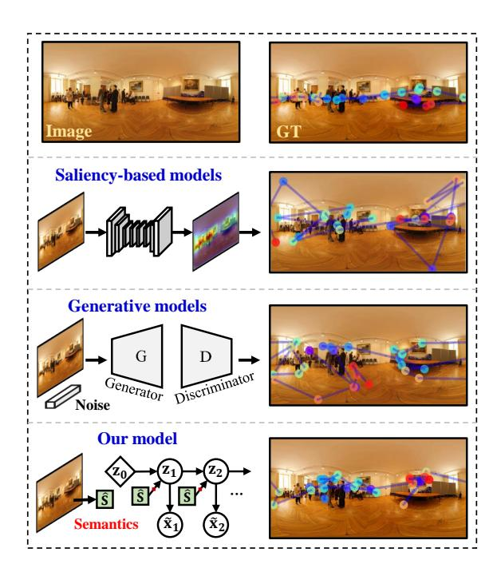
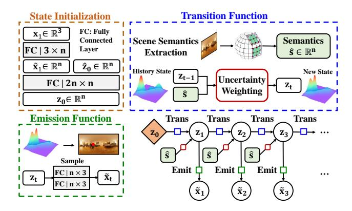
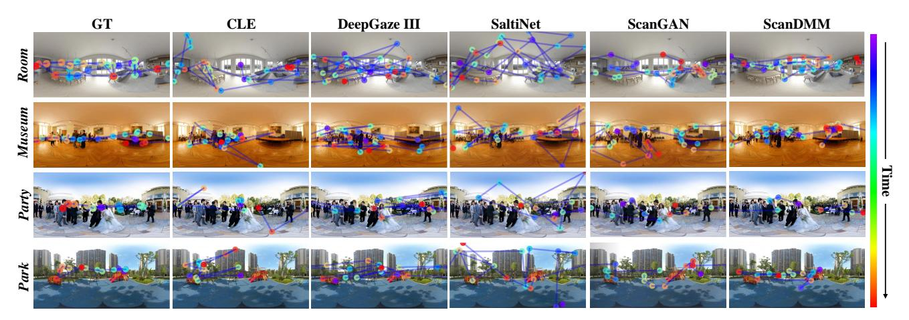
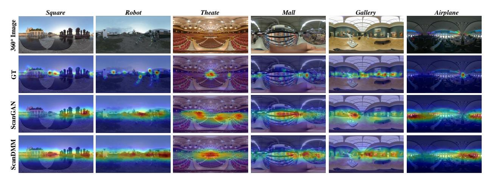

#### ScanDMM: A Deep Markov Model of Scanpath Prediction for 360◦ Images

Xiangjie Sui1 , Yuming Fang1\*, Hanwei Zhu2 , Shiqi Wang2 , Zhou Wang3 1 Jiangxi University of Finance and Economics, 2City University of Hong Kong, 3University of Waterloo

<https://github.com/xiangjieSui/ScanDMM>

# Abstract

*Scanpath prediction for 360*◦ *images aims to produce dynamic gaze behaviors based on the human visual perception mechanism. Most existing scanpath prediction methods for 360*◦ *images do not give a complete treatment of the timedependency when predicting human scanpath, resulting in inferior performance and poor generalizability. In this paper, we present a scanpath prediction method for 360*◦ *images by designing a novel Deep Markov Model (DMM) architecture, namely ScanDMM. We propose a semanticsguided transition function to learn the nonlinear dynamics of time-dependent attentional landscape. Moreover, a state initialization strategy is proposed by considering the starting point of viewing, enabling the model to learn the dynamics with the correct "launcher". We further demonstrate that our model achieves state-of-the-art performance on four 360*◦ *image databases, and exhibit its generalizability by presenting two applications of applying scanpath prediction models to other visual tasks – saliency detection and image quality assessment, expecting to provide profound insights into these fields.*

# 1. Introduction

360◦ images, also referred to as omnidirectional, sphere or virtual reality (VR) images, have been a popular type of visual data in many applications, providing us with immersive experiences. Nevertheless, how people explore virtual environments in 360◦ images has not been well understood. The scanpath prediction model that aims at generating realistic gaze trajectories has obtained increasing attention due to its significant influence in understanding users' viewing behaviors in VR scenes, as well as in developing VR rendering, display, compression, and transmission [\[51\]](#page-9-0).

Scanpath prediction has been explored for many years in 2D images [\[29\]](#page-8-0). However, 360◦ images are different greatly from 2D images, as a larger space is offered to interact with

Figure 1. Existing scanpath prediction models for 360◦ images could be classified to two types: saliency-based models [\[2,](#page-8-1) [70,](#page-10-0) [71\]](#page-10-1) and generative models [\[42,](#page-9-1) [43\]](#page-9-2). The scanpaths produced by saliency-based models, taking the study [\[2\]](#page-8-1) as an example, commonly exhibits unstable behavior with large displacements and scarce focal regions. Generative models, taking the study [\[43\]](#page-9-2) as an example, shows less attention to regions of interest. The proposed ScanDMM can produce more realistic scanpaths that focus on regions of interests.

– humans are allowed to use both head and gaze movements to explore viewports of interest in the scene. In such a case, viewing conditions, *e.g*., the starting point of viewing, has an important impact on humans' scanpaths [\[20,](#page-8-2) [21,](#page-8-3) [52\]](#page-9-3), and leads to complex and varied scanpaths among humans. This is inherently different from what happens in 2D visuals since humans can directly guide their attention to the regions of interest. Therefore, scanpath prediction for 360◦ images is a more complex task.

Current 360◦ image scanpath prediction methods could

\*Corresponding author (email: fa0001ng@e.ntu.edu.sg)

be roughly divided into two categories: saliency-based [\[2,](#page-8-1) [70,](#page-10-0) [71\]](#page-10-1) and generative methods [\[42,](#page-9-1) [43\]](#page-9-2). The basic idea of the former one is to sample predicted gaze points from a saliency map. The performance of such methods is highly dependent on that of the saliency maps. Furthermore, constructing a satisfactory sampling strategy to account for time-dependent visual behavior is non-trivial – the results of SaltiNet [\[2\]](#page-8-1) exhibit unstable behavior with large displacements and scarce focal regions (see Fig. [1\)](#page-0-0). The latter group of methods utilizes the advance of generative models, *e.g*., Generative Adversarial Network (GAN), to predict realistic scanpaths. However, such methods show less attention to regions of interests (see Fig. [1\)](#page-0-0). In addition, the GANbased methods are less flexible in determining the length of scanpaths and commonly suffer from unstable training.

None of above-mentioned studies give a complete treatment of the time-dependency of viewing behavior, which is critical for modeling dynamic gaze behaviors in 360◦ images. For time-series data, a popular approach is to leverage sequential models, *e.g*., recurrent neural networks (RNNs), as exemplified in gaze prediction for 360◦ videos [\[17,](#page-8-4) [35,](#page-9-4) [45\]](#page-9-5). However, such deterministic models are prone to overfitting, particularly on small 360◦ databases. More importantly, they typically make simplistic assumptions, *e.g*., one choice is to concatenate the saliency map to the model's hidden states [\[17,](#page-8-4) [45\]](#page-9-5), which assumes that the network learns how the states evolve by learning from saliency maps. Nevertheless, the neuroscience research [\[62\]](#page-10-2) reveals that in addition to top-down and bottom-up features, prior history and scene semantics are essential sources for guiding visual attention. Moreover, to be identified as interests or rejected as distractors, items *must* be compared to target templates held in memory [\[62\]](#page-10-2). Inspired by this, we argue that humans' scanpaths in 360◦ scenes are complex nonlinear dynamic attentional landscapes over time as a function of interventions of scene semantics on visual working memory. We present a probabilistic approach to learning the visual states that encode the time-dependent attentional landscape by specifying how these states evolve under the guidance of scene semantics and visual working memory. We instantiate our approach in the Deep Markov Model (DMM) [\[28\]](#page-8-5), namely ScanDMM. Our contributions can be summarized as follows:

- We present a novel method for time-dependent visual attention modeling for 360◦ images. Specifically, we model the mechanism of visual working memory by maintaining and updating the visual state in the Markov chain. Furthermore, a semantics-guided transition function is built to learn the nonlinear dynamics of the states, in which we model the interventions of scene semantics on visual working memory.
- We propose a practical strategy to initialize the visual state, facilitating our model to focus on learning the

- dynamics of states with correct "launcher", as well as enabling us to assign a specific starting point for scanpath generation. Moreover, ScanDMM is capable of producing 1, 000 variable-length scanpaths within one second, which is critical for real-world applications.
- We apply the proposed ScanDMM to two other computer vision tasks – saliency detection and image quality assessment, which demonstrates our model equips with strong generalizability and is expected to provide insights into other vision tasks.

# 2. Related Work

### 2.1. Visual Attention for 2D Images

Modeling Spatial Distribution of Gazes. Visual attention depends on two distinct types of attentional mechanisms: bottom-up and top-down mechanisms [\[10\]](#page-8-6). The performance of classic saliency detection methods for 2D images primarily depends on bottom-up features, *e.g*., colour, luminance, contrast and texture, for modeling visual attention [\[15,](#page-8-7) [18,](#page-8-8) [19,](#page-8-9) [24\]](#page-8-10). Although the studies [\[40,](#page-9-6) [69\]](#page-10-3) incorporate top-down features, *e.g*., human faces and texts, there are still obstacles in combining bottom-up and top-down visual features. Deep learning methods [\[36,](#page-9-7) [57,](#page-9-8) [59,](#page-10-4) [68\]](#page-10-5) take advantage of large-scale databases and well-established convolutional neural networks (CNNs), and they have achieved remarkable success.

Modeling Dynamic Gaze Behaviors. The studies in neuroscience suggest that scanpath generation can be an iterative process: while the eye fixates on an image location, the brain selects the next location to look at [\[26,](#page-8-11) [48\]](#page-9-9). Biologically inspired methods model such mechanism in different ways, *e.g*., considering the inhibition-of-return mechanism [\[25,](#page-8-12) [49,](#page-9-10) [53\]](#page-9-11), maintaining the residual perceptual information maps [\[58\]](#page-9-12), modeling the retina transformation [\[1\]](#page-8-13), and utilizing low-level semantic information [\[55,](#page-9-13) [67\]](#page-10-6). Another class of methods is statistically inspired for modeling dynamic gaze behaviors. A typical approach is to model fixation distributions by the product of the saliency map and the previous fixation location [\[4,](#page-8-14) [5,](#page-8-15) [13,](#page-8-16) [30,](#page-9-14) [33,](#page-9-15) [63\]](#page-10-7). Some studies regard fixation distributions as Gaussian densities, and model scanpath by leveraging component analysis [\[54\]](#page-9-16) or hidden markov models [\[12\]](#page-8-17). Different from interpretable models, fitting the data using deep generative models can also achieve competitive performance [\[9,](#page-8-18) [42,](#page-9-1) [66\]](#page-10-8).

#### 2.2. Visual Attention for 360◦ Images

Modeling Spatial Distribution of Gazes. Saliency detection of 360◦ images is more challenging compared with 2D images, mainly due to complex viewing behaviors and insufficient available data for 360◦ images. According to the space that the model is applied to, saliency detection models of 360◦ images can be grouped into two categories: 2D- plane-based methods [2, 22, 38] and viewport-based methods [8, 34, 44, 64]. The former models visual attention by using hand-craft features [22, 38] or data-driven features [2] extracted from the distorted (caused by the equirectangular projection) 2D plane, while the latter is designed by applying well-established 2D visual saliency detection methods on viewport plane with less distortions.

Modeling Dynamic Gaze Behaviors. Current scanpath prediction models of 360° images can be classified to two types: saliency-based models [2, 3, 70, 71] and generative models [42, 43]. The former first produces the saliency map by extracting low-level and high-level features [70,71] or learned features from data [2, 3]. Then, scanpaths are sampled from the saliency map by maximizing information gains [70, 71] or using a stochastic approach [2, 3]. The latter group of methods models scanpaths by learning from human data. PathGAN [42] is a generative model originally developed for 2D images, and it is fine-tuned on Salient360! [47] database to be applied on 360° images. However, the generated scanpaths lose sphere properties (e.g., longitudinal continuities) due to the assumption that a 360° image is similar to a traditional 2D image. To address this problem, ScanGAN [43] propose to learn the image and coordinate representations by using sphere convolutional neural network (S-CNN) [11] and CoordConv layer [39], respectively. Besides, a loss function that measures the spherical distance is proposed for model training.

### 3. The Proposed Method

#### 3.1. Problem Definition

In 360° environment, a human scanpath could be defined as a time series of gaze points  $\mathbf{x}_{1:T} = (\mathbf{x}_1, \mathbf{x}_2, ..., \mathbf{x}_T) \in \mathbb{R}^{3 \times T}$ , where  $\mathbf{x}_t$  is a three-dimensional coordinate  $(x_t, y_t, z_t)$ . Given a 360° image, a scanpath prediction model aims at producing realistic scanpaths  $\widetilde{\mathbf{x}}_{1:T}$  based on the human visual perception mechanism. This paper presents a probabilistic method – ScanDMM, for scanpath prediction for 360° images, as shown in Fig 2. We model the mechanism of visual working memory by maintaining a set of visual states  $\mathbf{z}_{1:T} = (\mathbf{z}_1, \mathbf{z}_2, ..., \mathbf{z}_T) \in \mathbb{R}^{n \times T}$  that encodes the dynamic attentional landscapes over time (n) is the dimension of the state space). Basically, the ScanDMM predicts a scanpath using the following generative process:

Transition: 
$$\mathbf{z}_t \sim p_{\theta_t}(\mathbf{z}_t | \mathbf{z}_{t-1}),$$
 (1)

Emission: 
$$\widetilde{\mathbf{x}}_t \sim p_{\theta_e}(\mathbf{x}_t | \mathbf{z}_t), \quad t = 1, 2, ..., T$$
 (2)

where  $\sim$  means the sample operation.  $p_{\theta_t}(\mathbf{z}_t|\mathbf{z}_{t-1})$  denotes the transition probabilities between the visual states, and  $p_{\theta_e}(\mathbf{x}_t|\mathbf{z}_t)$  denotes the emission probabilities that describe how the visual state generates a gaze point. Let  $\theta$  denotes all

Figure 2. An illustration of the proposed ScanDMM. Noting that the scene semantic  $\hat{s}$  is deterministic for an image.

parameters involved in the ScanDMM. We approximate the realistic scanpaths by maximizing the log-likelihood function  $\log p(\mathbf{x})$  (we omit subscripts here for simplicity):

$$\max \log p_{\theta}(\mathbf{x}) = \log \mathbb{E}_{p_{\theta}(\mathbf{z}|\mathbf{x})} p_{\theta}(\mathbf{x})$$

$$= \log \mathbb{E}_{p_{\theta}(\mathbf{z}|\mathbf{x})} \frac{p_{\theta}(\mathbf{x}, \mathbf{z})}{p_{\theta}(\mathbf{z}|\mathbf{x})}$$

$$= \log \mathbb{E}_{p_{\theta}(\mathbf{z}|\mathbf{x})} \frac{p_{\theta_{e}}(\mathbf{x}|\mathbf{z}) p_{\theta_{t}}(\mathbf{z})}{p_{\theta}(\mathbf{z}|\mathbf{x})}.$$
(3)

The posterior  $p_{\theta}(\mathbf{z}|\mathbf{x})$  can be approximated by using Variational Inference [61], which seeks to derive a distribution  $q_{\phi}(\mathbf{z}|\mathbf{x})$  that is parameterized by neural networks, s.t.  $q_{\phi}(\mathbf{z}|\mathbf{x}) \approx p_{\theta}(\mathbf{z}|\mathbf{x})$ . Based on Jensen's inequality,  $f(\mathbb{E}[x]) \geqslant \mathbb{E}[f(x)]$  where f is a concave function, we adopte the Evidence Lower Bound of  $\log p_{\theta}(\mathbf{x})$  as the loss function  $\mathcal{L}(\theta; \phi; \mathbf{x})$  to be maximized:

$$\log p_{\theta}(\mathbf{x}) \geqslant \mathbb{E}_{q_{\phi}} \log \frac{p_{\theta_{e}}(\mathbf{x}|\mathbf{z})p_{\theta_{t}}(\mathbf{z})}{q_{\phi}(\mathbf{z}|\mathbf{x})}$$

$$= \mathbb{E}_{q_{\phi}} [\log p_{\theta_{e}}(\mathbf{x}|\mathbf{z}) + \log p_{\theta_{t}}(\mathbf{z}) - \log q_{\phi}(\mathbf{z}|\mathbf{x})]$$

$$= \underbrace{\mathbb{E}_{q_{\phi}} [\log p_{\theta_{e}}(\mathbf{x}|\mathbf{z})]}_{\text{Reconstruction}} - \underbrace{\text{KL}(q_{\phi}(\mathbf{z}|\mathbf{x})||p_{\theta_{t}}(\mathbf{z}))}_{\text{Regularization}}$$

$$:= \mathcal{L}(\theta; \phi; \mathbf{x}),$$
(4)

where  $\mathrm{KL}(\cdot \| \cdot)$  denotes the Kullback–Leibler (KL) divergence. The reconstruction term evaluates the model's accuracy and the regularization term enforces the closeness between  $q_{\phi}(\mathbf{z}|\mathbf{x})$  and  $p_{\theta_t}(\mathbf{z})$ . The loss function also can be interpreted as the summation of transition  $p_{\theta_t}(\mathbf{z})$ , emission  $p_{\theta_e}(\mathbf{x}|\mathbf{z})$  and inference  $q_{\phi}(\mathbf{z}|\mathbf{x})$ . In the following section, we describe how we design the three functions tailored for scanpath prediction for 360° images.

#### 3.2. State Initialization

Different from the common strategy that simply sets the initial state to zero vector [28] or random vector [27], we

propose a practical strategy considering the starting points of scanpaths. The motivation derives from recent studies [20,21,52], which reveal that the starting point of viewing has an important influence on the scanpaths. To make our model better focus on learning the dynamics of visual states with the correct "launcher" rather than random scratch, in the training stage, we directly use the starting point  $\mathbf{x}_1$  to initialize  $\mathbf{z}_0$ :

$$\mathbf{z}_0 = \mathbf{F}(\hat{\mathbf{z}}_0, \mathbf{x}_1), \tag{5}$$

where  $\hat{\mathbf{z}}_0$  is a learnable parameter.  $\mathbf{F}$  denotes linear neural networks (see Fig. 2 for details). An advantage of such configuration is that we can assign a specific starting point for scanpath generation, which is flexible and even crucial in some visual tasks, *e.g.*, image quality assessment (see Section 5.2). Notably, to fairly compare ScanDMM with other scanpath prediction models, in the model evaluation, we randomly sample the starting points from an Equator Bias Map that covers the whole longitude and 20% latitude.

#### 3.3. Transition Function

Transition function  $p_{\theta_t}(\mathbf{z_t}|\mathbf{z_{t-1}})$  controls the dynamics of the visual states, in which the the history state  $\mathbf{z_{t-1}}$  functions as visual working memory that maintains the history attentional landscape. Inspired by the recent study in neuroscience [62], we propose to learn the dynamics guided by scene semantics. Due to the space-varying distortions inherent to equirectangular projections, we choose to extract scene semantics  $\hat{\mathbf{s}} \in \mathbb{R}^{n \times 1}$  using S-CNN [11]. Moreover, by considering the spatial locations of semantic features are critical for scanpath prediction, we utilize the CoordConv strategy [39] to give convolutions access to their own input coordinates, as suggested in [43]. Given the scene semantics  $\hat{\mathbf{s}}$  and the history visual state  $\mathbf{z}_{t-1}$ , transition function samples  $\mathbf{z}_t$  from the following Gaussian densities:

$$\mathbf{z}_t \sim \mathcal{N}(\mu_t^z, \ \sigma_t^z),$$
 (6)

where  $\mu_t^z$  and  $\sigma_t^z \in \mathbb{R}^{n \times 1}$  are the mean and scale of Gaussian densities describing an attentional landscape of the visual state  $\mathbf{z}_t$ .

Here, we present how we produce the two Gaussian parameters. Firstly, we compute the new underlying gaze distributions  $\hat{\mathbf{z}}_t$  by

$$\hat{\mathbf{z}}_t = \mathbf{W}_z^t(\mathbf{z}_{t-1} \oplus \hat{\mathbf{s}}) + \mathbf{b}_z^t, \tag{7}$$

where  $\oplus$  is the concatenate operation,  $\mathbf{W}_z^t \in \mathbb{R}^{2n \times n}$  and  $\mathbf{b}_z^t \in \mathbb{R}^{n \times 1}$  are learnable parameters of the neural networks. Inspired by the Long Short-Term Memory [23], we introduce the uncertainty weighting for adaptively determining how much components of the previous visual state  $\mathbf{z}_{t-1}$  to be updated:

$$\alpha_t = \sigma(\mathbf{W}_{\alpha}^t \mathbf{z}_{t-1} + \mathbf{b}_{\alpha}^t), \tag{8}$$

where  $\alpha_t$  is an uncertainty weighting determined by the history state  $\mathbf{z}_{t-1}$ , and  $\sigma$  denotes the sigmoid function.  $\mathbf{W}^t_{\{\alpha,\sigma\}} \in \mathbb{R}^{n \times n}$  and  $\mathbf{b}^t_{\{\alpha,\sigma\}} \in \mathbb{R}^{n \times 1}$  are learnable parameters of the neural networks. Finally, the two Gaussian parameters,  $\mu^t_t$  and  $\sigma^t_t$ , are computed by:

$$\mu_t^z = \alpha_t \hat{\mathbf{z}}_t + (1 - \alpha_t) \mathbf{z}_{t-1}, \tag{9}$$

$$\sigma_t^z = \log(1 + \exp(\mathbf{W}_{\sigma}^t \hat{\mathbf{z}}_t + \mathbf{b}_{\sigma}^t)). \tag{10}$$

#### 3.4. Emission Function

Emission function  $p_{\theta_e}(\mathbf{x}_t|\mathbf{z}_t)$  describes how a gaze point  $\widetilde{\mathbf{x}}_t$  is generated from the visual state  $\mathbf{z}_t$ . As a gaze point is parameterized as a three-dimensional coordinate, we model the emission process by sampling  $\widetilde{\mathbf{x}}_t$  from the three-dimensional Gaussian densities that are parameterized by  $\mu_t^x$  and  $\sigma_t^x \in \mathbb{R}^{3 \times 1}$ :

$$\widetilde{\mathbf{x}}_t \sim \mathcal{N}(\mu_t^x, \ \sigma_t^x),$$
 (11)

where  $\mu_t^x$  and  $\sigma_t^x$  are determined by the current visual state  $\mathbf{z}_t$ :

$$\mu_t^x = 2\sigma(\mathbf{W}_{\mu}^e \mathbf{z}_t + \mathbf{b}_{\mu}^e) - 1, \tag{12}$$

$$\sigma_t^x = \log(1 + \exp(\mathbf{W}_{\sigma}^e \mathbf{z}_t + \mathbf{b}_{\sigma}^e)). \tag{13}$$

 $\mathbf{W}^e_{\{\mu,\sigma\}} \in \mathbb{R}^{n \times 3}$  and  $\mathbf{b}^e_{\{\mu,\sigma\}} \in \mathbb{R}^{3 \times 1}$  are learnable parameters of the neural networks.

#### 3.5. Inference

Inference for a latent state can be made using information from past and future true observations [28], *i.e.*, GT gaze points in this study. In other words, the goal of inference is to provide an approximation to the exact posterior  $p_{\theta}(\mathbf{z}_{1:T}|\mathbf{x}_{1:T})$ . Here, we leverage the Variational Inference [61] to approximate  $p_{\theta}(\mathbf{z}_{1:T}|\mathbf{x}_{1:T})$  with a tractable family of conditional distributions  $q_{\phi}(\mathbf{z}_{1:T}|\mathbf{x}_{1:T})$ :

$$q_{\phi}(\mathbf{z}_{1:T}|\mathbf{x}_{1:T}) = \prod_{t=1}^{T} q_{\phi}(\mathbf{z}_{t}|\mathbf{z}_{t-1}, \mathcal{H}(\mathbf{x}_{t:T}))$$

$$q_{\phi}(\mathbf{z}_{1:T}|\mathbf{x}_{1:T}) = \prod_{t=1}^{T} q_{\phi}(\mathbf{z}_{t}|\mathbf{z}_{t-1}, \mathcal{H}(\mathbf{x}_{t:T}))$$

$$q_{\phi}(\mathbf{z}_{1:T}|\mathbf{x}_{1:T}) = \prod_{t=1}^{T} q_{\phi}(\mathbf{z}_{t}|\mathbf{z}_{t-1}, \mathcal{H}(\mathbf{x}_{t:T}))$$

$$q_{\phi}(\mathbf{z}_{1:T}|\mathbf{x}_{1:T}) = \prod_{t=1}^{T} q_{\phi}(\mathbf{z}_{t}|\mathbf{z}_{t-1}, \mathcal{H}(\mathbf{x}_{t:T}))$$

$$q_{\phi}(\mathbf{z}_{1:T}|\mathbf{x}_{1:T}) = \prod_{t=1}^{T} q_{\phi}(\mathbf{z}_{t}|\mathbf{z}_{t-1}, \mathcal{H}(\mathbf{x}_{t:T}))$$

$$q_{\phi}(\mathbf{z}_{1:T}|\mathbf{x}_{1:T}) = \prod_{t=1}^{T} q_{\phi}(\mathbf{z}_{t}|\mathbf{z}_{t-1}, \mathcal{H}(\mathbf{x}_{t:T}))$$

$$q_{\phi}(\mathbf{z}_{1:T}|\mathbf{z}_{1:T}) = \prod_{t=1}^{T} q_{\phi}(\mathbf{z}_{t}|\mathbf{z}_{t-1}, \mathcal{H}(\mathbf{x}_{t:T}))$$

$$q_{\phi}(\mathbf{z}_{1:T}|\mathbf{z}_{1:T}) = \prod_{t=1}^{T} q_{\phi}(\mathbf{z}_{t}|\mathbf{z}_{t-1}, \mathcal{H}(\mathbf{x}_{t:T}))$$

$$q_{\phi}(\mathbf{z}_{1:T}|\mathbf{z}_{1:T}) = \prod_{t=1}^{T} q_{\phi}(\mathbf{z}_{t}|\mathbf{z}_{t-1}, \mathcal{H}(\mathbf{x}_{t:T}))$$

$$q_{\phi}(\mathbf{z}_{1:T}|\mathbf{z}_{1:T}) = \prod_{t=1}^{T} q_{\phi}(\mathbf{z}_{t}|\mathbf{z}_{1:T})$$

$$q_{\phi}(\mathbf{z}_{1:T}|\mathbf{z}_{1:T}) = \prod_{t=1}^{T} q_{\phi}(\mathbf{z}_{t}|\mathbf{z}_{1:T})$$

$$q_{\phi}(\mathbf{z}_{1:T}|\mathbf{z}_{1:T}) = \prod_{t=1}^{T} q_{\phi}(\mathbf{z}_{1:T}|\mathbf{z}_{1:T})$$

$$q_{\phi}(\mathbf{z}_{1:T}|\mathbf{z}_{1:T}) = \prod_{t=1}^{T} q_{\phi}(\mathbf{z}_{1:T}|\mathbf{z}_{1:T})$$

$$q_{\phi}(\mathbf{z}_{1:T}|\mathbf{z}_{1:T}) = \prod_{t=1}^{T} q_{\phi}(\mathbf{z}_{1:T}|\mathbf{z}_{1:T})$$

$$q_{\phi}(\mathbf{z}_{1:T}|\mathbf{z}_{1:T}) = \prod_{t=1}^{T} q_{\phi}(\mathbf{z}_{1:T}|\mathbf{z}_{1:T})$$

s.t. 
$$q_{\phi}(\mathbf{z}_t|\mathbf{z}_{t-1}, \mathcal{H}(\mathbf{x}_{t:T})) \sim \mathcal{N}(\mu_t^i, \sigma_t^i),$$

where  $\mathcal{H}(\cdot) \in \mathbb{R}^{m \times 1}$  is the variational parameter computed by mapping a variable-length sequences  $\mathbf{x}_{t:T}$  to its m-dimensional space. We implement this by using RNN [28]. The Gaussian parameters  $\mu_t^i$  and  $\sigma_t^i \in \mathbb{R}^{n \times 1}$  are produced by the following process:

$$C_t = \frac{1}{2}((\mathbf{W}_c^i \mathbf{z}_{t-1} + \mathbf{b}_c^i) + \mathcal{H}(\mathbf{x}_{t:T})), \tag{15}$$

$$\mu_t^i = \mathbf{W}_u^i \mathcal{C}_t + \mathbf{b}_u^i, \tag{16}$$

$$\sigma_t^i = \log(1 + \exp(\mathbf{W}_\sigma^i \mathcal{C}_t + \mathbf{b}_\sigma^i)), \tag{17}$$

where  $\mathcal{C}_t$  denotes the combined feature of the previous state  $\mathbf{z}_{t-1}$  and the RNN hidden state  $\mathcal{H}(\mathbf{x}_{t:T})$ .  $\mathbf{W}_c^i \in \mathbb{R}^{n \times m}$ ,  $\mathbf{W}_{\{\mu,\sigma\}}^i \in \mathbb{R}^{m \times n}$ ,  $\mathbf{b}_c^i \in \mathbb{R}^{m \times 1}$ , and  $\mathbf{b}_{\{\mu,\sigma\}}^i \in \mathbb{R}^{n \times 1}$  are learnable parameters of the neural networks.

## 4. Experiments

In this section, we present the experimental results to validate the effectiveness of the proposed ScanDMM. We refer the interested readers to the supplementary file for more details on ScanDMM, datasets, and qualitative comparisons.

### 4.1. Dataset

We use four 360° image databases to conduct experiments, including Sitzmann [51], Salient360! [47], AOI [65], and JUFE [20]. Sitzmann [51] database contains 22 images and 1,980 scanpaths, 19 of 22 images are used for training, and the remaining are used for validation. Salient360! [47] database contains two sets: training and benchmark sets. In this paper, we consistently use its training set that contains 85 images and 3, 036 scanpaths for evaluation since its benchmark set is not publicly available. AOI [65] database contains 600 high-resolution 360° images and 18,000 scanpaths. JUFE [20] database is constructed for studying 360° image quality assessment, containing 1,032 images and 30,960 scanpaths. For the latter two databases, we randomly select 20% images for model evaluation. To obtain Ground-Truth (GT) scanpaths for model training and evaluation, we sample the raw scanpaths at 1 Hz on each database. Noting that the scanpaths of the AOI database had been processed by the authors, so we did not make any post-processing.

### 4.2. Experimental Setup

Implementation Details. We train the proposed model using Sitzmann [51] database. To augment data, we longitudinally shift the  $360^{\circ}$  images and adjust their scanpaths accordingly [43], which yields  $19\times 6=114$  images for training. Before the panoramic images are fed into the network, they are resized as (128,256). The learning rate is set to 3e-4 and is decreased by a factor of 0.99998 at each epoch. The dimensions of the visual state and RNN hidden state are set to 100 and 600, respectively. The network was trained for 500 epochs.

**Evaluation Metrics**. We use three metrics to evaluate the performance of  $360^{\circ}$  scanpath prediction models, including the Levenshtein distance (LEV), dynamic time warping (DTW), and recurrence measure (REC), as suggested in [16, 43]. Generally, lower LEV/DTW values and higher REC values mean better prediction performance. For an image with N GT scanpaths  $\mathbf{x}^{1:\hat{N}}$ , we generate  $\hat{N}=N$  fake scanpaths  $\mathbf{x}^{1:\hat{N}}$  for comparison. The lengths of generated scanpaths are equal to that of the viewing time1. To compare a set of GT scanpaths  $\mathbf{x}^{1:\hat{N}}$  to another set of predicted scanpaths  $\mathbf{x}^{1:\hat{N}}$ , taking LEV as an example, we choose to compute each metric for all possible pairwise comparisons

and average the results:

$$\text{mLEV} = \frac{1}{N\hat{N}} \sum_{i=1}^{N} \sum_{j=1}^{\hat{N}} \text{LEV}(\mathbf{x}^{i}, \widetilde{\mathbf{x}}^{j}).$$
 (18)

To reduce the evaluation bias caused by the randomly generated scanpaths, we test each generative model with 10 times and average these 10 results to obtain the final performance. To make the results more comparable and interpretable, for each metric, we compute the human consistency [43] as a realistic upper bound for model performance (see *Human* in Tab. 1). Specifically, we compare each GT scanpath against all the other ones and average the results. We also compare to the results of a chance model – produce scanpaths by adding a random Brownian motion to the previous positions (see *Random walk* in Tab. 1).

| Database            | Method                                                                        | $\mathrm{LEV}\downarrow$                                           | $\mathrm{DTW}\downarrow$                                                         | REC↑                                                        |
|---------------------|-------------------------------------------------------------------------------|--------------------------------------------------------------------|----------------------------------------------------------------------------------|-------------------------------------------------------------|
| Sitzmann [51]    | Random walk CLE [4] DeepGaze III [30] SaltiNet [2] ScanGAN [43] ScanDMM Human | 48.942 45.176 46.424 51.370 45.270 44.966 41.188 | 2232.987 1967.286 1992.859 2305.099 1951.848 1965.427 1836.986 | 2.669 3.130 3.082 1.564 3.241 3.475 6.345 |
| Salient360! [47] | Random walk CLE [4] DeepGaze III [30] SaltiNet [2] ScanGAN [43] ScanDMM Human | 40.802 39.774 40.006 40.848 38.932 37.272 35.084 | 2231.681 1714.409 1742.351 1855.477 1721.711 1528.592 1382.590 | 2.744 3.323 2.588 2.305 3.099 3.576 5.202 |
| AOI [65]         | Random walk CLE [4] DeepGaze III [30] SaltiNet [2] ScanGAN [43] ScanDMM Human | 13.696 12.865 13.155 14.695 12.889 12.127 9.243  | 711.516 547.892 558.445 596.544 552.446 537.504 389.477        | 2.993 3.617 2.892 2.244 3.750 4.024 6.228 |
| JUFE [20]        | Random walk CLE [4] DeepGaze III [30] SaltiNet [2] ScanGAN [43] ScanDMM Human | 24.039 24.844 24.129 26.074 24.209 23.091 18.306 | 1193.725 1172.150 1104.848 1287.144 1094.978 1086.014 1038.880 | 3.109 3.013 2.774 1.540 3.075 4.329 7.745 |

Table 1. Performance of scanpath prediction models on different databases. The best performance is highlighted.

### 4.3. Performance Comparison

**Model Selection.** We compare ScanDMM to four state-of-the-art scanpath prediction models: CLE [5], DeepGaze III [30], SaltiNet [2], and ScanGAN [43]. The first two models are built for traditional images, and the latter two are tailored for 360° images. For DeepGaze III and SaltiNet with larger sizes, we choose to use the pre-trained weights provided by the corresponding authors to avoid overfitting

&lt;sup>1For ScanGAN, we cut the produced scanpaths to the required lengths.

Figure 3. Qualitative comparison to different scanpath prediction models for four different scenes. From left to right: scanpath samples obtained by a observer, scanpath results obtained by CLE [4], DeepGaze III [30], SaltiNet [2], ScanGAN [43], and the proposed model. From top to bottom: the *Room* from Sitzmann [51] database, the *Museum* from Salient360! [47] database, the *Party* from AOI [65] database, and the *Park* from JUFE [20] database.

on small  $360^{\circ}$  image datasets. PathGAN [42] and Zhu *et al.* [71] are the other two popular scanpath prediction methods for  $360^{\circ}$  images. Nevertheless, we do not include them in comparison since the study [43] had shown their failures in producing realistic scanpaths for  $360^{\circ}$  images.

| Method                                                       | Paramters                   | Running Time                                                                                                   |
|--------------------------------------------------------------|-----------------------------|----------------------------------------------------------------------------------------------------------------|
| CLE [4] DeepGaze III [30] SaltiNet [2] ScanGAN [43] | 78.9MB 103.6MB 33.9MB | $\approx 39 \text{ seconds}$ $\approx 11 \text{ minutes}$ $\approx 49 \text{ minutes}$ 0.987  seconds |
| ScanDMM                                                      | 18.7MB                      | 0.737 seconds                                                                                                  |

Table 2. Efficiency comparison in terms of the model size and running time (computed by the time cost of producing 1,000 scanpaths). Noting that CLE is a traditional model that built on saliency maps, we only count the time to produce the scanpaths.

Accuracy Comparison. Table 1 and Fig. 3 show that our model could provide results closer to the human scanpaths. In Fig. 3, we observe that CLE and DeepGaze III exhibit large displacements that might caused by the treatment that regarding 360° images as 2D images. SaltiNet, a saliency-based scanpath prediction model, exhibits unstable behavior with large displacements and scarce focal regions (*e.g.*, referring to *Room* or *Park* of Fig. 3), leading to worse results than the *Random walk* model. The proposed model could better focus on the salient objects in scenes than ScanGAN (*e.g.*, referring to *Museum*, *Party* or *Park* of Fig. 3).

**Efficiency Comparison**. We also compare the efficiency in terms of the model size and running time. The results are shown in Table 2. Our model has the smallest size - 18.7MB, which is about 1/5 of the size of SaltiNet. For running time comparison, we record the time cost to gen-

| Database         | Method                                                                                                                                           | $\mathrm{LEV}\downarrow$             | $\mathrm{DTW}\downarrow$                     | $\operatorname{REC}\uparrow$     |
|------------------|--------------------------------------------------------------------------------------------------------------------------------------------------|--------------------------------------|----------------------------------------------|----------------------------------|
| Sitzmann [51]    | $\begin{array}{c} \operatorname{ScanDMM}_{(I)} \\ \operatorname{ScanDMM}_{(S)} \\ \operatorname{ScanDMM}_{(IS)} \\ \textbf{ScanDMM} \end{array}$ | 45.949 46.800 46.489 44.966 | 1996.456 2098.412 2011.157 1965.427 | 3.091 2.833 2.904 3.475 |
| Salient360! [47] | $\begin{array}{c} \operatorname{ScanDMM}_{(I)} \\ \operatorname{ScanDMM}_{(S)} \\ \operatorname{ScanDMM}_{(IS)} \\ \textbf{ScanDMM} \end{array}$ | 38.340 39.194 38.958 37.272 | 1698.517 1787.674 1720.894 1528.592 | 3.168 2.744 2.853 3.576 |

Table 3. Ablation study. The effectiveness of our designs is well justified.

erate 1,000 scanpaths for a given image. The results show that our model has the fastest inference speed - 0.737 seconds.

### 4.4. Ablation Study

We conduct ablation experiments to analyze the impact of the state initialization strategy and the scene semantics on the proposed model. We compare the proposed Scan-DMM with three baselines: (1) ScanDMM(I), initializing state directly using learnable parameter:  $\mathbf{z}_0 = \hat{\mathbf{z}}_0$ . (2) ScanDMM(S), removing scene semantics  $\hat{\mathbf{s}}$  in Eq. 7. (3) ScanDMM(IS), performing both of the two modifications. All baseline models are trained in the same settings, and the results are shown in Table 3. We can observe that the model achieves the best performance when incorporating both the state initialization strategy and the scene semantics.

### 5. Applications

In this section, we demonstrate the generalizability of our model by applying it to two downstream applications – saliency detection and quality assessment for 360° images.

| -                   | 3.5 . 1 . 1    | 17701 | 3700 1 | ~~ .  | **** D |
|---------------------|----------------|-------|--------|-------|--------|
| Database            | Method         | AUC↑  | NSS↑   | CC↑   | KLD↓   |
| Sitzmann [51]    | BMS360 [34]    | 0.831 | 1.328  | 0.666 | 0.475  |
|                     | GBVS360 [34]   | 0.845 | 1.433  | 0.693 | 0.374  |
|                     | SaltiNet [2]   | 0.762 | 0.948  | 0.497 | 0.671  |
|                     | SalNet360 [44] | 0.841 | 1.467  | 0.718 | 0.421  |
|                     | SalGAN360 [8]  | 0.813 | 1.188  | 0.612 | 0.561  |
|                     | ScanGAN [43]   | 0.761 | 0.902  | 0.475 | 0.654  |
|                     | ScanDMM        | 0.767 | 0.958  | 0.521 | 0.609  |
|                     | Human          | 0.877 | 2.265  | 1.000 | 0.117  |
| Salient360! [47] | BMS360 [34]    | 0.748 | 0.907  | 0.567 | 0.476  |
|                     | GBVS360 [34]   | 0.712 | 0.775  | 0.484 | 0.576  |
|                     | SaltiNet [2]   | 0.737 | 0.842  | 0.530 | 0.514  |
|                     | SalNet360 [44] | 0.744 | 0.989  | 0.602 | 0.476  |
|                     | SalGAN360 [8]  | 0.759 | 0.975  | 0.613 | 0.495  |
|                     | ScanGAN [43]   | 0.728 | 0.774  | 0.491 | 0.556  |
|                     | ScanDMM        | 0.777 | 1.042  | 0.660 | 0.384  |
|                     | Human          | 0.860 | 2.395  | 1.000 | 0.290  |

Table 4. Performance of saliency prediction models on Sitzmann [51] and Salient360! [47] databases.

### 5.1. Saliency Detection for 360° images

Visual attention prediction, commonly known as saliency detection, is the task of inferring the objects or regions that attract human attention in a scene. Intuitively, an ideal scanpath prediction model should be able to model spatially visual attention. In this section, we apply the proposed ScanDMM and ScanGAN [43] to the saliency detection task by generating 1,000 scanpaths and post-processing these gaze points to yield continuous saliency maps. Specifically, we convolve fixation maps, the two-dimensional records of the locations of all the gaze points, with a modified Gaussian [56]:

$$G(x,y) = \frac{1}{2\pi\sigma_y^2} \exp(-\frac{x^2}{2\sigma_x}) \exp(-\frac{y^2}{2\sigma_y})$$
 (19)

where  $\sigma_x = \frac{\sigma_y}{\cos(\theta)}$ .  $\sigma_y = 19^\circ$  is a constant value, and  $\theta \in [-\frac{\pi}{2}, \frac{\pi}{2}]$  is the latitude of the gaze point.

Evaluation Metrics. We evaluate saliency detection models using 4 metrics: the Judd variant of the area under curve (AUC) [6], normalized scanpath saliency (NSS) [46], correlation coefficient (CC) [32], and Kullback–Leibler divergence (KLD) [31]. Similarly, for each metric, we compute the human consistency as a realistic upper bound for model performance [7], referring to Human in Table 4. Specifically, we first compare the fixations of two groups of M observers, where M varies from 1 to N/2 (i.e., half of the total N observers). We then fit the N/2 performance scores to a power function (i.e.,  $aM^b + c$ ), and predict the human performance as that of two groups of infinite observers (which is equal to c, for b < 0).

**Performance Comparison**. We compare different saliency detection models on Sitzmann [51] and Salient360! [47]

| Method                                                                                               | CC ↑                                                            | SRCC ↑                             | RMSE↓                            |
|------------------------------------------------------------------------------------------------------|-----------------------------------------------------------------|------------------------------------|----------------------------------|
| PSNR PSNR GAN PSNR DMM PSNR Human                          | $0.156 \\ 0.135 \\ 0.563 \\ 0.585$                              | $0.016 \\ 0.014 \\ 0.546 \\ 0.583$ | 0.787 0.790 0.659 0.646 |
| SSIM SSIM GAN SSIM DMM SSIM Human                          | $\begin{array}{c} 0.148 \\ 0.162 \\ 0.519 \\ 0.527 \end{array}$ | 0.046 $0.046$ $0.509$ $0.532$      | 0.788 0.790 0.681 0.677 |
| VIF VIF GAN VIF DMM VIF Human                              | 0.163 0.147 0.597 0.616                                | 0.096 $0.092$ $0.572$ $0.601$      | 0.786 0.788 0.639 0.628 |
| DISTS DISTS GAN DISTS DMM DISTS Human                      | 0.162 0.176 0.662 0.700                                | 0.081 0.100 0.675 0.711   | 0.786 0.784 0.597 0.569 |
| $\begin{array}{c} DeepWSD \\ DeepWSD_{GAN} \\ DeepWSD_{\mathbf{DMM}} \\ DeepWSD_{Human} \end{array}$ | 0.160 0.162 0.635 0.668                                | 0.044 $0.072$ $0.628$ $0.667$      | 0.786 0.786 0.616 0.593 |

Table 5. Performance of quality assessment models on JUFE [20] database.

databases. In addition to ScanGAN [43], we also compare the proposed ScanDMM with 5 saliency detection models tailored for 360° images: BMS360 [34], GBVS360 [34], SalGAN [8], SalNet [44], and SaltiNet [2], the results are shown in Table 4 and Fig. 4. Table 4 shows that the proposed ScanDMM achieves the best performance on Salient360! database, while its performance drops apparently on Sitzmann database. One reason might be that scanpath-to-saliency models are worse at suppressing nonsalient regions than the models tailored for 360° images (please refer to the supplementary file for the complete comparison), e.g., referring to Robat in Fig. 4. The results show that applying the scanpath prediction model for the saliency detection task is encouraging. Nevertheless, there is significant room for improvement, as evidenced by a large performance gap between computational models and humans.

### 5.2. Quality Assessment for 360° Images

The image quality assessment (IQA) model aims at predicting the perceived quality of visual images [41]. Recent studies [20,21,52] reveal that the viewing behaviors may be indispensable for quality assessment for 360° scenes, highlighting the importance of scanpath prediction in 360° IQA. In this section, we show how much gain scanpath prediction models can provide for 360° IQA. Specifically, we leverage the computational framework [52], which offers us a natural way to utilize scanpaths for 360° IQA. Basically, there have 4 steps: (1) Extracting the sequences of rectilinear projections of viewports along different generated scanpaths. (2) Computing the "frame-level" (*i.e.*, viewport-level) quality scores by using existing 2D IQA models. (3) Computing the

Figure 4. Qualitative comparison to different saliency detection models for six different scenes. First two columns: *Square* and *Robot* of Sitzmann [\[51\]](#page-9-0) database. Last four columns: *Theater*, *Mall*, *Gallery* and *Airplane* of Salient360! [\[47\]](#page-9-20) database. From top to bottom: 360◦ images, GT saliency maps, the predictions of ScanGAN [\[43\]](#page-9-2) and the proposed ScanDMM.

perceived quality of a "video" (*i.e*., a viewport sequence) by temporally pooling the frame-level quality scores. (4) Averaging the quality scores of all videos to obtain the final perceived quality of the 360◦ image.

Evaluation Metrics. We use 3 evaluation metrics to quantify the quality prediction performance, including CC, Spearman's rank-order correlation coefficient (SRCC) and root mean square error (RMSE). Generally, higher CC/SRCC values and lower RMSE values mean better performance.

Performance Comparison. We conduct comparison experiments on JUFE [\[20\]](#page-8-2) database, in which each image has 4 quality labels corresponding to 4 different viewing conditions (2 starting point × 2 exploration time). Considering this database is goal-directed (*i.e*., IQA), we retrain the ScanDMM and ScanGAN [\[43\]](#page-9-2) on 80% training set. We generate Nˆ=N fake scanapths for extracting viewport sequences for each image. For frame-level quality calculation, we employ five 2D IQA models, including the Peak Signal-to-Noise Ratio (PSNR), the Structural SIMilarity index (SSIM) [\[60\]](#page-10-12), the Visual information fidelity (VIF) [\[50\]](#page-9-27), the Deep Image Stracture and Txture Similarity metircs (DISTS) [\[14\]](#page-8-28), and the DeepWSD [\[37\]](#page-9-28). Then, the Gaussian weighting function [\[52\]](#page-9-3) is chosen to temporally pool the frame-level quality scores. We add "GAN", "DMM", and "Human" to the five IQA methods as the subscripts to name the quality model that uses the scanpaths generated by Scan-GAN [\[43\]](#page-9-2), ScanDMM, and human, respectively. We also directly apply 2D IQA models to equirectangular projections as baselines. The results are shown in Table [5,](#page-6-2) where we can observe that all baseline models fail to predict the perceived quality, which is reasonable since they produce one quality score for a given image that has four quality labels. Conversely, our ScanDMM can simulate the viewing behaviors under the specific viewing condition thanks to the state initialization strategy, which significantly improves the performance of 2D IQA models and have competitive performance compared with Human models. ScanGAN [\[43\]](#page-9-2), however, is not applicable due to the uncontrollable starting points. Current work only tests traditional 2D IQA models; future models that take better account for VR-specific distortions will have great potential to boost the performance.

# 6. Conclusion and Discussion

This paper presents a scanpath prediction model for 360◦ images and demonstrates its crucial capabilities, *i.e*., high accuracy, efficiency and generalizability, for real-world applications. Moreover, we provide a novel perspective for saliency detection and quality assessment in 360◦ scenes – constructing models by simulating humans' viewing behaviors, which is an extremely natural way if we recall how we obtain the GT labels. Nevertheless, there is still much to explore, as we only simply exploit generated scanpaths without elaborately designing for a specific task. While this paper primarily focuses on static 360◦ images, our ScanDMM can be easily adapted to dynamic 360◦ videos by feeding dynamic scene semantics to the network. Moreover, as a probabilistic approach, ScanDMM is able to learn the general pattern of the viewing behaviors in 360◦ scenes, thus could also be applied to VR transmission, automatic cinematography, navigation, virtual scene design, etc.

# Acknowledgments

This work was supported in part by the National Key Research and Development Program of China under Grant 2018AAA0100601, in part by the National Natural Science Foundation of China under Grant 62132006, and in part by the Natural Science Foundation of Jiangxi Province of China under Grant 20223AEI91002.

# References

- [1] Hossein Adeli, Franc¸oise Vitu, and Gregory J Zelinsky. A model of the superior colliculus predicts fixation locations during scene viewing and visual search. *Journal of Neuroscience*, 37(6):1453–1467, 2017. [2](#page-1-0)
- [2] Marc Assens, Xavier Giro-i Nieto, Kevin McGuinness, and Noel E. O'Connor. SaltiNet: Scan-path prediction on 360 degree images using saliency volumes. In *IEEE International Conference on Computer Vision Workshops*, pages 2331– 2338, 2017. [1,](#page-0-1) [2,](#page-1-0) [3,](#page-2-1) [5,](#page-4-2) [6,](#page-5-3) [7](#page-6-3)
- [3] Marc Assens, Xavier Giro i Nieto, Kevin McGuinness, and Noel E. O'Connor. Scanpath and saliency prediction on 360 degree images. *Signal Processing: Image Communication*, 69:8–14, 2018. [3](#page-2-1)
- [4] Giuseppe Boccignone, Vittorio Cuculo, and Alessandro D'Amelio. How to look next? A data-driven approach for scanpath prediction. In *International Symposium on Formal Methods*, pages 131–145. Springer, 2019. [2,](#page-1-0) [5,](#page-4-2) [6](#page-5-3)
- [5] Giuseppe Boccignone and Mario Ferraro. Modelling gaze shift as a constrained random walk. *Physica A: Statistical Mechanics and its Applications*, 331(1-2):207–218, 2004. [2,](#page-1-0) [5](#page-4-2)
- [6] Zoya Bylinskii, Tilke Judd, Ali Borji, Laurent Itti, Fredo ´ Durand, Aude Oliva, and Antonio Torralba. MIT saliency benchmark, 2015. [7](#page-6-3)
- [7] Zoya Bylinskii, Tilke Judd, Aude Oliva, Antonio Torralba, and Fredo Durand. What do different evaluation metrics tell ´ us about saliency models? *IEEE Transactions on Pattern Analysis and Machine Intelligence*, 41(3):740–757, 2019. [7](#page-6-3)
- [8] Fang-Yi Chao, Lu Zhang, Wassim Hamidouche, and Olivier Deforges. SalGAN360: Visual saliency prediction on 360 degree images with generative adversarial networks. In *IEEE International Conference on Multimedia & Expo Workshops*, pages 1–4, 2018. [3,](#page-2-1) [7](#page-6-3)
- [9] Xianyu Chen, Ming Jiang, and Qi Zhao. Predicting human scanpaths in visual question answering. In *IEEE Conference on Computer Vision and Pattern Recognition*, pages 10876– 10885, 2021. [2](#page-1-0)
- [10] Charles E. Connor, Howard E. Egeth, and Steven Yantis. Visual attention: Bottom-up versus top-down. *Current Biology*, 14(19):R850–R852, 2004. [2](#page-1-0)
- [11] Benjamin Coors, Alexandru Paul Condurache, and Andreas Geiger. SphereNet: Learning spherical representations for detection and classification in omnidirectional images. In *European Conference on Computer Vision*, 2018. [3,](#page-2-1) [4](#page-3-1)
- [12] Antoine Coutrot, Janet H Hsiao, and Antoni B Chan. Scanpath modeling and classification with hidden markov models. *Behavior research methods*, 50(1):362–379, 2018. [2](#page-1-0)
- [13] Ryan Anthony Jalova de Belen, Tomasz Bednarz, and Arcot Sowmya. Scanpathnet: A recurrent mixture density network for scanpath prediction. In *IEEE Conference on Computer Vision and Pattern Recognition Workshops*, pages 5010–5020, 2022. [2](#page-1-0)
- [14] Keyan Ding, Kede Ma, Shiqi Wang, and Eero P. Simoncelli. Image quality assessment: Unifying structure and texture

- similarity. *IEEE Transactions on Pattern Analysis and Machine Intelligence*, 44(5):2567–2581, 2022. [8](#page-7-1)
- [15] Erkut Erdem and Aykut Erdem. Visual saliency estimation by nonlinearly integrating features using region covariances. *Journal of Vision*, 13(4):11–11, 2013. [2](#page-1-0)
- [16] Ramin Fahimi and Neil DB Bruce. On metrics for measuring scanpath similarity. *Behavior Research Methods*, 53(2):609– 628, 2021. [5](#page-4-2)
- [17] Ching-Ling Fan, Jean Lee, Wen-Chih Lo, Chun-Ying Huang, Kuan-Ta Chen, and Cheng-Hsin Hsu. Fixation prediction for 360◦ video streaming in head-mounted virtual reality. In *Workshop on Network and Operating Systems Support for Digital Audio and Video*, page 67–72. Association for Computing Machinery, 2017. [2](#page-1-0)
- [18] Shu Fang, Jia Li, Yonghong Tian, Tiejun Huang, and Xiaowu Chen. Learning discriminative subspaces on random contrasts for image saliency analysis. *IEEE Transactions on Neural Networks and Learning Systems*, 28(5):1095–1108, 2017. [2](#page-1-0)
- [19] Yuming Fang, Zhenzhong Chen, Weisi Lin, and Chia-Wen Lin. Saliency detection in the compressed domain for adaptive image retargeting. *IEEE Transactions on Image Processing*, 21(9):3888–3901, 2012. [2](#page-1-0)
- [20] Yuming Fang, Liping Huang, Jiebin Yan, Xuelin Liu, and Yang Liu. Perceptual quality assessment of omnidirectional images. In *AAAI Conference on Artificial Intelligence*, volume 36, pages 580–588, 2022. [1,](#page-0-1) [4,](#page-3-1) [5,](#page-4-2) [6,](#page-5-3) [7,](#page-6-3) [8](#page-7-1)
- [21] Yuming Fang, Yiru Yao, Xiangjie Sui, and Kede Ma. A database for perceived quality assessment of user-generated VR videos. *CoRR*, abs/2206.08751, 2022. [1,](#page-0-1) [4,](#page-3-1) [7](#page-6-3)
- [22] Yuming Fang, Xiaoqiang Zhang, and Nevrez Imamoglu. A novel superpixel-based saliency detection model for 360 degree images. *Signal Processing: Image Communication*, 69:1–7, 2018. [3](#page-2-1)
- [23] Sepp Hochreiter and Jurgen Schmidhuber. Long short-term ¨ memory. *Neural Computation*, 9(8):1735–1780, 1997. [4](#page-3-1)
- [24] Nevrez Imamoglu, Weisi Lin, and Yuming Fang. A saliency detection model using low-level features based on wavelet transform. *IEEE Transactions on Multimedia*, 15(1):96–105, 2013. [2](#page-1-0)
- [25] L. Itti, C. Koch, and E. Niebur. A model of saliency-based visual attention for rapid scene analysis. *IEEE Transactions on Pattern Analysis and Machine Intelligence*, 20(11):1254– 1259, 1998. [2](#page-1-0)
- [26] Rimas P. Kalesnykas and David L. Sparks. The primate superior colliculus and the control of saccadic eye movements. *The Neuroscientist*, 2(5):284–292, 1996. [2](#page-1-0)
- [27] Sameer Khurana, Antoine Laurent, Wei-Ning Hsu, Jan Chorowski, Adrian Lancucki, Ricard Marxer, and James Glass. A convolutional deep markov model for unsupervised speech representation learning. *CoRR*, abs/2006.02547, 2020. [3](#page-2-1)
- [28] Rahul Krishnan, Uri Shalit, and David Sontag. Structured inference networks for nonlinear state space models. In *AAAI Conference on Artificial Intelligence*, volume 31, 2017. [2,](#page-1-0) [3,](#page-2-1) [4](#page-3-1)
- [29] Matthias Kummerer and Matthias Bethge. State-of-the-art in ¨ human scanpath prediction. *CoRR*, abs/2102.12239, 2021. [1](#page-0-1)

- [30] Matthias Kummerer, Matthias Bethge, and Thomas S. A. ¨ Wallis. DeepGaze III: Modeling free-viewing human scanpaths with deep learning. *Journal of Vision*, 22(5):7–7, 2022. [2,](#page-1-0) [5,](#page-4-2) [6](#page-5-3)
- [31] Matthias Kummerer, Thomas S. A. Wallis, and Matthias ¨ Bethge. Information-theoretic model comparison unifies saliency metrics. *National Academy of Sciences*, 112(52):16054–16059, 2015. [7](#page-6-3)
- [32] Olivier Le Meur, Patrick Le Callet, and Dominique Barba. Predicting visual fixations on video based on low-level visual features. *Vision Research*, 47(19):2483–2498, 2007. [7](#page-6-3)
- [33] Olivier Le Meur and Zhi Liu. Saccadic model of eye movements for free-viewing condition. *Vision research*, 116:152– 164, 2015. [2](#page-1-0)
- [34] Pierre Lebreton and Alexander Raake. GBVS360, BMS360, ProSal: Extending existing saliency prediction models from 2D to omnidirectional images. *Signal Processing: Image Communication*, 69:69–78, 2018. [3,](#page-2-1) [7](#page-6-3)
- [35] Chenge Li, Weixi Zhang, Yong Liu, and Yao Wang. Very long term field of view prediction for 360-degree video streaming. In *IEEE Conference on Multimedia Information Processing and Retrieval*, pages 297–302, 2019. [2](#page-1-0)
- [36] Guanbin Li and Yizhou Yu. Deep contrast learning for salient object detection. In *IEEE Conference on Computer Vision and Pattern Recognition*, pages 478–487, 2016. [2](#page-1-0)
- [37] Xingran Liao, Baoliang Chen, Hanwei Zhu, Shiqi Wang, Mingliang Zhou, and Sam Kwong. DeepWSD: Projecting degradations in perceptual space to wasserstein distance in deep feature space. In *ACM International Conference on Multimedia*. ACM, 2022. [8](#page-7-1)
- [38] Jing Ling, Kao Zhang, Yingxue Zhang, Daiqin Yang, and Zhenzhong Chen. A saliency prediction model on 360 degree images using color dictionary based sparse representation. *Signal Processing: Image Communication*, 69:60–68, 2018. [3](#page-2-1)
- [39] Rosanne Liu, Joel Lehman, Piero Molino, Felipe Petroski Such, Eric Frank, Alex Sergeev, and Jason Yosinski. An intriguing failing of convolutional neural networks and the coordconv solution. In *Advances in Neural Information Processing Systems*, volume 31, 2018. [3,](#page-2-1) [4](#page-3-1)
- [40] Tie Liu, Zejian Yuan, Jian Sun, Jingdong Wang, Nanning Zheng, Xiaoou Tang, and Heung-Yeung Shum. Learning to detect a salient object. *IEEE Transactions on Pattern Analysis and Machine Intelligence*, 33(2):353–367, 2011. [2](#page-1-0)
- [41] Kede Ma and Yuming Fang. Image quality assessment in the modern age. In *ACM International Conference on Multimedia*, page 5664–5666, 2021. [7](#page-6-3)
- [42] Assens Marc, Giro-i-Nieto Xavier, McGuinness Kevin, and E. O'Connor Noel. PathGan: Visual scanpath prediction with generative adversarial networks. In *European Conference on Computer Vision Workshops*, 2018. [1,](#page-0-1) [2,](#page-1-0) [3,](#page-2-1) [6](#page-5-3)
- [43] Daniel Martin, Ana Serrano, Alexander W. Bergman, Gordon Wetzstein, and Belen Masia. ScanGAN360: A generative model of realistic scanpaths for 360◦ images. *IEEE Transactions on Visualization and Computer Graphics*, 28(5):2003–2013, 2022. [1,](#page-0-1) [2,](#page-1-0) [3,](#page-2-1) [4,](#page-3-1) [5,](#page-4-2) [6,](#page-5-3) [7,](#page-6-3) [8](#page-7-1)

- [44] Rafael Monroy, Sebastian Lutz, Tejo Chalasani, and Aljosa Smolic. SalNet360: Saliency maps for omni-directional images with CNN. *Signal Processing: Image Communication*, 69:26–34, 2018. [3,](#page-2-1) [7](#page-6-3)
- [45] Anh Nguyen, Zhisheng Yan, and Klara Nahrstedt. Your attention is unique: Detecting 360-degree video saliency in head-mounted display for head movement prediction. In *ACM International Conference on Multimedia*, page 1190–1198, 2018. [2](#page-1-0)
- [46] Robert J. Peters, Asha Iyer, Laurent Itti, and Christof Koch. Components of bottom-up gaze allocation in natural images. *Vision Research*, 45(18):2397–2416, 2005. [7](#page-6-3)
- [47] Yashas Rai, Jesus Guti ´ errez, and Patrick Le Callet. A dataset ´ of head and eye movements for 360 degree images. In *ACM on Multimedia Systems Conference*, page 205–210. Association for Computing Machinery, 2017. [3,](#page-2-1) [5,](#page-4-2) [6,](#page-5-3) [7,](#page-6-3) [8](#page-7-1)
- [48] A.Zenon RJ Krauzlis, LP Lovejoy. Superior colliculus and ´ visual spatial attention. *Annual Review of Neuroscience*, 36(1):165–182, 2013. [2](#page-1-0)
- [49] Heiko H Schutt, Lars OM Rothkegel, Hans A Truken- ¨ brod, Sebastian Reich, Felix A Wichmann, and Ralf Engbert. Likelihood-based parameter estimation and comparison of dynamical cognitive models. *Psychological Review*, 124(4):505, 2017. [2](#page-1-0)
- [50] H.R. Sheikh and A.C. Bovik. Image information and visual quality. *IEEE Transactions on Image Processing*, 15(2):430– 444, 2006. [8](#page-7-1)
- [51] Vincent Sitzmann, Ana Serrano, Amy Pavel, Maneesh Agrawala, Diego Gutierrez, Belen Masia, and Gordon Wetzstein. Saliency in VR: How do people explore virtual environments? *IEEE Transactions on Visualization and Computer Graphics*, 24(4):1633–1642, 2018. [1,](#page-0-1) [5,](#page-4-2) [6,](#page-5-3) [7,](#page-6-3) [8](#page-7-1)
- [52] Xiangjie Sui, Kede Ma, Yiru Yao, and Yuming Fang. Perceptual quality assessment of omnidirectional images as moving camera videos. *IEEE Transactions on Visualization and Computer Graphics*, 28(8):3022–3034, 2022. [1,](#page-0-1) [4,](#page-3-1) [7,](#page-6-3) [8](#page-7-1)
- [53] Wanjie Sun, Zhenzhong Chen, and Feng Wu. Visual scanpath prediction using IOR-ROI recurrent mixture density network. *IEEE Transactions on Pattern Analysis and Machine Intelligence*, 43(6):2101–2118, 2021. [2](#page-1-0)
- [54] Xiaoshuai Sun, Hongxun Yao, Rongrong Ji, and Xian-Ming Liu. Toward statistical modeling of saccadic eye-movement and visual saliency. *IEEE Transactions on Image Processing*, 23(11):4649–4662, 2014. [2](#page-1-0)
- [55] Benjamin W Tatler, James R Brockmole, and Roger HS Carpenter. LATEST: A model of saccadic decisions in space and time. *Psychological review*, 124(3):267, 2017. [2](#page-1-0)
- [56] Evgeniy Upenik and Touradj Ebrahimi. A simple method to obtain visual attention data in head mounted virtual reality. In *IEEE International Conference on Multimedia & Expo Workshops*, pages 73–78, 2017. [7](#page-6-3)
- [57] Lijun Wang, Huchuan Lu, Yifan Wang, Mengyang Feng, Dong Wang, Baocai Yin, and Xiang Ruan. Learning to detect salient objects with image-level supervision. In *IEEE Conference on Computer Vision and Pattern Recognition*, pages 3796–3805, 2017. [2](#page-1-0)
- [58] Wei Wang, Cheng Chen, Yizhou Wang, Tingting Jiang, Fang Fang, and Yuan Yao. Simulating human saccadic scanpaths

- on natural images. In *IEEE Conference on Computer Vision and Pattern Recognition*, pages 441–448, 2011. [2](#page-1-0)
- [59] Yifan Wang, Wenbo Zhang, Lijun Wang, Ting Liu, and Huchuan Lu. Multi-source uncertainty mining for deep unsupervised saliency detection. In *IEEE Conference on Computer Vision and Pattern Recognition*, pages 11727–11736, 2022. [2](#page-1-0)
- [60] Zhou Wang, A.C. Bovik, H.R. Sheikh, and E.P. Simoncelli. Image quality assessment: From error visibility to structural similarity. *IEEE Transactions on Image Processing*, 13(4):600–612, 2004. [8](#page-7-1)
- [61] David Wingate and Theophane Weber. Automated variational inference in probabilistic programming. *CoRR*, abs/1301.1299, 2013. [3,](#page-2-1) [4](#page-3-1)
- [62] Jeremy M Wolfe. Guided search 6.0: An updated model of visual search. *Psychonomic Bulletin & Review*, 28(4):1060– 1092, 2021. [2,](#page-1-0) [4](#page-3-1)
- [63] Chen Xia, Junwei Han, Fei Qi, and Guangming Shi. Predicting human saccadic scanpaths based on iterative representation learning. *IEEE Transactions on Image Processing*, 28(7):3502–3515, 2019. [2](#page-1-0)
- [64] Mai Xu, Li Yang, Xiaoming Tao, Yiping Duan, and Zulin Wang. Saliency prediction on omnidirectional image with generative adversarial imitation learning. *IEEE Transactions on Image Processing*, 30:2087–2102, 2021. [3](#page-2-1)
- [65] Mai Xu, Li Yang, Xiaoming Tao, Yiping Duan, and Zulin Wang. Saliency prediction on omnidirectional image with generative adversarial imitation learning. *IEEE Transactions on Image Processing*, 30:2087–2102, 2021. [5,](#page-4-2) [6](#page-5-3)
- [66] Zhibo Yang, Lihan Huang, Yupei Chen, Zijun Wei, Seoyoung Ahn, Gregory Zelinsky, Dimitris Samaras, and Minh Hoai. Predicting goal-directed human attention using inverse reinforcement learning. In *IEEE Conference on Computer Vision and Pattern Recognition*, 2020. [2](#page-1-0)
- [67] Dario Zanca, Stefano Melacci, and Marco Gori. Gravitational laws of focus of attention. *IEEE Transactions on Pattern Analysis and Machine Intelligence*, 42(12):2983–2995, 2020. [2](#page-1-0)
- [68] Kaihua Zhang, Mingliang Dong, Bo Liu, Xiao-Tong Yuan, and Qingshan Liu. Deepacg: Co-saliency detection via semantic-aware contrast gromov-wasserstein distance. In *IEEE Conference on Computer Vision and Pattern Recognition*, pages 13703–13712, 2021. [2](#page-1-0)
- [69] Guokang Zhu, Qi Wang, and Yuan Yuan. Tag-Saliency: Combining bottom-up and top-down information for saliency detection. *Computer Vision and Image Understanding*, 118:40–49, 2014. [2](#page-1-0)
- [70] Yucheng Zhu, Guangtao Zhai, and Xiongkuo Min. The prediction of head and eye movement for 360 degree images. *Signal Processing: Image Communication*, 69:15–25, 2018. [1,](#page-0-1) [2,](#page-1-0) [3](#page-2-1)
- [71] Yucheng Zhu, Guangtao Zhai, Xiongkuo Min, and Jiantao Zhou. The prediction of saliency map for head and eye movements in 360 degree images. *IEEE Transactions on Multimedia*, 22(9):2331–2344, 2020. [1,](#page-0-1) [2,](#page-1-0) [3,](#page-2-1) [6](#page-5-3)