# ScanDTM: A Novel Dual-Temporal Modulation Scanpath Prediction Model for Omnidirectional Images

Dandan Zhu [,](https://orcid.org/0000-0001-6436-7088) *Member, IEEE*, Kaiwei Zhan[g](https://orcid.org/0000-0002-1620-736X) , Xiongkuo Min [,](https://orcid.org/0000-0001-5693-0416) *Member, IEEE*, Guangtao Zhai [,](https://orcid.org/0000-0001-8165-9322) *Fellow, IEEE*, and Xiaokang Yan[g](https://orcid.org/0000-0003-4029-3322) , *Fellow, IEEE*

*Abstract*— Scanpath prediction for omnidirectional images aims to effectively simulate the human visual perception mechanism to generate dynamic realistic fixation trajectories. However, the majority of scanpath prediction methods for omnidirectional images are still in their infancy as they fail to accurately capture the time-dependency of viewing behavior and suffer from sub-optimal performance along with limited generalization capability. A desirable solution should achieve a better tradeoff between prediction performance and generalization ability. To this end, we propose a novel dual-temporal modulation scanpath prediction (ScanDTM) model for omnidirectional images. Such a model is designed to effectively capture longrange time-dependencies between various fixation regions across both internal and external time dimensions, thereby generating more realistic scanpaths. In particular, we design a Dual Graph Convolutional Network (Dual-GCN) module comprising a semantic-level GCN and an image-level GCN. This module servers as a robust visual encoder that captures spatial relationships among various object regions within an image and fully utilizes similar images as complementary information to capture similarity relations across relevant images. Notably, the proposed Dual-GCN focuses on modeling temporal correlations from both local and global perspectives within the internal time dimension. Furthermore, drawing inspiration from the promising generalization capabilities of diffusion models across various generative tasks, we introduce a novel diffusion-guided saliency module. This module formulates the prediction issue as a conditional generative process for the saliency map, utilizing extracted semantic-level and image-level visual features as conditions. With the well-designed diffusion-guided saliency module, our proposed ScanDTM model acting as an external temporal modulator, we can progressively refine the generated scanpath from the noisy map. We conduct extensive experiments on several benchmark datasets, and the results demonstrate that

Received 28 June 2024; revised 9 November 2024; accepted 20 February 2025. Date of publication 3 March 2025; date of current version 6 August 2025. This work was supported in part by the National Key Research and Development Program of China under Grant 2021YFE0206700 and in part by the National Natural Science Foundation of China under Grant 62377011. This article was recommended by Associate Editor S. Bakshi. *(Corresponding author: Kaiwei Zhang.)*

Dandan Zhu is with the School of Computer Science and Technology, East China Normal University, Shanghai 200333, China (e-mail: ddzhu@mail.ecnu.edu.cn).

Kaiwei Zhang, Xiongkuo Min, and Guangtao Zhai are with the Institute of Image Communication and Network Engineering, Shanghai Jiao Tong University, Shanghai 200240, China (e-mail: zhangkaiwei@sjtu.edu.cn; minxiongkuo@sjtu.edu.cn; zhaiguangtao@sjtu.edu.cn).

Xiaokang Yang is with the MoE Key Laboratory of Artificial Intelligence, AI Institute, Shanghai Jiao Tong University, Shanghai 200240, China (e-mail: xkyang@sjtu.edu.cn).

Digital Object Identifier 10.1109/TCSVT.2025.3545908

our ScanDTM model significantly outperforms other competitors. Meanwhile, when applied to tasks such as saliency prediction and image quality assessment, our ScanDTM model consistently achieves superior generalization performance.

*Index Terms*— Scanpath prediction, dual graph convolutional network, diffusion model, dual temporal modulator, omnidirectional image.

## I. INTRODUCTION

I N RECENT years, artificial intelligence generated content (AIGC) technology and metaverse technology have gained unprecedented progress, thus promoting the widespread application of virtual reality (VR) and augmented reality (AR). To the best of our knowledge, human eye fixation movements (*i.e.,* fixation prediction) are crucial for optimizing and enhancing user experience in VR/AR applications [\[1\]. Fr](#page-13-0)om one perspective, fixation prediction can accurately track and understand the visual viewing behavior of users by interpreting and analyzing human eye movement patterns and fixation directions, thereby providing a more natural and realistic human-computer interaction experience [\[2\],](#page-13-1) [\[3\],](#page-13-2) [\[4\],](#page-13-3) [\[5\]. Fr](#page-13-4)om another perspective, accurately and quickly estimating fixation locations can enhance foveated rending performance and reduce computational overhead in VR/AR applications. More importantly, by comprehensively and systematically analyzing human fixation data, VR/AR systems can fully understand and accurately predict the user's region of interest and intentions, which can be used to optimize interface design [6] [and](#page-13-5) provide personalized recommendations [\[7\],](#page-13-6) [\[8\].](#page-13-7)

From the above description, it can be concluded that accurately predicting the user's eye fixation and scanpath is crucial to enhancing the immersive experience of VR/AR applications. It is worth mentioning that, compared with the fixation prediction task, the visual scanpath prediction task is more challenge because it requires not only predicting the fixation position but also the order of fixations. Fig. [1](#page-1-0) illustrates the process of visual scanpath prediction in a VR scene. From Fig. [1,](#page-1-0) we can clearly observe that the goal of the scanpath prediction task is to effectively model and capture the time-dependency of viewing behavior, which is crucial for elevating prediction performance and understanding the mechanism of human visual perception. Thus, scanpath prediction in VR scene is a more complex task compared to the task of saliency prediction.

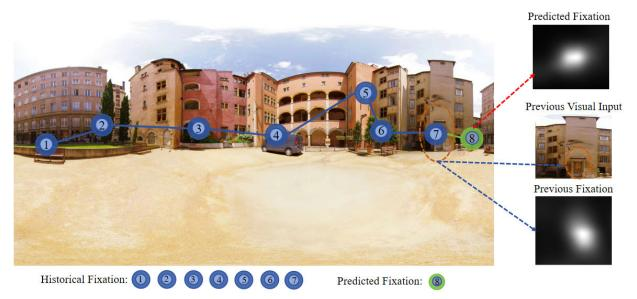

Fig. 1. The schematic diagram illustrates the pipeline for predicting human scanpath within a VR scene, which consists of a series of fixations and saccades. Firstly, the scanpath prediction process determines the starting point of viewing. Subsequently, information from previous fixations (*i.e.* historical fixations) can be used to predict the next fixation. Finally, predicted fixations at different locations are connected by modeling temporal correlations to generate realistic fixation trajectories.

Currently, scanpath prediction methods for omnidirectional images are broadly divided into two categories: saliencybased methods [\[9\],](#page-13-8) [\[10\]](#page-13-9) and generative-based methods [\[11\],](#page-13-10) [\[12\].](#page-13-11) For saliency-based methods, they usually adopt a sampling strategy to sample fixations from the saliency map. However, the performance of such methods often heavily relies on the predicted saliency map and requires a satisfactory sampling strategy to interpret time-dependent visual viewing behavior. As can be seen from Fig. [2,](#page-1-1) inferior sampling strategy directly result in unstable viewing behavior, such as larger displacements and less fixation regions. As for generative-based methods, they usually utilize various generative adversarial networks (GANs) to predict the realistic scanpaths. Albeit alleviating the displacement bias issue compared to saliency-based methods, such methods rarely focus on the salient regions, as shown in Fig. [2.](#page-1-1) Additionally, generative-based methods face challenges in generating scanpaths of varying lengths and usually suffer from unstable training.

Although the above-mentioned scanpath prediction methods for omnidirectional images have achieved some performance improvements, these methods are still in their infancy stages because they cannot effectively capture the time-dependency of viewing behavior. To the best of our knowledge, it is crucial to effectively model dynamic fixation movements in omnidirectional scenes. For time series data, current mainstream methods involve utilizing sequential techniques, such as recurrent neural network (RNNs) and long shortterm memory (LSTM) as backbones to capture temporal relationships in scanpath prediction tasks for omnidirectional images. However, such deterministic methods suffer from overfitting on small omnidirectional image datasets and cannot better capture long-range temporal dependencies between multiple fixations. Therefore, there is an urgent need to propose a novel scanpath prediction model that not only shows strong generalization performance but also has superior temporal modeling capabilities.

Inspired by the effectiveness of graph convolutional networks (GCNs) in modeling spatial object relations, we propose a novel dual-temporal modulation scanpath prediction (ScanDTM) model that incorporates dual-GCN as semantic-level encoder and image-level encoder, and the

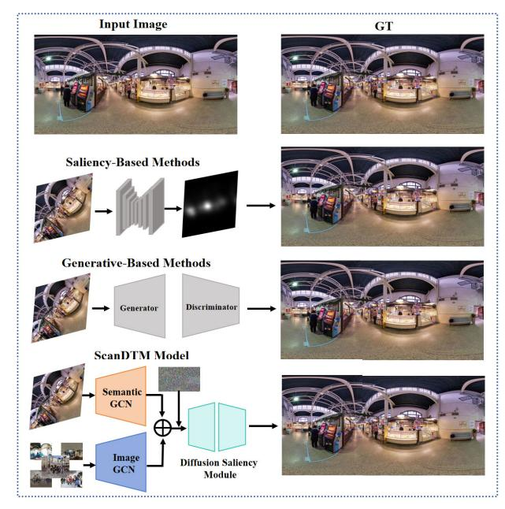

Fig. 2. Intuitive comparison between mainstream scanpath prediction methods and our proposed ScanDTM model. Saliency-based methods often show larger displacements and fewer fixation regions, whereas generative-based methods tend to ignore regions of interest. In contrast, our proposed ScanDTM model can not only generate more realistic scanpath but also focus on regions of interest.

overall model architecture is shown in Fig. [3.](#page-4-0) Our proposed dual-GCN encoder comprises a semantic-level GCN and an image-level GCN, which effectively capture long-range temporal dependencies from both local and global perspectives to generate realistic eye-viewing trajectories. Specifically, the semantic-level GCN captures spatial relations among different object regions within an image, providing temporal modeling capabilities from a local perspective. Meanwhile, the image-level GCN captures similarity relations across relevant images by leveraging similar images as complementary information, thereby capturing temporal correlations from a global perspective. With this well-designed dual-GCN, our proposed ScanDTM model is capable of generating eye-viewing trajectories that closely align with human visual behavior. Furthermore, inspired by the dual-process recognition mechanism in the human brain, and aiming to fully leverage both semantic-level and image-level GCNs, we propose a dual-GCN encoder that simulates the familiarity and recollection processes of the brain. Specifically, our semantic-level GCN emulates the familiarity mechanism in the visual cortex, effectively extracting visual features from the local receptive field. Meanwhile, our image-level GCN mirrors the recollection mechanism associated with the hippocampus, adeptly learning visual features from a global perspective. Consequently, the function and working mechanism of our dual-GCN align closely with the brain's recognition theory, reflecting the processes of familiarity and recollection.

In specific, the semantic-level GCN focuses on objects in local regions to explore spatial object-level relations, while the image-level GCN explores the similarity relations among multiple relevant images at the global level. Notably, to better capture the image-level similarity relations, we first calculate the similarity scores between different images. Subsequently, we select the images with the highest similarity scores as meaningful complementary global visual features. With the well-designed dual-GCN, we can gain a deeper understanding of the relationships between different fixation regions within a single omnidirectional image and fully leverage similar images as additional information to generate realistic scanpaths. Note that the role of the proposed dual-GCN is considered as an internal temporal regulator, which can effectively capture and characterize the temporal correlations between different fixation regions in omnidirectional images. Meanwhile, recent studies on diffusion models have shown impressive generalization capabilities and external time evolution performance in various computer vision tasks [\[13\],](#page-14-0) [\[14\],](#page-14-1) [\[15\]. M](#page-14-2)otivated by this, we propose a novel diffusion-guided saliency module to formulate the prediction issue as a conditional generative task of the saliency map by employing extracted semantic-level and image-level visual features as conditions. Benefiting from the iterative optimization denoising property of the diffusion model, ScanDTM model can iteratively reuse the diffusionguided saliency module to boost the performance of saliency prediction without retraining. The significant advantage of our proposed diffusion-guided saliency module is that it acts an external temporal modulator, which can establish temporal correlations between different fixation regions in the external temporal dimension and generate realistic scanpaths. In this way, our proposed ScanDTM model, equipped with dual-GCN encoders and diffusion-guided saliency module, can yield scanpaths that align more closely with human visual viewing behavior. Furthermore, cutting-edge neuroscience studies provide sufficient evidence that human visual working mechanism is influenced by both the history of fixations and scene information. To better simulate the human visual working mechanism, we devise a memory-based attention module that can be seamlessly and naturally incorporated in the diffusion-guided saliency module, and can effectively estimate the next fixation based on previous fixations and visual information. In summary, the main contributions of this work can be outlined in four-folds:

- We propose a novel dual-temporal modulation scanpath prediction (ScanDTM) model, which can better capture the long-range time-dependencies between different fixation regions and accurately generate scanpath that are closer to the human visual viewing mechanism.
- To better establish the temporal correlation of the generated scanpaths from both local and global perspectives, we introduce a dual-GCN as a powerful visual encoder to simultaneously capture the spatial relations among different object regions and the similarity relations among similar images.
- To the best of our knowledge, we are the first to attempt incorporating a diffusion model into the scanpath prediction task and propose a diffusion-guided saliency module. This module leverages semantic-level and imagelevel visual features to formulate the prediction issue as a conditional generative task of the saliency map. Notably, such a module can be used as an external temporal modulator and integrated with dual-GCN to form a complete

dual-temporal modulator, thus being able to generate realistic scanpaths.

• To comprehensively validate the powerful generalization ability of our proposed ScanTM model, we apply our proposed ScanDTM model to two related computer vision tasks: saliency prediction and image quality assessment. We hope that the proposed model can provide inspiration for other vision tasks.

## II. RELATED WORK

To the best of our knowledge, visual attention prediction task can be broadly classified into two categories: visual saliency prediction and visual scanpath prediction. For the visual saliency prediction task, researchers mainly focus on traditional 2D images and a series of representative works [\[16\],](#page-14-3) [\[17\],](#page-14-4) [\[18\]](#page-14-5) for estimating human visual attention have emerged. However, fewer saliency prediction methods [\[9\],](#page-13-8) [\[19\],](#page-14-6) [\[20\],](#page-14-7) [\[21\],](#page-14-8) [\[22\],](#page-14-9) [\[23\]](#page-14-10) focus on estimating human visual attention in omnidirectional images. Compared with the visual saliency prediction task, visual scanpath prediction is a more complex task that involves dynamically estimating human fixation at different time points. Existing studies [\[24\],](#page-14-11) [\[25\],](#page-14-12) [\[26\],](#page-14-13) [\[27\]](#page-14-14) primarily concentrate on visual scanpath prediction in 2D images, with only a few exploring the modeling and predicting of human scanpath when viewing omnidirectional scenes. Next, we provide an overview of related works.

# *A. Visual Attention Prediction for 2D Images*

*1) Visual Saliency Prediction for 2D Images:* Early methods [\[28\],](#page-14-15) [\[29\],](#page-14-16) [\[30\],](#page-14-17) [\[31\],](#page-14-18) [\[32\]](#page-14-19) typically utilize two well-established types of features: bottom-up and top-down features. As far as we know, classic saliency prediction methods [\[28\],](#page-14-15) [\[29\],](#page-14-16) [\[30\]](#page-14-17) usually depend on bottom-up lowlevel features, such as color, texture, orientation, and contrast, to extract distinctive features for predicting human fixations. These methods generally achieve sub-optimal performance in predicting human fixations. Consequently, some works [\[31\],](#page-14-18) [\[32\]](#page-14-19) attempt to incorporate some top-down semantic features, like human face, and text information, into bottom-up based saliency prediction methods for estimating human attention. Later, with the widespread availability and powerful learning capabilities of deep learning, various deep learningbased computer vision tasks have emerged, such as face recognition [\[33\],](#page-14-20) [\[34\],](#page-14-21) [\[35\],](#page-14-22) [\[36\],](#page-14-23) [\[37\], i](#page-14-24)mage generation [\[38\],](#page-14-25) human parsing [\[39\],](#page-14-26) semantic segmentation [\[40\],](#page-14-27) and uncrewed aerial vehicles tracking [\[41\],](#page-14-28) [\[42\].](#page-14-29) Meanwhile, numerous saliency prediction methods [\[16\],](#page-14-3) [\[17\],](#page-14-4) [\[18\]](#page-14-5) fully exploit large-scale datasets and well-performing convolutional neural networks (CNNs), achieving tremendous performance improvements compared with traditional saliency prediction methods. Furthermore, deep learning techniques are applied to the video saliency prediction task and still achieve competitive performance. For instance, Ma et al. [\[43\]](#page-14-30) propose a video saliency forecasting transformer to capture spatial-temporal dependencies between the input past frames and the target future frame, which can accurately predict the saliency map for each frame. Zhang and Chen [\[44\]](#page-14-31) propose a two-stream neural network to automatically extract saliency related feature for human fixation estimation, eliminating the need for preprocessing and post-processing techniques. Wu et al. [\[45\]](#page-14-32) introduce a deep coupled fully convolutional networks that effectively learn spatial-temporal features for predicting human fixations in videos.

*2) Visual Scanpath Prediction for 2D Images:* The cuttingedge neuroscience studies [\[46\],](#page-14-33) [\[47\]](#page-14-34) claim that the essence of scanpath prediction is an iterative process: when the human eye focuses on a position within an image, the human brain automatically selects the next location to watch. Inspired by neuroscience findings, some biologicallyinspired methods [\[48\],](#page-14-35) [\[49\],](#page-14-36) [\[50\]](#page-14-37) are proposed that leverage classic biological mechanisms, *e.g.,* inhibition-of-return (IOR) mechanism and winner-take-all (WAT) mechanism, to combine with low-level features for modeling dynamic fixation viewing behavior. Albeit achieving performance gains to a certain extent, these methods typicall employ static saliency maps during the entire scanpath prediction process and ignore the dynamic temporal correlations between different fixations. Consequently, this can lead to significant disparities between the predicted scanpath and the ground-truth human visual scanpath.

Additionally, another category of methods attempts to model dynamic visual viewing behavior by utilizing statistical techniques. The most representative methods [\[24\],](#page-14-11) [\[51\],](#page-14-38) [\[52\]](#page-14-39) often model fixation distributions by adopting the product of the saliency map and the previous fixation location. For instance, Le Meur and Liu [\[52\]](#page-14-39) first performs spatial statistics on human eye fixation patterns based on collected human scanpaths. Subsequently, they propose a dynamic scanpath prediction model that integrates the obtained saliency map, statistic information, and the IOR mechanism, which can predict the trajectory of human visual viewing movements. Meanwhile, recent works [\[53\],](#page-14-40) [\[54\]](#page-14-41) generally model fixation distributions as Gaussian density functions and predict scanpaths using hidden markov models and component analysis. Although the above methods usually formulate scanpath prediction as an iterative process and rely only on adjacent fixations to predict the location of the next fixation, ignoring the influence of previous fixation information in the long-range temporal dimension. Therefore, such methods suffer from incomplete modeling of the temporal correlation between fixations.

## *B. Visual Attention Prediction for Omnidirectional Images*

*1) Visual Saliency Prediction for Omnidirectional Images:* With the soaring development of deep learning technique, deep learning-based saliency prediction methods for 2D images have been extensively studied and have achieved competitive performance. However, omnidirectional images are inherently different from 2D images due to their larger viewports and complex viewing behaviors. Therefore, saliency prediction for omnidirectional images is a more challenging task compared to saliency prediction for 2D images.

To this end, some researchers devote themselves to better exploring specific viewing behaviors in omnidirectional images and propose a large number of saliency prediction methods [\[9\],](#page-13-8) [\[19\],](#page-14-6) [\[20\],](#page-14-7) [\[21\],](#page-14-8) [\[22\],](#page-14-9) [\[23\],](#page-14-10) [\[55\].](#page-14-42) Generally, saliency prediction methods for omnidirectional images can be divided into two categories: equirectangular projection (ERP) based methods [\[9\],](#page-13-8) [\[19\],](#page-14-6) [\[55\]](#page-14-42) and viewport-based methods [\[20\],](#page-14-7) [\[21\],](#page-14-8) [\[22\],](#page-14-9) [\[23\]. R](#page-14-10)egarding ERP-based methods [\[9\],](#page-13-8) [\[19\],](#page-14-6) [\[55\],](#page-14-42) they first pre-train the these methods on larger-scale 2D images visual attention datasets and then fine-tune them on smaller-scale datasets of omnidirectional images. It is worth mentioning that some saliency prediction methods [\[9\],](#page-13-8) [\[19\]](#page-14-6) for omnidirectional images are devised based on conventional saliency prediction methods for 2D images. For viewport-based methods [\[9\],](#page-13-8) [\[19\],](#page-14-6) [\[55\],](#page-14-42) they typically extend well-designed 2D saliency prediction methods into the omnidirectionla images with multiple viewport planes, and such methods can significantly reduce projection distortions.

*2) Visual Scanpath Prediction for Omnidirectional Images:* Similar to scanpath prediction methods for 2D images, scanpath prediction methods for omnidirectional images are classified into two categories: saliency-based methods [\[9\],](#page-13-8) [\[10\],](#page-13-9) [\[56\]](#page-14-43) and generative-based methods [\[11\],](#page-13-10) [\[12\].](#page-13-11) For saliency-based methods, the general pipeline involves first generating the saliency map by extracting low-level and highlevel features. Subsequently, they employ sampling strategies, such as maximizing information gains [\[10\]](#page-13-9) and stochastic methods [\[9\],](#page-13-8) [\[56\], t](#page-14-43)o sample the saliency maps and produce scanpaths. While for generative-based methods, they usually devise a series of generative manners by learning from human data to produce scanpaths. The most representative method, PathGAN [\[11\], i](#page-13-10)s originally devised for 2D images and then fine-tune on the Salient360! [\[57\]](#page-14-44) dataset to make it suitable for omnidirectional images. However, similar to the PathGAN method, the scanpaths generated by such methods often lose their spherical characteristics because they assume that omnidirectional images are similar to 2D images. To tackle this issue, Martin et al. [\[12\]](#page-13-11) propose a scanpath prediction method based on sphere convolutional neural network (SCNN), which can effectively learn image and coordinate representations and accurately estimate the scanpath. Although the aforementioned methods make progress in performance, they still face difficulties in providing a comprehensive solution for effectively modeling the dynamic viewing behavior with long-range timedependency in omnidirectional scenes.

# *C. Graph Convolutional Networks for Saliency Prediction*

To the best of our knowledge, GNNs are designed to capture dependencies within a graph by enabling message passing between its nodes. Unlike conventional neural networks, GNNs not only represent the information of the node itself but also capture information from its neighbors at arbitrary depths. Thanks to their ability to capture the relationships and dependencies between nodes in graphs, GNNs have been introduced to the saliency prediction task for omnidirectional images, effectively reducing projection distortions and enhancing performance. For instance, Chen et al. [\[58\]](#page-14-45) propose an intra- and inter-reasoning GNN for saliency prediction on omnidirectional images, named SalReGCN360, which

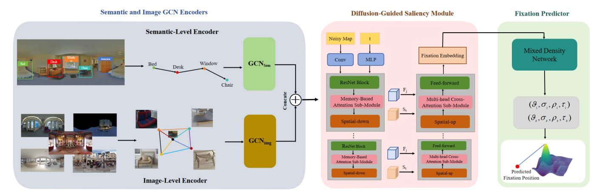

Fig. 3. An overview of the proposed ScanDTM model. ScanDTM model first captures spatial object-level relations and similarity relations by using semantic-level and image-level encoders, respectively. Then the diffusion-guided saliency module takes the integrated semantic-level and image-level features as the conditions to guide the model in generating the saliency map from the noisy map. Finally, we employ a mixed density network (MDN) that takes the fixation embedding yielded by the diffusion-guided saliency module as input and predict the next fixation position. Notably, to better simulate the human visual working mechanism, we incorporate a memory-based attention sub-module into the diffusion-guided saliency module. This module can effectively predict the next fixation by utilizing previous fixation features and visual information.

effectively integrates semantic information from different images and significantly improve performance. Subsequently, Yang et al. [59] propose a graph-based fully convolutional network (SalGFCN) for saliency prediction on omnidirectional images, which adeptly projects omnidirectional pixels onto spherical graph structures for feature representation. Similarly, GNNs [60] are also applied to the co-saliency detection task and achieve significant performance improvements compared to other state-of-the-art CNNs-based methods. Despite the significant performance gains GNNs have achieved in saliency and co-saliency prediction tasks, relatively few studies have adopted GNNs for scanpath prediction.

### D. Diffusion Models for Saliency Prediction

In recent years, diffusion models have gained significant attention due to their realistic generative results and strong generalization ability. Notably, unlike conventional generative adversarial networks (GANs), Notably, different from conventional generative adversarial networks (GANs), the core pipeline of diffusion models first adopts the Markov process to introduce noise into the training data, and then trains deep neural networks to denoise it. Following this pipeline, diffusion models achieve impressive performance in various generative tasks, such as image generation [61], [62], [63], video generation [64], [65], and any-to-any generation [15], [66], among others. Beyond generative tasks, diffusion models have shown to be highly effective in saliency prediction tasks. For instance, Xiong et al. [67] propose a DiffSal model, which formulates the prediction issue as a conditional generative task for the saliency map by using the input video and audio as conditions. Subsequently, Aydemir et al. [68] introduce a data augmentation method with latent diffusion for saliency prediction, which edits natural images while preserving the variability and complexity of real-world scenes to enhance the performance of saliency prediction. However, relatively few works have attempted to utilize diffusion models as temporal modulators for scanpath prediction, which inspired the development of the proposed ScanDTM in this work to

fully explore the potential of diffusion models for scanpath prediction.

#### III. PROPOSED MODEL

In this section, we introduce a novel dual-temporal modulation scanpath prediction (ScanDTM) model in detail. Specifically, the main goal of our proposed ScanDTM model is to accurately estimate scanpaths that closely align with the human visual viewing mechanism. Fig. 3 illustrates the overall architecture of our proposed ScanDTM model, which consists of three main components: a dual-GCN encoder, a diffusion-guided saliency module, and a fixation predictor. Notably, our proposed ScanDTM model predicts scanpaths in free-viewing scenes without relying on any guiding information.

Given an omnidirectional image I, we utilize the predicted scanpath  $S_c$  to describe the dynamic human visual viewing behavior when observing an omnidirectional scene. The detailed pipeline of the proposed ScanDTM model is as follows: firstly, we employ the widely-used object detector Faster-RCNN [69] to detect a series of objects  $M_{obj} = \{v_i\}_{i=1}^{O}$ , where O denotes different object regions in an image, and  $v_i$  denotes a C dimensional feature representation for the ith object region. Then, we employ a semantic-level GCN encoder and an image-level GCN encoder to capture the spatial relations between objects within the same image and the similarity relations among relevant images at the image-level, respectively. Afterwards, the semantic-level and image-level features are concatenated and fed into a diffusion-guided saliency module as conditions to progressively guide the model to generate realistic saliency maps from noisy maps. Finally, we propose a mixed density network (MDN) to predict the next fixation position by using the fixation embedding from diffusion-guided saliency module as input. In the following subsections, we will introduce each component of our proposed ScanDTM model in detail.

## A. Dual-GCN Encoder

In omnidirectional images, the majority of objects are generally treated as salient and semantic targets by human visual perception mechanisms. In order to better characterize the spatial relationships between different salient objects (*i.e.* fixation regions) within omnidirectional images from a local perspective, and to capture the similarity relations among multiple images from a global perspective, we propose a dual-GCN encoder comprising a semantic-level encoder and an image-level encoder.

1) Semantic-Level GCN: Our devised semantic-level GCN aims to establish spatial relations among different objects. Specifically, each feature extracted from an object region is regraded as a vertex, and the relative positions between different objects are represented as directed edges. Based on the above formulations, we construct a spatial graph  $G_{sem} = (V_{sem}, E_{sem})$ , where  $E_{sem} = \{(v_i, v_j)\}$  denotes the set of spatial relation edges between region vertices. Here,  $(v_i, v_j)$  denotes the sequential relationship between  $i^{th}$  and  $j^{th}$  objects. The detailed implementation process of constructing a spatial graph is as follows: Firstly, we employ the relative distance and relative angle between two objects as the relative geometry relations to build edges. The constructed edges include front, behind, overlap, and no relation, etc. Then, each vertex  $v_i$  is defined by using the modified GCN as follows:

$$v_i^{sem} = \sigma(\sum_{v_i \in N(v_i)} T_{v_i \to v_j} v_j + b_{v_j \to v_i}), \tag{1}$$

where  $v_i$  is the node information in the graph, and it is a vector of real values.  $N(v_i)$  represents the set of neighboring vertices of  $v_i$ , and  $\sigma$  indicates the activation function.  $T_{v_i \to v_j}$  and  $b_{v_j \to v_i}$  represent the transformation matrix and bias parameter, respectively.  $v_j \to v_i$  denotes the direction from  $v_j$  to  $v_i$ , indicating that  $v_i$  is treated earlier than  $v_j$  along the time dimension.

2) Image-Level GCN: In the scanpath prediction task, conventional methods typically find that extracting features from a single omnidirectional image is insufficient to capture distinctive regions and cannot accurately estimate the realistic scanpath. To this end, we propose an image-level GCN that enhances feature representation ability and information flow within the graph by incorporating relevant information from other images. To be specific, we can clearly observe that images with higher similarity to a given image can serve as auxiliary information for predicting the scanpath of the given image. We assume that  $\tilde{v}_j$  represents the latent feature of  $j^{th}$  given image, which includes a set of objects  $V^j_{sem} = \{v^{sem}_i\}_{i=1}^O$ . The specific formula is defined as follows:

$$\tilde{v}_j = \frac{1}{O} \sum_{i=1}^{O} v_i^{sem}.$$
 (2)

With the obtained latent feature representation, we aim to find similar images  $\tilde{v}_s \in \Phi(\tilde{v}_j)$  based on the  $L_2$  distance between the features of the given image and the features of relevant images from the same dataset. The detailed implementation can be formulated as follows:

$$\tilde{v}_s \in \Phi(\tilde{v}_j) := \left[ \sum_{d=1}^C (\tilde{v}_s^d - \tilde{v}_j^d)^2 \right]_{\nu}, \tag{3}$$

where C denotes the feature dimension, and  $[\cdot]_K$  represents the selection of K images with the smallest distance values. Upon obtaining the top K images, we can establish an image-level graph  $G_{img} = (V_{img}, E_{img})$ , where the image features serve as nodes  $V_{img}$  and the similarity between paired images serve as edges  $E_{img}$ . Subsequently, we perform encoder operation for each image node in the graph:

$$\mu_j^{img} = \sigma(\sum_{\tilde{v}_s \in \Phi(\tilde{v}_j)} T\tilde{v}_s + b), \tag{4}$$

where  $\Phi(\tilde{v}_j)$  indicates the set of similar images of  $\tilde{v}_j$ . In our constructed image-level graph,  $\mu_j^{img}$  denotes the feature of a given image and its corresponding K nearest neighbor images.

3) Feature Embedding Integration: After completing semantic-level and image-level GCN modeling, it is essential to integrate the semantic-level GCN into the image-level GCN to fully leverage the complementary advantages from both global and local perspectives. Concretely, we concatenate the features extracted from the semantic-level GCN with those from the image-level GCN as inputs to the diffusion-guided saliency module for predicting the saliency map. The specific concatenation operation is formulated as follows:

$$F_{j} = Concat(V_{sem}^{j}, \mu_{j}^{img})$$

$$= [concat(v_{1}^{sem}, \mu_{i}^{img}), \dots, concat(v_{Q}^{sem}, \mu_{i}^{img})], \quad (5)$$

where  $F_j$  denotes the concatenated feature from the given image and other similar images. Such a feature embedding integration operation integrates the properties of each semantic object in the given image locally and the contextual object information from other similar images globally. Afterwards, the global and local visual feature embeddings are fed into a diffusion-guided saliency module to generate a more accurate saliency map.

## B. Diffusion-Guided Saliency Module

To the best of our knowledge, the main goal of dual-GCN modeling is to effectively capture the temporal correlation between different human visual fixations in omnidirectional images, which acts an internal temporal regulator. To further enhance the capability of capturing long-range dynamic time-dependencies between different human fixations in the scanpath prediction task, we devise a novel diffusion-guided saliency module with the memory-based attention sub-module and the multi-head attention sub-module. Note that this module serves as an external temporal modulator. When equipped with the internal temporal regulator of the dual-GCN encoder, this dual-temporal modulator can provide a comprehensive treatment of time-dependency in predicting human scanpaths.

Specifically, our devised diffusion-guided saliency module leverages the concatenated features  $F_j$  from the semantic-level GCN and the image-level GCN as conditions, aiming to guide the ScanDTM model in generating the saliency map  $\tilde{S}_g$  from the noisy map  $S_t$ :

$$\tilde{S}_g = g_{\vartheta}(S_t, t, F_j), \tag{6}$$

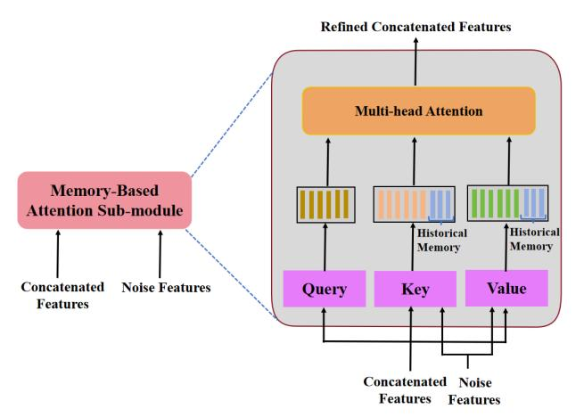

Fig. 4. An overview of the memory-based attention sub-module in the feature encoding component.

where  $S_t = \sqrt{\alpha_t}S_g + \sqrt{1-\alpha_t}\varepsilon$  denotes the noisy map,  $\varepsilon$  represents noise from a Gaussion distribution, and  $t \in \{1, 2, ..., T\}$  denotes the random diffusion step.

More specifically, our devised diffusion-guided saliency module comprises a feature encoding component and a feature decoding component, as shown in Fig. 3. Regarding the feature encoding component, it takes the concatenated feature  $F_i$  and the noisy feature map  $S_t$  as inputs, and utilizes multiple ResNet blocks with the memory-based attention submodule to progressively enhance the feature representation ability. As for the feature decoding component, its goal is to utilize the encoded features with memory (historical fixation) information to progressively decode salient feature, closely aligning with the human visual viewing mechanism. Notably, the feature decoding component not only captures the temporal correlation between different salient features but also progressively improves the feature representation capability. After performing feature decoding component, we can obtain feature embedding to predict the saliency map  $S_g$ . The entire diffusion-guided saliency module includes four layers of ResNet stages for feature encoding and four layers of multihead cross-attention for feature decoding.

To achieve more accurate saliency prediction in our proposed diffusion-guided saliency module, we introduce the memory-based attention sub-module in the feature encoding component and the multi-head cross-attention sub-module in the feature decoding component.

1) Memory-Based Attention: The majority of existing scanpath prediction methods mainly rely on visual information extracted from the current timestamp and several neighboring timestamps, rather than considering historical fixation information over long-range time dimensions. These methods incur inferior performance in estimating scanpaths. In other words, historical visual features are essential for accurately predicting human scanpaths and are considered memory information that must be taken into account when modeling human visual attention. To this end, we elegantly integrate the memory-based attention sub-module into the feature encoding component to capture the influence of past historical fixation information on current fixation prediction. The detailed structure of the proposed memory-based attention sub-module is

shown in Fig. 4. As shown in Fig. 4, the concatenated features and noisy features are fed into the memory-based attention sub-module to further enhance the feature representation ability within the feature encoding component. Specifically, in the feature encoding process, historical fixation information is simultaneously considered as the historical memory for the keys and values matrices. Subsequently, we employ multi-head attention in our proposed memory-based attention sub-module to further enhance the feature representation capability with the historical memory information. The feature encoding results from different heads are concatenated to obtain the refined concatenated features. Consequently, the devised memory-based attention sub-module can effectively exploit historical fixation features (i.e. memory information) by incorporating learnable key matrix K and value matrix Vacross long-range time dimensions to accurately predict the scanpath. The specific process is formulated as follows:

$$K^{i} = \left[\omega_{k}^{i} S_{t}, \omega_{sk}^{i} F_{j}\right],$$

$$V^{i} = \left[\omega_{v}^{i} S_{t}, \omega_{sv}^{i} F_{j}\right],$$

$$Head_{i} = Attention(\omega_{q}^{i} F_{j}, K^{i}, V^{i}),$$

$$\tilde{F}_{j} = [Head_{1}, \dots, Head_{h}]\omega^{o},$$
(7)

where  $\omega_k^i$ ,  $\omega_v^i$ ,  $\omega_{sk}^i$ ,  $\omega_{sv}^i$ ,  $\omega_q^i$  and  $\omega^o$  represent the learnable matrix parameters.  $\omega_{sk}^i F_j$  and  $\omega_{sv}^i F_j$  indicate the historical fixation memory.  $[\cdot,\cdot]$  denotes the concatenation operation. In this way, we can obtain the features with stronger representation ability along with the role of historical fixation memory information.

Notably, the historical visual information serves as historical memory for the key and value matrices, which store a set of past visual features. To better explore and enhance the intrinsic relationships between historical visual information and current fixation information, we devise a memory-based attention submodule. Unlike methods that treat past learned information as hyperparameters, our memory-based attention sub-module incorporates stacks of self-attention layers, encoding both historical and current fixation information through intramodal interactions. Consequently, the sub-module can mine intrinsic relationships by incorporating learnable key and value matrices, particularly when past historical visual information is poorly recorded.

2) Multi-Head Cross-Attention: In the feature decoding component, we employ a multi-head cross-attention submodule to focus on various aspects of the semantic fixation sequences and capture more complex relationship within these sequences simultaneously. To be specific, given concatenated features  $F_j$ , and noise features  $S_t$ , we first perform linear transformation on both feature  $F_j$  and  $S_t$  to obtain query, key, and value:

$$Q_{\Upsilon} = W_{\Upsilon}^{Q} \cdot S_{t}, \quad K_{\Upsilon} = W_{\Upsilon}^{K} \cdot F_{j}, \quad V_{\Upsilon} = W_{\Upsilon}^{V} \cdot F_{j}, \quad (8)$$

where  $W_{\Upsilon}^Q$ ,  $W_{\Upsilon}^K$ , and  $W_{\Upsilon}^V$  denote the linear transformation matrices, and  $\Upsilon$  represents the  $\Upsilon^{th}$  attention head.

Subsequently, we calculate the attention value using the  $\Upsilon$  head:

Attention 
$$\gamma = (Q_{\Upsilon}, K_{\Upsilon}, V_{\Upsilon}) = softmax(\frac{Q_{\Upsilon} \cdot K_{\Upsilon}^{T}}{\sqrt{d_{k}}} \cdot V_{\Upsilon}),$$
(9)

where  $d_k$  denotes the dimension of the key vector.

Finally, we concatenate the outputs of all the heads and perform a linear transformation:

= 
$$W^O \cdot [Attention_1, Attention_2, \dots, Attention_h], (10)$$

where  $W^O$  denotes the linear transformation matrix, and  $[\cdot,\cdot]$  represents the concatenation operation. Notably, the feature decoding component comprises four layers of the multi-head cross-attention stage. After performing multi-head cross-attention, we can generate superior fixation feature embeddings  $F_t^e$  at timestamp t to predict the next fixation position. Such a multi-head cross-attention not only significantly improves computational efficiency but also greatly enhances the capability to represent diverse features.

### C. Fixation Predictor

To our knowledge, the distribution of fixation within a visual scanpath is generally multi-modal, which indicates that multiple possible fixations need to be considered. To this end, we employ a mixture density network (MDN) to predict the probability distribution of the next fixation, as the MDN can explicitly model the stochastic nature of the human visual viewing mechanism. Specifically, the MDN takes the fixation feature embedding generated by the diffusion-guided saliency module as input and predicts z sets of Gaussian distribution parameters, consisting of means  $\mu$ , correlations  $\rho$ , standard deviations  $\xi$ , and mixture weights  $\pi$ . The proposed MDN is based on a two-layer perceptron that consists of a hidden layer and a ReLu (Rectified Linear Unit) activation layer. Formally, we utilize the Z Gaussian to model the probability distribution, defined as follows:

$$F_{MDN}(F_t^e; \theta_{MDN}) = \{\tilde{\mu}_t^i, \tilde{\xi}_t^i, \tilde{\rho}_t^i, \tilde{\pi}_t^i\}_{i=1}^Z,$$
(11)

where  $F_t^e$  denotes the fixation feature embedding obtained by the diffusion-guided saliency module at timestamp t, and  $\theta_{MDN}$  represents the parameters consisting of weights and biases for the MDN.

To achieve a reasonable probability distribution, we need to normalize the parameters of the MDN, and this process is represented as follows:

$$\mu_t^i = \tilde{\mu}_t^i,$$

$$\xi_t^i = exp(\tilde{\xi}_t^i),$$

$$\rho_t^i = tanh(\tilde{\rho}_t^i),$$

$$\pi_t^i = \frac{exp(\tilde{\pi}_t^i)}{\sum_{i=1}^Z exp(\tilde{\pi}_t^i)},$$
(12)

where  $\mu_t^i$ ,  $\xi_t^i$ ,  $\rho_t^i$ , and  $\pi_t^i$  denote the normalized parameters of the Gaussian distribution.

Finally, we predict the next fixation position based on the estimated probability distribution map, with the pixel location having the highest probability considered as the next fixation:

$$\tilde{p}_t = \underset{p \in \Omega}{\arg \max} (\sum_{i=1}^{Z} \pi_t^i \mathcal{N}(p_t | \mu_t^i, \xi_t^i, \rho_t^i)), \tag{13}$$

where  $\mathcal{N}$  denotes the bivariate normal distribution, and  $\Omega$  denotes the collection of fixation position coordinates, and  $\tilde{p}_t$  represents the predicted fixation coordinates.

### IV. EXPERIMENTS

In this section, we conduct extensive experiments on several benchmark datasets to validate the effectiveness of our proposed ScanDTM model. Firstly, we provide a brief introduction to the omnidirectional image datasets and widely used evaluation metrics. Subsequently, to facilitate the reproduction of our proposed ScanDTM model, we present detailed implementation details. Thirdly, to comprehensively assess the superiority of our ScanDTM model, we conduct qualitative and quantitative comparisons with other stateof-the-art scanpath prediction methods on four benchmark datasets. Fourthly, we perform ablation experiments to analyze the role of each component in our proposed model. Fifthly, we presents a discussion to explore the influence of displacement bias on scanpath prediction performance. Finally, to validate the generalization ability of the proposed model, we elegantly apply it to two downstream tasks: saliency prediction and quality assessment for omnidirectional images.

## A. Dataset

In our experiments, we systematically compare the performance of our model using four commonly used datasets. To be specific, these four datasets include Salient360! [57], AOI [23], Sitzmann [70], and JUFE [71]. Salient360! dataset contains training set and benchmark set. In this experiment, we only utilize the training set of the Salient360! dataset for comparison, as the benchmark set is not publicly available. The training set comprises 85 images and their corresponding 3,036 scanpaths. In this experiment, we only utilize the training set of the Salient360! dataset for comparison, as the benchmark set is not publicly available. Sitzmann dataset includes 22 images and their corresponding 1,980 scanpaths, with 19 images for training and the remaining for testing. JUFE dataset is originally collected for quality assessment and subsequently used for scanpath prediction. It comprises 1,032 images and 30,960 corresponding scanpaths. For both AOI and JUFE datasets, we randomly choose 20% of the images for testing. To ensure a more objective comparison, we sample the raw scanpath at 1 Hz for each dataset to obtain the groundtruth (GT). Notably, the scanpaths of the AOI dataset are not post-processed, as the authors have already conducted this operation.

## B. Evaluation Metrics

To make a fair and objective comparison, we adopt three commonly used metrics to evaluate the performance of our

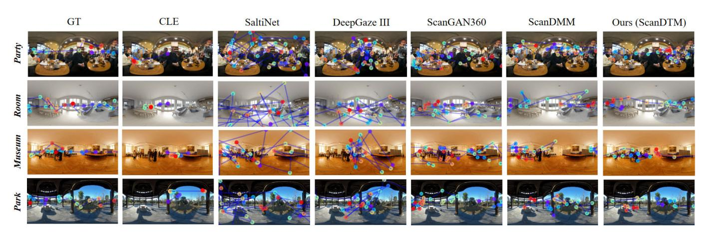

Fig. 5. Qualitative comparison of various scanpath prediction methods across four different scenes. From top to down: the party from the AOI [\[23\]](#page-14-10) dataset, the room from the Sitzmann [\[70\]](#page-15-9) dataset, the museum from the Salient360! [\[57\]](#page-14-44) dataset, and the park from the JUFE dataset. From left to right: scanpath prediction results obtained by humans, scanpath results yielded by CLE [\[24\], S](#page-14-11)altiNet [\[9\], D](#page-13-8)eepGaze III [\[26\], S](#page-14-13)canGAN360 [\[12\], S](#page-13-11)canDMM [\[72\], a](#page-15-11)nd our proposed ScanDTM model.

model. These three metrics include dynamic time warping (DTW), Levenshtein distance (LEV), and recurrence measure (REC). Notably, smaller DTW and LEV values, as well as higher REC values, indicate better performance. Specifically, for an image with *N* GT scanpaths *x* 1:*N* , we can yield *N*˜ = *N* fake scanpaths *x*˜ 1:*N*˜ for comparison. It is worth mentioning that the lengths of the yielded scanpaths are equal to the viewing time. During the comparison process, we use these three metrics to compare a set of predicted scanpaths with their corresponding ground truth (GT) scanpaths. Notably, to mitigate evaluation bias caused by randomly generated scanpaths, we conduct 10 tests for each generative model and average the results to obtain the final performance. When performing quantitative comparison, we compare each GT scanpath with all the others and average these results.

# *C. Implementation Details*

In our proposed ScanDTM model, we train on the Sitzmann [\[70\]](#page-15-9) dataset. To facilitate the convergence of our model, we perform data augmentation operation on the Sitzmann dataset. We utilize a longitudinal manner to shift omnidirectional images and adjust the corresponding scanpaths sequentially, resulting in 19 × 6 = 114 images for training. Our proposed model includes semantic-level and image-level GCNs, and we provide a detailed implementation process from two perspectives. For the semantic-level GCN, we first employ Faster-RCNN [\[69\]](#page-15-8) to detect object regions in each omnidirectional image. Then, we adopt the nonmaximum suppression (NMS) method [\[73\]](#page-15-12) to eliminate redundant overlapping bounding boxes and retain the most representative ones. Afterward, we calculate the center point location using the four vertex positions, treating each bounding box's center point as a node (*i.e.* fixation region). Next, we calculate the distance between the two center point locations directly and rank these distances from smallest to largest. Based on this distance metric, we sequentially build edges between the objects. By iterating the above process, we construct a graph with temporal correlation for all human fixations. As for the image-level GCN, after applying the NMS constraint to each image, we aggregate all objects by summing them together and averaging to obtain the final objects for a single image. Then, we select one image as the target image and utilize a similarity method to compute similarity values between the target and other source images. Subsequently, we select the top 6 images as nodes and build edges based on the similarity values of these images. In this way, we can build the image-level GCN to capture the temporal dependency of fixations. After obtaining semantic-level and image-level GCNs, we concatenate the semantic and image-level features and store these combined features into a dictionary.

The diffusion-guided saliency module in our proposed model generates noisy saliency maps by introducing controlled corruption to ground-truth saliency maps, training the module specifically for denoising. Gaussian noise, scaled by the parameter α*t* , is added to these ground-truth saliency maps to produce noisy samples. Here, α*t* is a pre-defined monotonically decreasing cosine schedule, applied at each sampling step *t*. During inference, our proposed ScanDTM model gradually denoises noisy saliency maps sampled from a Gaussian distribution, refining prediction results over multiple sampling steps. At each step, our devised diffusion-guided saliency module takes in either a randomly initialized noisy saliency maps or the predicted saliency maps from the previous step, progressively generating more refined saliency maps.

During training, we utilize Adam as the optimizer with a learning rate set to 0.0001. In our diffusion-guided saliency module, the total number of sampling steps is set to 1000, and the whole training process is set 10 epochs. The batch size for all experiments is 20, and the iterative denoising step is set to 4. For the MDN, the hidden layer size is set to 16, and the Gaussian kernel size is set to 5. All experiments are conducted on a platform equipped with 4 NVIDIA GeForce RTX 3090 GPUs and using the PyTorch framework.

## *D. Performance Comparison*

To more comprehensively and systematically assess the performance of the proposed ScanDTM model, we conduct comparison from both quantitative and qualitative perspectives. Concretely, we compare our proposed ScanDTM model with other state-of-the-art methods, including CLE [\[24\],](#page-14-11) SaltiNet [\[9\], D](#page-13-8)eepGaze III [\[26\],](#page-14-13) ScanGAN360 [\[12\],](#page-13-11) and ScanDMM [\[72\]. A](#page-15-11)mong these, CLE and SaltiNet are scanpath prediction methods for conventional 2D images, while the other methods are specifically designed for omnidirectional images. Notably, since SaltiNet and DeepGaze III require large-scale datasets for training, we choose the pre-trained weights of these methods to mitigate the issue of overfitting on small omnidirectional images. Furthermore, although Zhu et al. [\[10\]](#page-13-9) and PathGAN [\[11\]](#page-13-10) are scanpath prediction methods devised for omnidirectional images, they obtain suboptimal results in scanpath prediction. Hence, we refrain from directly comparing these two methods in our experiments.

*1) Qualitative Comparison:* To validate the superiority of our proposed ScanDTM model, we perform visual comparisons with other scanpath prediction methods. The visualization results are shown in Fig. [5.](#page-8-0) From Fig. [5,](#page-8-0) we can clearly observe that there are large displacements in the scanpaths generated by CLE and DeepGaze III when compared to the ground-truth (GT). The main reason for these discrepancies lies in the fact both these methods are tailored for traditional 2D images rather than being suitable for omnidirectional images. Furthermore, as depicted in Fig. [5,](#page-8-0) the SaltiNet method shows unstable viewing behavior with larger displacements and sparse focal regions, which is particularly evident in room and museum scenes. Notably, our proposed ScanDTM model exhibits a remarkable ability to focus on salient objects across all scenes, with relatively smaller displacements compared to ScanDMM methods. In summary, the scanpath results generated by our proposed model significantly outperform other methods and closely approximate the GT.

*2) Quantitative Comparison:* To objectively evaluate the performance of our proposed ScanDTM model, we conduct a comparative analysis with recent state-of-the-art methods from a quantitative perspective. Meanwhile, to ensure fairness, we employ three commonly used evaluation metrics to perform comparison. The comparison results of different scanpath methods are reported in Table [I.](#page-10-0) From Table [I,](#page-10-0) we can clearly observe that our proposed ScanDTM model consistency outperforms the other five methods across all datasets and metrics. It is particularly noteworthy that the performance improvement of our model is most significant on the AOI dataset. For instance, compared to the secondbest method, ScanDMM, our model achieves an REC increase from 4.024 to 6.348, a LEV decrease from 12.127 to 9.892, and a DTW decrease from 537.504 to 392.478. In summary, both qualitative and quantitative experiments demonstrate the superior capability of our model in generating realistic scanpaths.

## *E. Ablation Study*

In this subsection, we conduct comprehensive ablation experiments to validate the effectiveness of the key components in our proposed ScanDTM model. Furthermore, to demonstrate the advantages of reduced displacements achieved by our proposed ScanDTM model in generating scanpaths, we provide a visual comparison with other scanpath prediction methods.

- *1) Effect of Main Components:* In this subsection, we conduct ablation experiments to investigate the impact of the dual-GCN encoder and the diffusion-guided saliency module in our proposed ScanDTM model. Specifically, we compare our model with three baselines: (1) *Scan DT MI GC N* , refers to our ScanDTM model that utilizes only the image-level GCN encoder without using the semantic-level GCN encoder; (2) *Scan DT MSGC N* denotes our ScanDTM model that employs only the semantic-level GCN encoder instead of using the image-level GCN encoder; (3) *Scan DT MS I GC N* indicates that our ScanDTM model removes the diffusion-guided saliency module while being equipped with both semantic-level and image-level GCN encoders. Notably, all baseline models are trained under the same settings, and comparative results are presented in Table [II.](#page-10-1) From Table [II,](#page-10-1) we can clearly observe that our proposed ScanDTM model with both dual-GCN encoders and diffusion-guided saliency module achieve the best performance compared to the other three baselines.
- *2) Effect of Temporal Modulators:* To validate the effectiveness of our proposed ScanDTM model with the dual-GCN temporal modulator for scanpath prediction, we conduct comparative experiments between dual-GCN and other temporal modulators, such as long short-term memory (LSTM), recurrent neural network (RNN), and Transformer. Notably, except for the temporal modulator, all other model structures remain unchanged. The detailed quantitative results are reported in Table [III.](#page-11-0) From Table [III,](#page-11-0) it is clear that when using ScanDTM + RNN, the LEV, DTW, and REC values on both datasets significantly worsen. However, when we replace the dual-GCN with the Transformer on the Salient360 dataset, the results change significantly: the LEV value reaches 39.273, the DTW reaches 1824.021, and the REC value reaches 3.728, all of which are clearly worse than those of the proposed model with dual-GCN. Therefore, these results indicate that the effectiveness of our proposed model with dual-GCN in capturing long-range time dependencies across different fixation regions in both local and global time dimensions.
- *3) Effect of the Iterative Denoising Step:* The main goal of our proposed diffusion-guided saliecy module is to further enhance the ability to capture long-range time-dependencies across different fixation regions, which also serving as an external temporal modulator. To the best of our knowledge, the core of the diffusion-guided saliency module is the reverse diffusion process, which aims to restore the saliency map from a pure noise sample through learning. Therefore, the number of iterative denoising steps is crucial to the final performance. To more intuitively demonstrate the effect of iterative denoising step on final performance using several evaluation metrics, we conduct ablation experiments on the Salient360 and AOI datasets, and the results are shown in Fig. [7.](#page-11-1) From Fig. [7,](#page-11-1) as the number of denoising steps increases, there is a steady performance improvements. It is worth noting that when the number of denoising steps exceeds 4, the performance of scanpath prediction obviously worsens. Therefore, we can conclude that setting the number of denoising steps to 4 is optimal, as it achieves a good balance between performance and computational cost.

TABLE I QUANTITATIVE COMPARISON OF VARIOUS SCANPATH PREDICTION METHODS ON FOUR BENCHMARK DATASETS. THE BEST PERFORMANCE IS HIGHLIGHTED IN BOLD

| Datasets          | Sitzmannn |          |       | Salient360! |          |       |  |
|-------------------|-----------|----------|-------|-------------|----------|-------|--|
| Methods           | LEV ↓     | DTW ↓    | REC ↑ | LEV ↓       | DTW ↓    | REC ↑ |  |
| CLE [24]          | 45.176    | 1967.286 | 3.130 | 39.744      | 1714.409 | 3.323 |  |
| DeepGaze III [26] | 46.424    | 1992.859 | 3.082 | 40.006      | 1742.351 | 2.588 |  |
| SaltiNet [9]      | 51.370    | 2305.099 | 1.564 | 40.848      | 1855.477 | 2.305 |  |
| ScanGAN360 [12]   | 44.080    | 1967.282 | 3.245 | 38.928      | 1722.709 | 3.095 |  |
| ScanDMM [72]      | 44.966    | 1965.427 | 3.475 | 37.272      | 1528.592 | 3.576 |  |
| Ours (ScanDTM)    | 42.081    | 1962.024 | 3.678 | 35.378      | 1384.094 | 4.672 |  |
| Datasets          | AOI       |          |       | JUFE        |          |       |  |
| Methods           | LEV ↓     | DTW ↓    | REC ↑ | LEV ↓       | DTW ↓    | REC ↑ |  |
| CLE [24]          | 12.856    | 547.892  | 3.617 | 24.844      | 1172.150 | 3.013 |  |
| DeepGaze III [26] | 13.155    | 558.445  | 2.892 | 24.129      | 1104.848 | 2.774 |  |
| SaltiNet [9]      | 14.695    | 596.544  | 2.244 | 26.074      | 1287.144 | 1.540 |  |
| ScanGAN360 [12]   | 12.609    | 552.368  | 3.743 | 24.109      | 1095.362 | 3.068 |  |
| ScanDMM [72]      | 12.127    | 537.504  | 4.024 | 23.091      | 1086.014 | 4.329 |  |
| Ours (ScanDTM)    | 9.892     | 392.478  | 6.348 | 21.204      | 1042.738 | 7.356 |  |

TABLE II ABLATION EXPERIMENTS OF DIFFERENT COMPONENTS IN OUR SCANDTM MODEL. THE BETTER RESULTS ARE HIGHLIGHTED IN BOLD

| Datasets                         |        | Salient360! |       | AOI    |          |       |  |
|----------------------------------|--------|-------------|-------|--------|----------|-------|--|
| Methods                          | LEV ↓  | DTW ↓       | REC ↑ | LEV ↓  | DTW ↓    | REC ↑ |  |
| ${\sf ScanDTM}_{IGCN}$           | 44.286 | 1978.296    | 3.209 | 42.385 | 1727.438 | 3.014 |  |
| $ScanDTM_{SGCN}$                 | 42.253 | 1968.203    | 3.334 | 41.265 | 1702.376 | 3.293 |  |
| $\operatorname{ScanDTM}_{SIGCN}$ | 39.016 | 1838.215    | 3.629 | 37.028 | 1503.247 | 4.152 |  |
| ScanDTM                          | 35.378 | 1384.094    | 4.672 | 9.892  | 392.478  | 6.348 |  |

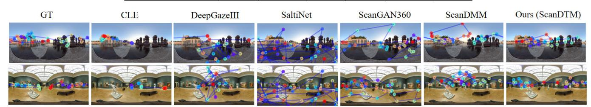

Fig. 6. An intuitive comparison of displacement biases among different methods for generating scanpaths on the Sitzmann and Salient360! datasets. The first row is from the Sitzmann dataset, while the second row is from the Salient360! dataset.

# *F. Time Complexity Analysis*

A desirable scanpath prediction model should achieve a better balance between performance and computational cost. However, most existing scanpath prediction methods achieve performance improvements primarily relying on deeper and wider neural networks, which usually incur higher computational costs. Here, to intuitively demonstrate the time complexity of our proposed model, we perform its computational costs with those of 5 other methods in terms of model size and running time on the Salient360! dataset. The detailed comparative results are reported in Table [IV.](#page-11-2) From Table [IV,](#page-11-2) the model size and running time of our proposed ScanDTM model are not optimal compared to other scanpath prediction methods. Therefore, achieving a better

TABLE III
ABLATION EXPERIMENTS OF DIFFERENT TEMPORAL MODULATORS IN OUR SCANDTM MODEL. THE BETTER RESULTS ARE HIGHLIGHTED IN BOLD

| Datasets              | Salient360! |          |       | AOI    |          |       |  |
|-----------------------|-------------|----------|-------|--------|----------|-------|--|
| Methods               | LEV ↓       | DTW ↓    | REC ↑ | LEV ↓  | DTW ↓    | REC ↑ |  |
| ScanDTM + RNN         | 48.686      | 1983.304 | 3.009 | 44.889 | 1745.037 | 2.936 |  |
| ScanDTM + LSTM        | 44.553      | 1969.412 | 3.334 | 42.094 | 1721.284 | 3.483 |  |
| ScanDTM + Transformer | 39.273      | 1824.021 | 3.728 | 36.384 | 1538.368 | 4.297 |  |
| ScanDTM + dual-GCN    | 35.378      | 1384.094 | 4.672 | 9.892  | 392.478  | 6.348 |  |

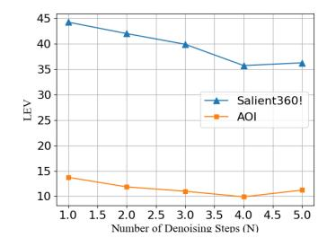

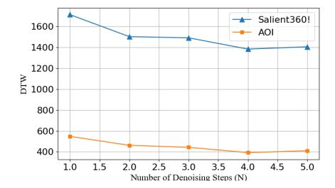

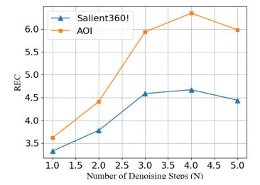

Fig. 7. Performance analysis of different number of denoising steps on the Salient360! and AOI datasets. Notably, smaller LEV and DTW values indicate better performance, while a larger REC value indicates better performance.

#### TABLE IV

COMPARISON OF THE TIME COMPLEXITY OF DIFFERENT METHODS ON THE SALIENT360! DATASET. NOTABLY, MODEL SIZE REFERS TO THE NUMBER OF PARAMETERS IN THE METHODS, AND RUNNING TIME REFERS TO THE TIME TAKEN TO GENERATE 200 SCANPATHS FOR EACH METHOD

| Methods           | Model Size (M) | Running Time (s) |  |
|-------------------|----------------|------------------|--|
| CLE [24]          | 8M             | 20s              |  |
| DeepGaze III [26] | 78.9M          | 45s              |  |
| SaltiNet [9]      | 98.7M          | 68s              |  |
| ScanGAN360 [12]   | 30.3M          | 30s              |  |
| ScanDMM [72]      | 17.7M          | 26s              |  |
| Ours (ScanDTM)    | 20.5M          | 28s              |  |

trade-off between performance and computational cost is our next goal.

# G. Discussion

To the best of our knowledge, an optimal scanpath prediction model aims to generate a realistic scanpath with relatively minor displacements while accurately focusing on salient objects simultaneously. Existing scanpath methods typically result in larger displacements and sparse focal regions, which inevitably degrade the performance of scanpath prediction. In contrast, our proposed ScanDTM model effectively addresses these issues, as demonstrated by the competitive results depicted in Fig. 6. From Fig. 6, we can see that our model is able to produce results that are closer to the ground-truth. This is primarily because our model not only generates scanpaths with smaller deviations but also focuses mainly on salient objects. Therefore, we can directly

conclude that displacement bias is a key factor influencing the performance of scanpath prediction.

### V. GENERALIZATION APPLICATIONS

In this section, we aim to validate the generalization performance of our proposed ScanDTM model by apply it to two popular downstream applications: saliency prediction and quality assessment for omnidirectional images.

## A. Saliency Prediction for Omnidirectional Images

Saliency prediction aims to automatically infer and estimate the most prominent regions that attract human visual attention in an omnidirectional image. Theoretically, a superior scanpath prediction model has the capability to effectively model the spatial distributions of human visual fixations. To demonstrate the versatility of our proposed ScanDTM model in predicting saliency maps, we directly apply it along with ScanGAN [12] to the saliency prediction task. This involves yielding 1,000 scanpaths and then post-processing these fixations to generate continuous saliency maps. To be specific, we employ a modified Gaussian for convolving fixation maps, which represent 2D records of all fixation locations. The process is formulated as follows:

$$G(x, y) = \frac{1}{2\pi\sigma_y^2} exp(-\frac{x^2}{2\sigma_x}) exp(-\frac{y^2}{2\sigma_y}),$$
 (14)

where  $\sigma_x = \frac{\sigma_y}{\cos(\theta)}$ , and  $\sigma_y = 19^o$  denotes a constant value.  $\theta \in \{-90^o, 90^o\}$  represents the latitude of the fixations.

1) Evaluation Metrics: In the saliency prediction task, we employ four widely used evaluation metrics to assess the performance of various saliency prediction methods. These four metrics include: normalized scanpath saliency (NSS), Judd variant of the area under curve (AUC), Kullback–Leibler divergence (KLD), and correlation coefficient (CC).

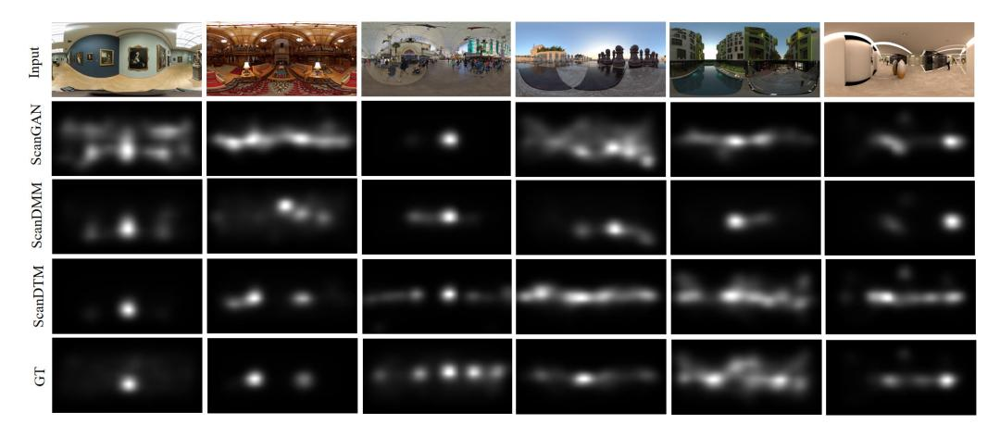

Fig. 8. Visual comparisons for different saliency prediction methods on the Salient360! and Sitzmann datasets. The first three columns are from the Salient360! dataset, while the remaining columns are from the Sitzmann dataset.

TABLE V QUANTITATIVE COMPARISON OF VARIOUS SALIENCY PREDICTION METHODS ON THE SITZMANN AND SALIENT360! DATASETS. THE MOST FAVORABLE RESULTS ARE HIGHLIGHTED IN BOLD

| Datasets       | Sitzmann |       |       |       | Salient360! |       |       |       |
|----------------|----------|-------|-------|-------|-------------|-------|-------|-------|
| Methods        | AUC ↑    | NSS ↑ | CC ↑  | KLD ↓ | AUC ↑       | NSS ↑ | CC ↑  | KLD ↓ |
| BMS360 [21]    | 0.831    | 1.328 | 0.666 | 0.475 | 0.478       | 0.907 | 0.907 | 0.476 |
| GBVS360 [21]   | 0.845    | 1.433 | 0.693 | 0.374 | 0.712       | 0.775 | 0.484 | 0.576 |
| SaltiNet [9]   | 0.762    | 0.948 | 0.497 | 0.671 | 0.737       | 0.842 | 0.530 | 0.514 |
| SalNet360 [22] | 0.841    | 1.467 | 0.718 | 0.421 | 0.744       | 0.989 | 0.602 | 0.476 |
| SalGAN360 [20] | 0.813    | 1.188 | 0.612 | 0.561 | 0.759       | 0.975 | 0.613 | 0.495 |
| ScanGAN [12]   | 0.761    | 0.902 | 0.475 | 0.654 | 0.728       | 0.774 | 0.491 | 0.556 |
| ScanDMM [72]   | 0.767    | 0.958 | 0.521 | 0.609 | 0.777       | 1.042 | 0.660 | 0.384 |
| Ours (ScanDTM) | 0.828    | 0.983 | 0.544 | 0.368 | 0.802       | 1.236 | 0.679 | 0.364 |

*2) Performance Comparison:* To effectively evaluate the performance of our proposed ScanDTM model in the saliency prediction task, we conduct comparative analyses on the Sitzmann [\[70\]](#page-15-9) and Salient360! [\[57\]](#page-14-44) datasets. These saliency methods include: BMS360 [\[21\], G](#page-14-8)BVS360 [\[21\], S](#page-14-8)alNet360 [\[22\],](#page-14-9) SalGAN360 [\[20\],](#page-14-7) SaltiNet [\[9\], S](#page-13-8)canGAN [\[12\],](#page-13-11) and ScanDMM [\[72\]. T](#page-15-11)he specific comparison results are presented in Table [V](#page-12-0) and Fig. [8,](#page-12-1) respectively. We can see from Table [V](#page-12-0) that our proposed ScanDTM model achieves the best performance across all metrics. Meanwhile, we can see from Fig. [8](#page-12-1) that the saliency maps predicted by our ScanDTM model are more closer to the ground-truth. In summary, these results demonstrate the effectively and feasibility of applying the scanpath prediction model to the saliency prediction task.

## *B. Quality Assessment for Omnidirectional Images*

As far as we know, image quality assessment (IOA) methods aim to accurately estimate and predict the perceived quality of visual images. Recent studies [\[71\],](#page-15-10) [\[74\]](#page-15-13) highlight that human viewing behaviors, specifically the human visual attention mechanism, demonstrate promising performance in IOA tasks. This clearly shows the critical importance of scanpath prediction in assessing omnidirectional image quality. To further validate the generalization capability of our ScanDTM model in the IQA task, we draw inspiration from the computational framework [\[74\]](#page-15-13) by decomposing the scanpath model into several distinct steps. Firstly, we extract sequences of rectilinear projections of viewports from various generated scanpaths. Secondly, we apply existing 2D IQA methods to compute quality scores at the viewport-level (*i.e.* frame-level). Subsequently, we temporally pool these frame-level quality scores to obtain the perceived quality of a video (i.e., viewport sequence). Finally, we aggregate these scores across all videos using averaging to determine the final perceived quality of omnidirectional images.

*1) Evaluation Metrics:* We adopt three commonly used metrics to objectively evaluate the performance of various IQA methods. These metrics include root mean square error (RMSE), CC, and Spearman's rank-order correlation coefficient (SRCC). Notably, higher CC and SRCC values indicate superior performance, while a lower RMSE value means better performance.

TABLE VI QUANTITATIVE COMPARISON OF DIFFERENT QUALITY ASSESSMENT METHODS ON THE JUFE DATASET. THE MOST FAVORABLE RESULTS ARE HIGHLIGHTED IN BOLD

| Methods               | CC ↑  | SRCC ↑ | RMSE ↓ |
|-----------------------|-------|--------|--------|
| PSNR                  | 0.156 | 0.016  | 0.787  |
| $PSNR_{GAN}$          | 0.135 | 0.014  | 0.790  |
| $PSNR_{DMM}$          | 0.563 | 0.546  | 0.659  |
| $PSNR_{DTM}$          | 0.568 | 0.562  | 0.649  |
| SSIM                  | 0.148 | 0.046  | 0.788  |
| $\mathtt{SSIM}_{GAN}$ | 0.162 | 0.046  | 0.790  |
| $SSIM_{DMM}$          | 0.519 | 0.509  | 0.681  |
| $\mathtt{SSIM}_{DTM}$ | 0.524 | 0.521  | 0.676  |
| VIF                   | 0.163 | 0.096  | 0.786  |
| $\mathrm{VIF}_{GAN}$  | 0.147 | 0.092  | 0.788  |
| $\mathrm{VIF}_{DMM}$  | 0.597 | 0.572  | 0.639  |
| ${\rm VIF}_{DTM}$     | 0.603 | 0.584  | 0.631  |
| DeepWSD               | 0.160 | 0.044  | 0.786  |
| $DeepWSD_{GAN}$       | 0.162 | 0.072  | 0.786  |
| $DeepWSD_{DMM}$       | 0.635 | 0.628  | 0.616  |
| $DeepWSD_{DTM}$       | 0.642 | 0.635  | 0.602  |
| DISTS                 | 0.162 | 0.081  | 0.786  |
| $DISTS_{GAN}$         | 0.176 | 0.100  | 0.784  |
| $DISTS_{DMM}$         | 0.662 | 0.675  | 0.597  |
| $DISTS_{DTM}$         | 0.718 | 0.693  | 0.572  |

*2) Performance Comparison:* To comprehensively assess the generalization performance of our ScanDTM model in the IQA task, we perform comparative experiments on the JUFE dataset. Since the JUFE dataset is goal-oriented, we retrain the ScanGAN, ScanDMM and ScanDTM models using the training set of the JUFE dataset. We can obtain *N*˜ = *N* fake scanpaths to extract viewport sequences for each omnidirectional image. To more objectively compare frame-level quality, we first adopt five IQA methods for 2D images, including the Structural SIMilarity index (SSIM) [\[75\],](#page-15-14) the Peak Signal-to-Noise Ratio (PSNR) [\[76\],](#page-15-15) the Deep Image Structure and Texture Similarity (DISTS) [\[77\],](#page-15-16) the Visual information fidelity (VIF) [\[78\],](#page-15-17) and the DeepWSD [\[79\].](#page-15-18) Subsequently, we develop a Gaussian weighting function to temporally pool the frame-level quality values. To intuitively represent the quality methods that utilize the scanpath obtained by ScanGAN, ScanDMM, and ScanDTM, we append "GAN", "DMM" and "DTM" as subscripts to the five quality methods, respectively. Meanwhile, we apply 2D IQA methods to omnidirectional images as baselines. The detailed comparative results are tabulated in Table [VI.](#page-13-12) From Table [VI,](#page-13-12) we can clearly observe that our ScanDTM model outperforms other scanpath prediction methods and baselines across all metrics on the JUFE dataset. Therefore, these results indicate that applying our ScanDTM model to the IQA task is both reasonable and practical.

## VI. CONCLUSION

This paper proposes a novel dual-temporal modulation scanpath prediction (ScanDTM) model to estimate dynamic fixation trajectories in omnidirectional scenes by simulating human visual viewing behaviors. Compared to other scanpath prediction methods, the proposed ScanDTM model demonstrates crucial capabilities with high prediction accuracy and robust generalization for real-world applications. Specifically, we propose a Dual Graph Convolutional Network (Dual-GCN) module with semantic-level GCN and image-level GCN components, aiming to capture spatial relationships among various objects within a single image and similarity relations across relevant images. Additionally, inspired by the inherent property of iterative refinement and generalization, we design a diffusion-guided saliency module to formulate the scanpath prediction problem as a conditional generative task of the saliency map by employing semantic-level and image-level visual features as conditions. Such a module aims to progressively refine the saliency map from the noisy map. Extensive experiments on four public datasets show that our model significantly surpasses other state-of-the-art methods. Moreover, we apply our model elegantly to saliency prediction and quality assessment tasks for omnidirectional scenes, demonstrating its powerful generalization performance in practical applications.

## REFERENCES

- [\[1\] A](#page-0-0). Kar and P. Corcoran, "A review and analysis of eye-gaze estimation systems, algorithms and performance evaluation methods in consumer platforms," *IEEE Access*, vol. 5, pp. 16495–16519, 2017.
- [\[2\] A](#page-0-1). Bulling and H. Gellersen, "Toward mobile eye-based human– computer interaction," *IEEE Pervasive Comput.*, vol. 9, no. 4, pp. 8–12, Oct. 2010.
- [\[3\] H](#page-0-2). R. Chennamma and X. Yuan, "A survey on eye-gaze tracking techniques," 2013, *arXiv:1312.6410*.
- [\[4\] C](#page-0-3). H. Morimoto and M. R. M. Mimica, "Eye gaze tracking techniques for interactive applications," *Comput. Vis. Image Understand.*, vol. 98, no. 1, pp. 4–24, Apr. 2005.
- [\[5\] V](#page-0-4). Tanriverdi and R. J. K. Jacob, "Interacting with eye movements in virtual environments," in *Proc. SIGCHI Conf. Hum. Factors Comput. Syst.*, Apr. 2000, pp. 265–272.
- [\[6\] Y](#page-0-5). K. Meena, H. Cecotti, K. Wong-Lin, A. Dutta, and G. Prasad, "Toward optimization of gaze-controlled human–computer interaction: Application to Hindi virtual keyboard for stroke patients," *IEEE Trans. Neural Syst. Rehabil. Eng.*, vol. 26, no. 4, pp. 911–922, Apr. 2018.
- [\[7\] Y](#page-0-6). Li, P. Xu, D. Lagun, and V. Navalpakkam, "Towards measuring and inferring user interest from gaze," in *Proc. 26th Int. Conf. World Wide Web Companion*, 2017, pp. 525–533.
- [\[8\] M](#page-0-7). Bielikova, "5.5 utilizing eye tracking data for user modeling in personalized recommendation," *Ubiquitous Gaze Sens. Interact.*, vol. 11, pp. 98–99, Oct. 1998.
- [\[9\] M](#page-1-2). Assens, X. Giro-i-Nieto, K. McGuinness, and N. E. O'Connor, "SaltiNet: Scan-path prediction on 360 degree images using saliency volumes," in *Proc. IEEE Int. Conf. Comput. Vis. Workshops (ICCVW)*, Oct. 2017, pp. 2331–2338.
- [\[10\]](#page-1-3) Y. Zhu, G. Zhai, X. Min, and J. Zhou, "The prediction of saliency map for head and eye movements in 360 degree images," *IEEE Trans. Multimedia*, vol. 22, no. 9, pp. 2331–2344, Sep. 2020.
- [\[11\]](#page-1-4) M. Assens, X. Giró-I-Nieto, K. McGuinness, and N. E. O'Connor, "PathGAN: Visual scanpath prediction with generative adversarial networks," in *Proc. Eur. Conf. Comput. Vis. (ECCV) Workshops*, Jan. 2019, pp. 406–422.
- [\[12\]](#page-1-5) D. Martin, A. Serrano, A. W. Bergman, G. Wetzstein, and B. Masia, "ScanGAN360: A generative model of realistic scanpaths for 360◦ images," *IEEE Trans. Vis. Comput. Graph.*, vol. 28, no. 5, pp. 2003–2013, May 2022.

- [\[13\]](#page-2-0) S. Chen, P. Sun, Y. Song, and P. Luo, "DiffusionDet: Diffusion model for object detection," in *Proc. IEEE/CVF Int. Conf. Comput. Vis.*, Oct. 2023, pp. 19830–19843.
- [\[14\]](#page-2-1) P. Dhariwal and A. Nichol, "Diffusion models beat GANs on image synthesis," in *Proc. NIPS*, vol. 34, 2021, pp. 8780–8794.
- [\[15\]](#page-2-2) S. Gu et al., "Vector quantized diffusion model for text-to-image synthesis," in *Proc. IEEE/CVF Conf. Comput. Vis. Pattern Recognit. (CVPR)*, Jun. 2022, pp. 10696–10706.
- [\[16\]](#page-2-3) G. Li and Y. Yu, "Deep contrast learning for salient object detection," in *Proc. IEEE Conf. Comput. Vis. Pattern Recognit. (CVPR)*, Jun. 2016, pp. 478–487.
- [\[17\]](#page-2-4) L. Wang et al., "Learning to detect salient objects with image-level supervision," in *Proc. IEEE Conf. Comput. Vis. Pattern Recognit. (CVPR)*, Jul. 2017, pp. 136–145.
- [\[18\]](#page-2-5) Y. Wang, W. Zhang, L. Wang, T. Liu, and H. Lu, "Multi-source uncertainty mining for deep unsupervised saliency detection," in *Proc. IEEE/CVF Conf. Comput. Vis. Pattern Recognit. (CVPR)*, Jun. 2022, pp. 11727–11736.
- [\[19\]](#page-2-6) Y. Fang, X. Zhang, and N. Imamoglu, "A novel superpixel-based saliency detection model for 360-degree images," *Signal Process., Image Commun.*, vol. 69, pp. 1–7, Nov. 2018.
- [\[20\]](#page-2-7) F.-Y. Chao, L. Zhang, W. Hamidouche, and O. Deforges, "SalGAN360: Visual saliency prediction on 360 degree images with generative adversarial networks," in *Proc. IEEE Int. Conf. Multimedia Expo Workshops (ICMEW)*, Jul. 2018, pp. 1–4.
- [\[21\]](#page-2-8) P. Lebreton and A. Raake, "GBVS360, BMS360, ProSal: Extending existing saliency prediction models from 2D to omnidirectional images," *Signal Process. Image Commun.*, vol. 69, pp. 69–78, Nov. 2018.
- [\[22\]](#page-2-9) R. Monroy, S. Lutz, T. Chalasani, and A. Smolic, "SalNet360: Saliency maps for omni-directional images with CNN," *Signal Process., Image Commun.*, vol. 69, pp. 26–34, Nov. 2018.
- [\[23\]](#page-2-10) M. Xu, L. Yang, X. Tao, Y. Duan, and Z. Wang, "Saliency prediction on omnidirectional image with generative adversarial imitation learning," *IEEE Trans. Image Process.*, vol. 30, pp. 2087–2102, 2021.
- [\[24\]](#page-2-11) G. Boccignone, V. Cuculo, and A. D'Amelio, "How to look next? A data-driven approach for scanpath prediction," in *Proc. Formal Methods. FM Int. Workshops*, Porto, Portugal. Cham, Switzerland: Springer, Jan. 2020, pp. 131–145.
- [\[25\]](#page-2-12) R. A. J. de Belen, T. Bednarz, and A. Sowmya, "ScanpathNet: A recurrent mixture density network for scanpath prediction," in *Proc. IEEE/CVF Conf. Comput. Vis. Pattern Recognit. Workshops (CVPRW)*, Jun. 2022, pp. 5006–5016.
- [\[26\]](#page-2-13) M. Kümmerer, M. Bethge, and T. S. A. Wallis, "DeepGaze III: Modeling free-viewing human scanpaths with deep learning," *J. Vis.*, vol. 22, no. 5, p. 7, Apr. 2022.
- [\[27\]](#page-2-14) C. Xia, J. Han, F. Qi, and G. Shi, "Predicting human saccadic scanpaths based on iterative representation learning," *IEEE Trans. Image Process.*, vol. 28, no. 7, pp. 3502–3515, Jul. 2019.
- [\[28\]](#page-2-15) E. Erdem and A. Erdem, "Visual saliency estimation by nonlinearly integrating features using region covariances," *J. Vis.*, vol. 13, no. 4, p. 11, Mar. 2013.
- [\[29\]](#page-2-16) S. Fang, J. Li, Y. Tian, T. Huang, and X. Chen, "Learning discriminative subspaces on random contrasts for image saliency analysis," *IEEE Trans. Neural Netw. Learn. Syst.*, vol. 28, no. 5, pp. 1095–1108, May 2017.
- [\[30\]](#page-2-17) Y. Fang, Z. Chen, W. Lin, and C.-W. Lin, "Saliency detection in the compressed domain for adaptive image retargeting," *IEEE Trans. Image Process.*, vol. 21, no. 9, pp. 3888–3901, Sep. 2012.
- [\[31\]](#page-2-18) T. Liu et al., "Learning to detect a salient object," *IEEE Trans. Pattern Anal. Mach. Intell.*, vol. 33, no. 2, pp. 353–367, Feb. 2011.
- [\[32\]](#page-2-19) G. Zhu, Q. Wang, and Y. Yuan, "Tag-saliency: Combining bottom-up and top-down information for saliency detection," *Comput. Vis. Image Understand.*, vol. 118, pp. 40–49, Jan. 2014.
- [\[33\]](#page-2-20) J. Zhao et al., "Towards pose invariant face recognition in the wild," in *Proc. IEEE/CVF Conf. Comput. Vis. Pattern Recognit.*, Jun. 2018, pp. 2207–2216.
- [\[34\]](#page-2-21) J. Zhao, L. Xiong, J. Li, J. Xing, S. Yan, and J. Feng, "3D-aided dualagent GANs for unconstrained face recognition," *IEEE Trans. Pattern Anal. Mach. Intell.*, vol. 41, no. 10, pp. 2380–2394, Oct. 2019.
- [\[35\]](#page-2-22) J. Zhao et al., "Look across elapse: Disentangled representation learning and photorealistic cross-age face synthesis for age-invariant face recognition," in *Proc. 33rd AAAI Conf. Artif. Intell.*, Aug. 2019, vol. 33, no. 1, pp. 9251–9258.
- [\[36\]](#page-2-23) J. Zhao, S. Yan, and J. Feng, "Towards age-invariant face recognition," *IEEE Trans. Pattern Anal. Mach. Intell.*, vol. 44, no. 1, pp. 474–487, Jan. 2022.

- [\[37\]](#page-2-24) Q. Wang, P. Zhang, H. Xiong, and J. Zhao, "Face.evoLVe: A highperformance face recognition library," 2021, *arXiv:2107.08621*.
- [\[38\]](#page-2-25) J. Zhao et al., "Dual-agent GANs for photorealistic and identity preserving profile face synthesis," in *Proc. Adv. Neural Inf. Process. Syst.*, vol. 30, Jan. 2017, pp. 66–76.
- [\[39\]](#page-2-26) J. Zhao, J. Li, Y. Cheng, T. Sim, S. Yan, and J. Feng, "Understanding humans in crowded scenes: Deep nested adversarial learning and a new benchmark for multi-human parsing," in *Proc. 26th ACM Int. Conf. Multimedia*, Oct. 2018, pp. 792–800.
- [\[40\]](#page-2-27) H. Xie et al., "PRCL: Probabilistic representation contrastive learning for semi-supervised semantic segmentation," *Int. J. Comput. Vis.*, vol. 132, no. 10, pp. 4343–4361, Oct. 2024.
- [\[41\]](#page-2-28) B. Huang, J. Li, J. Chen, G. Wang, J. Zhao, and T. Xu, "Anti-UAV410: A thermal infrared benchmark and customized scheme for tracking drones in the wild," *IEEE Trans. Pattern Anal. Mach. Intell.*, vol. 46, no. 5, pp. 2852–2865, May 2024.
- [\[42\]](#page-2-29) N. Jiang et al., "Anti-UAV: A large multi-modal benchmark for UAV tracking," 2021, *arXiv:2101.08466*.
- [\[43\]](#page-2-30) C. Ma, H. Sun, Y. Rao, J. Zhou, and J. Lu, "Video saliency forecasting transformer," *IEEE Trans. Circuits Syst. Video Technol.*, vol. 32, no. 10, pp. 6850–6862, Oct. 2022.
- [\[44\]](#page-2-31) K. Zhang and Z. Chen, "Video saliency prediction based on spatial– temporal two-stream network," *IEEE Trans. Circuits Syst. Video Technol.*, vol. 29, no. 12, pp. 3544–3557, Dec. 2019.
- [\[45\]](#page-3-0) Z. Wu, L. Su, and Q. Huang, "Learning coupled convolutional networks fusion for video saliency prediction," *IEEE Trans. Circuits Syst. Video Technol.*, vol. 29, no. 10, pp. 2960–2971, Oct. 2019.
- [\[46\]](#page-3-1) R. P. Kalesnykas and D. L. Sparks, "REVIEW: The primate superior colliculus and the control of saccadic eye movements," *Neuroscientist*, vol. 2, no. 5, pp. 284–292, Sep. 1996.
- [\[47\]](#page-3-2) R. J. Krauzlis, L. P. Lovejoy, and A. Zénon, "Superior colliculus and visual spatial attention," *Annu. Rev. Neurosci.*, vol. 36, no. 1, pp. 165–182, Jul. 2013.
- [\[48\]](#page-3-3) L. Itti, C. Koch, and E. Niebur, "A model of saliency-based visual attention for rapid scene analysis," *IEEE Trans. Pattern Anal. Mach. Intell.*, vol. 20, no. 11, pp. 1254–1259, Nov. 1998.
- [\[49\]](#page-3-4) W. Wang, C. Chen, Y. Wang, T. Jiang, F. Fang, and Y. Yao, "Simulating human saccadic scanpaths on natural images," in *Proc. CVPR*, Jun. 2011, pp. 441–448.
- [\[50\]](#page-3-5) H. Adeli, F. Vitu, and G. J. Zelinsky, "A model of the superior colliculus predicts fixation locations during scene viewing and visual search," *J. Neurosci.*, vol. 37, no. 6, pp. 1453–1467, Feb. 2017.
- [\[51\]](#page-3-6) G. Boccignone and M. Ferraro, "Modelling gaze shift as a constrained random walk," *Phys. A, Stat. Mech. Appl.*, vol. 331, nos. 1–2, pp. 207–218, Jan. 2004.
- [\[52\]](#page-3-7) O. Le Meur and Z. Liu, "Saccadic model of eye movements for freeviewing condition," *Vis. Res.*, vol. 116, pp. 152–164, Nov. 2015.
- [\[53\]](#page-3-8) X. Sun, H. Yao, R. Ji, and X.-M. Liu, "Toward statistical modeling of saccadic eye-movement and visual saliency," *IEEE Trans. Image Process.*, vol. 23, no. 11, pp. 4649–4662, Nov. 2014.
- [\[54\]](#page-3-9) A. Coutrot, J. H. Hsiao, and A. B. Chan, "Scanpath modeling and classification with hidden Markov models," *Behav. Res. Methods*, vol. 50, no. 1, pp. 362–379, Feb. 2018.
- [\[55\]](#page-3-10) J. Ling, K. Zhang, Y. Zhang, D. Yang, and Z. Chen, "A saliency prediction model on 360 degree images using color dictionary based sparse representation," *Signal Process., Image Commun.*, vol. 69, pp. 60–68, Nov. 2018.
- [\[56\]](#page-3-11) M. Assens, X. Giro-I-Nieto, K. McGuinness, and N. E. O'Connor, "Scanpath and saliency prediction on 360 degree images," *Signal Process., Image Commun.*, vol. 69, pp. 8–14, Nov. 2018.
- [\[57\]](#page-3-12) Y. Rai, J. Gutiérrez, and P. Le Callet, "A dataset of head and eye movements for 360 degree images," in *Proc. 8th ACM Multimedia Syst. Conf.*, Jun. 2017, pp. 205–210.
- [\[58\]](#page-3-13) D. Chen, C. Qing, X. Lin, M. Ye, X. Xu, and P. Dickinson, "Intra- and inter-reasoning graph convolutional network for saliency prediction on 360◦ images," *IEEE Trans. Circuits Syst. Video Technol.*, vol. 32, no. 12, pp. 8730–8743, Dec. 2022.
- [\[59\]](#page-4-1) Y. Yang, Y. Zhu, Z. Gao, and G. Zhai, "SalGFCN: Graph based fully convolutional network for panoramic saliency prediction," in *Proc. Int. Conf. Vis. Commun. Image Process. (VCIP)*, Dec. 2021, pp. 1–5.
- [\[60\]](#page-4-2) K. Zhang, T. Li, S. Shen, B. Liu, J. Chen, and Q. Liu, "Adaptive graph convolutional network with attention graph clustering for co-saliency detection," in *Proc. IEEE/CVF Conf. Comput. Vis. Pattern Recognit. (CVPR)*, Jun. 2020, pp. 9050–9059.

- [\[61\]](#page-4-3) Y. Benny and L. Wolf, "Dynamic dual-output diffusion models," in *Proc. IEEE/CVF Conf. Comput. Vis. Pattern Recognit. (CVPR)*, Jun. 2022, pp. 11472–11481.
- [\[62\]](#page-4-4) J. Choi, J. Lee, C. Shin, S. Kim, H. Kim, and S. Yoon, "Perception prioritized training of diffusion models," in *Proc. IEEE/CVF Conf. Comput. Vis. Pattern Recognit. (CVPR)*, Jun. 2022, pp. 11462–11471.
- [\[63\]](#page-4-5) V. De Bortoli, J. Thornton, J. Heng, and A. Doucet, "Diffusion Schrödinger bridge with applications to score-based generative modeling," in *Proc. Adv. Neural Inf. Process. Syst.*, vol. 34, 2021, pp. 17695–17709.
- [\[64\]](#page-4-6) W. R. Harvey, S. Naderiparizi, V. Masrani, C. Weilbach, and F. Wood, "Flexible diffusion modeling of long videos," in *Proc. Adv. Neural Inf. Process. Syst.*, vol. 35, Jan. 2022, pp. 27953–27965.
- [\[65\]](#page-4-7) R. Yang, P. Srivastava, and S. Mandt, "Diffusion probabilistic modeling for video generation," *Entropy*, vol. 25, no. 10, p. 1469, Oct. 2023.
- [\[66\]](#page-4-8) Q. Zhang and Y. Chen, "Fast sampling of diffusion models with exponential integrator," 2022, *arXiv:2204.13902*.
- [\[67\]](#page-4-9) J. Xiong, P. Zhang, T. You, C. Li, W. Huang, and Y. Zha, "DiffSal: Joint audio and video learning for diffusion saliency prediction," in *Proc. IEEE/CVF Conf. Comput. Vis. Pattern Recognit. (CVPR)*, Jun. 2024, pp. 27263–27273.
- [\[68\]](#page-4-10) B. Aydemir, D. Bhattacharjee, T. Zhang, M. Salzmann, and S. Süsstrunk, "Data augmentation via latent diffusion for saliency prediction," 2024, *arXiv:2409.07307*.
- [\[69\]](#page-4-11) S. Ren, K. He, R. Girshick, and J. Sun, "Faster R-CNN: Towards realtime object detection with region proposal networks," in *Proc. Adv. Neural Inf. Process. Syst.*, vol. 28, Dec. 2015, pp. 91–99.
- [\[70\]](#page-7-0) V. Sitzmann et al., "Saliency in VR: How do people explore virtual environments?" *IEEE Trans. Vis. Comput. Graph.*, vol. 24, no. 4, pp. 1633–1642, Apr. 2018.
- [\[71\]](#page-7-1) Y. Fang, L. Huang, J. Yan, X. Liu, and Y. Liu, "Perceptual quality assessment of omnidirectional images," in *Proc. AAAI Conf. Artif. Intell.*, 2022, vol. 36, no. 1, pp. 580–588.
- [\[72\]](#page-8-1) X. Sui, Y. Fang, H. Zhu, S. Wang, and Z. Wang, "ScanDMM: A deep Markov model of scanpath prediction for 360◦ images," in *Proc. IEEE/CVF Conf. Comput. Vis. Pattern Recognit. (CVPR)*, Jun. 2023, pp. 6989–6999.
- [\[73\]](#page-8-2) R. Rothe, M. Guillaumin, and L. Van Gool, "Non-maximum suppression for object detection by passing messages between windows," in *Proc. 12th Asian Conf. Comput. Vis. (ACCV)*, Singapore. Cham, Switzerland: Springer, Jan. 2015, pp. 290–306.
- [\[74\]](#page-12-2) X. Sui, K. Ma, Y. Yao, and Y. Fang, "Perceptual quality assessment of omnidirectional images as moving camera videos," *IEEE Trans. Vis. Comput. Graph.*, vol. 28, no. 8, pp. 3022–3034, Aug. 2022.
- [\[75\]](#page-13-13) W. Zhou, A. C. Bovik, H. R. Sheikh, and E. P. Simoncelli, "Image quality assessment: From error visibility to structural similarity," *IEEE Trans. Image Process.*, vol. 13, no. 4, pp. 600–612, Apr. 2004.
- [\[76\]](#page-13-14) A. Hore and D. Ziou, "Image quality metrics: PSNR vs. SSIM," in *Proc. 20th Int. Conf. Pattern Recognit.*, Aug. 2010, pp. 2366–2369.
- [\[77\]](#page-13-15) K. Ding, K. Ma, S. Wang, and E. P. Simoncelli, "Image quality assessment: Unifying structure and texture similarity," *IEEE Trans. Pattern Anal. Mach. Intell.*, vol. 44, no. 5, pp. 2567–2581, May 2020.
- [\[78\]](#page-13-16) H. R. Sheikh and A. C. Bovik, "Image information and visual quality," *IEEE Trans. Image Process.*, vol. 15, no. 2, pp. 430–444, Feb. 2006.
- [\[79\]](#page-13-17) X. Liao, B. Chen, H. Zhu, S. Wang, M. Zhou, and S. Kwong, "DeepWSD: Projecting degradations in perceptual space to Wasserstein distance in deep feature space," in *Proc. 30th ACM Int. Conf. Multimedia*, Oct. 2022, pp. 970–978.

Kaiwei Zhang received the B.S. and M.S. degrees from Xidian University, Xi'an, China, in 2016. He is currently pursuing the Ph.D. degree with the Institute of Image Communication and Network Engineering, Shanghai Jiao Tong University. His research interests include image quality assessment, image reconstruction, multimedia signal processing, and computational imaging.

Xiongkuo Min (Member, IEEE) received the B.E. degree from Wuhan University, Wuhan, China, in 2013, and the Ph.D. degree from Shanghai Jiao Tong University, Shanghai, China, in 2018. He is currently a tenure-track Associate Professor with the Institute of Image Communication and Network Engineering, Shanghai Jiao Tong University. His research interests include image/video/audio quality assessment, quality of experience, visual attention modeling, extended reality, and multimodal signal processing. He received the Best Paper Runner-Up

Award of IEEE TRANSACTIONS ON MULTIMEDIA in 2021, the Best Student Paper Award of the IEEE International Conference on Multimedia and Expo (ICME) in 2016, and the Excellent Ph.D. Thesis Award from Chinese Institute of Electronics (CIE) in 2020.

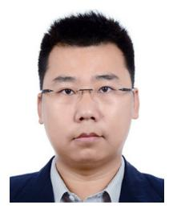

Guangtao Zhai (Fellow, IEEE) received the B.E. and M.E. degrees from Shandong University, Shandong, China, in 2001 and 2004, respectively, and the Ph.D. degree from Shanghai Jiao Tong University, Shanghai, China, in 2009. He is currently a Research Professor with the Institute of Image Communication and Information Processing, Shanghai Jiao Tong University. His research interests include multimedia signal processing and perceptual signal processing. He received the Award of National Excellent Ph.D. Thesis from the Ministry of Education of China in 2012.

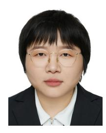

Dandan Zhu (Member, IEEE) received the Ph.D. degree from Tongji University, Shanghai, China, in 2019. She was a Post-Doctoral Researcher with the MoE Key Laboratory of Artificial Intelligence, Shanghai Jiao Tong University, Shanghai, from 2019 to 2021. She is currently an Associate Professor with the School of Computer Science and Technology, East China Normal University. Her research interests include multimedia signal processing, computer vision, and visual attention modeling.

Xiaokang Yang (Fellow, IEEE) received the Ph.D. degree from Shanghai Jiao Tong University, Shanghai, China, in 2000. He is currently a Distinguished Professor with the School of Electronic Information and Electrical Engineering and the Deputy Director of the Institute of Image Communication and Information Processing, Shanghai Jiao Tong University. He has published over 200 refereed articles and has filed 60 patents.