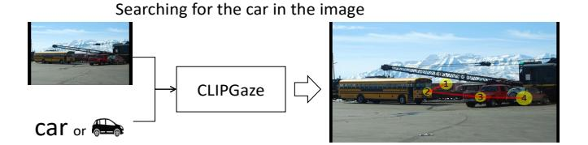
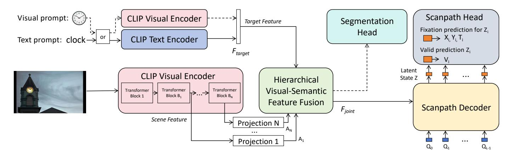
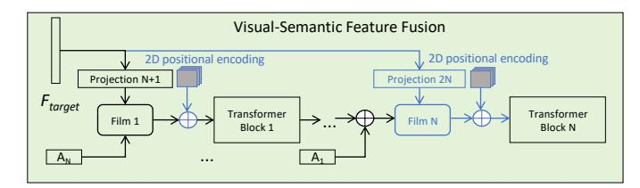
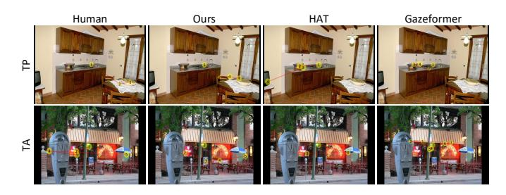
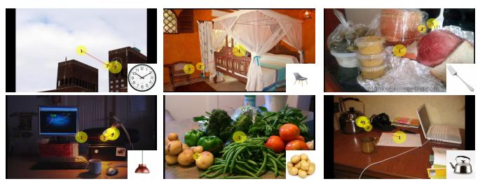

# CLIPGaze: Zero-Shot Goal-Directed Scanpath Prediction Using CLIP

Yantao Lai1,2 , Rong Quan1 , Dong Liang2,3,⋆, Jie Qin1

College of Artificial Intelligence, Nanjing University of Aeronautics and Astronautics, Nanjing, China College of Computer Science and Technology, Nanjing University of Aeronautics and Astronautics, Nanjing, China Shenzhen Research Institute, Nanjing University of Aeronautics and Astronautics, Shenzhen, China yantaolai@nuaa.edu.cn, rongquan0806@gmail.com, liangdong@nuaa.edu.cn, qinjiebuaa@gmail.com

*Abstract*—Goal-directed scanpath prediction aims to predict people's gaze shift path when searching for objects in a visual scene. Most existing goal-directed scanpath prediction methods cannot generalize to target classes not present during training. Besides, they usually exploit different pre-trained models to extract features for the target prompt and image, resulting in big feature gap and making the subsequent feature matching and fusion very difficult. To solve the above problems, we propose a novel zero-shot goal-directed scanpath prediction model named CLIPGaze. We use CLIP to extract pre-matched features for the target prompt and input image, making the feature fusion easier to receive. Using large model like CLIP can also enhance the whole model's generalization ability on target classes not present during training. We propose a hierarchical visual-semantic feature fusion module to fuse the target and image features more comprehensively. Furthermore, due to the limited number of classes in goal-directed scanpath dataset, we employ image segmentation as a proxy task to help train the feature fusion module, significantly enhancing our model's performance in zeroshot setting. Extensive experiments demonstrate the effectiveness of our method on both seen and unseen target classes.

*Index Terms*—scanpath, zero-shot, CLIP

# I. INTRODUCTION

Scanpath prediction is a dynamic process of forecasting human attention. By learning scanpath prediction models, we can better understand the process of human attention shifts and provide enhanced immersive experiences. Currently, scanpath prediction has been applied to various aspects of people's daily life, such as image/video quality assessment [1]–[3], foveated rendering [4]–[6], disease monitoring [7]–[9], and so on.

Unlike free-viewing approaches [10]–[21], goal-directed scanpath prediction is task-driven and purposeful, as illustrated in Fig. 1. Recent goal-directed scanpath prediction methods are based on visual-semantic matching. These methods first match and fuse the text prompt and the visual information, and then explore the gaze searching path in the visual-semantic feature space. Existing visual semantic matching methods usually use different pre-trained feature extractors for the target prompt and image [22], [23], resulting in a big gap between the extracted target and image features, which makes subsequent

This work is supported in part by the National Natural Science Foundation of China under grant 62206127, 62272229 and U2441285, the Natural Science Foundation of Jiangsu Province under grant BK20222012, and Shenzhen Science and Technology Program JCYJ20230807142001004.

Fig. 1. Illustration of goal-directed scanpath prediction task. The yellow points, red lines and radii indicate fixations, saccades and durations.

feature matching difficult and always requires extensive training data. Furthermore, most existing goal-directed scanpath prediction models have poor generalization ability [24]–[31], owing to the limited training data and object classes in this field (only CoCoSearch18 [32] with 18 classes). Consequently, these models are limited to categories with ample training data and cannot perform well in zero-shot setting.

To solve the above problems, we study a zero-shot goaldirected scanpath prediction model named CLIPGaze, which can not only predict accurate scanpaths for seen target classes, but also produce good results for target classes not present during training. We resort to large visual language model (CLIP [33]) to extract features from both the target prompt and image, which can not only extract pre-matched features for the target prompt and image, but also provide accurate features for target classes that are not present in the training dataset. Next, to fuse the target prompt and image more comprehensively, we extract multi-level features for the input image and propose a hierarchical visual-semantic fusion model to fuse the extracted target prompt and image features from coarse to fine. To further enhance the model's generalization ability, we employ image segmentation as a proxy task to help train the feature fusion module and pre-train the segmentation head with a large-scale dataset (PhraseCut [34]) containing far more object classes than the scanpath prediction dataset, which significantly improve our model's performance in zeroshot setting. Finally, the fused visual-semantic features are input into a scanpath decoder to predict the final scanpath. In summary, our contributions are as follows:

• We use large visual language model, CLIP, as feature extractor in our model, to provide pre-matched features for the target prompt and image, which can make the

⋆ corresponding author

Fig. 2. The architecture of our method. The proposed model consists of six main components: Scene Feature Extractor, Target Feature Extractor, Hierarchical Visual-Semantic Feature Fusion, Segmentation Head, Scanpath Decoder and Scanpath Head.

- subsequent feature matching and fusion easier to receive. Besides, using large model such as CLIP can greatly enhance the generalization ability of our model.
- We introduce an auxiliary segmentation head to help train the feature fusion module, significantly improving our model's searching performance on unseen target classes.
- Extensive experimental results demonstrate that CLIPGaze can outperform other methods on both seen and unseen target classes.

# II. METHOD

Fig. 2 presents an overview of CLIPGaze. It extracts scene image features from N different layers of CLIP's visual encoder and target text/visual features, which are then input together into a hierarchical visual-semantic feature fusion module. The fused information and fixation query information are input together into a scanpath decoder, to predict the hidden states of all fixations in parallel. Finally, the scanpath head converts each fixation's hidden state into coordinate positions (X, Y), duration (T), and validity probability (V). Notably, to enhance the model's capability in zero-shot setting, we employ image segmentation (with a segmentation head) as a proxy task to pre-train the fusion module.

# *A. Architecture*

- *1) Scene Feature Extractor:* Since the grid size of the feature map has been demonstrated to have a profound impact on model performance [24], we intentionally resize the input images to ensure the same grid size H = 20, W = 32 as the baseline models [25]–[27]. We then employ a Vision Transformer (ViT) [35] based CLIP visual encoder to extract image information. We extract N different intermediate layer outputs and project them to the internal dimension D used in all subsequent Transformer [36] structures. Through this approach, we can obtain N different feature maps A1, ..., AN ∈ RH×W×D.
- *2) Target Feature Extractor:* This component can utilize the text or visual encoder of CLIP to extract the target semantic feature Ftarget ∈ Rdtarget , where dtarget denotes the dimensionality of Ftarget. To maintain consistency with

Fig. 3. Detailed architecture of Hierarchical Visual-Semantic Feature Fusion. Black arrows: structure for zero-shot setting; Blue arrows: additional structures incorporated for traditional target-present and target-absent settings.

other methods, we don't utilize additional prompts (e.g., 'a photo of') to encode the target semantic information.

- *3) Hierarchical Visual-Semantic Feature Fusion:* The design presented in this section varies according to the specific task scenario, as depicted in Fig. 3. In the part with black arrows, we employ a *projection* layer to transform the dimension of Ftarget to D. We then utilize a *FiLM* [37] to fuse the transformed target information with visual feature map AN and then pass it through a Transformer Block for alignment and contextualization. We then iteratively fuse new feature maps Ai , i ∈ [N − 1, ..., 1] and encode them through new Transformer encoders. By performing such process N times, We can obtain the joint feature Fjoint ∈ RH×W×D. Upon incorporating the part with blue arrows, we have N *projections* and N *FiLMs*, with adding 2D positional encoding information before passing it through the Transformer blocks. Similarly, after repeating N times, we can also obtain the joint feature information Fjoint ∈ RH×W×D.
- *4) Segmentation Head:* This component comprises a twolayer upsampling structure that can transform the joint feature Fjoint into a semantic segmentation output. It is only used during the pre-training process in the zero-shot setting.
- *5) Scanpath Decoder:* Unlike the traditional autoregressive approach [36], we employ a parallel approach for scanpath generation [27], [38], [39], enabling the creation of new scanpaths in a single pass. We input a set of queries Qi ∈ RD, i ∈ [0, 1, . . . , L − 1] of length L = 7 along with the joint feature Fjoint into the Scanpath Decoder structure. This

yields the hidden information  $Z_i \in R^D, i \in [0, 1, ..., L-1]$  for each fixation. This component comprises a total of  $N_d = 6$  standard Transformer decoder layers [36], and the queries are randomly initialized learnable embeddings that provide temporal information.

6) Scanpath Head: For each fixation in the scanpath, we predict coordinate positions X and Y, the duration T, and the validity probability V, which indicating whether the fixation is the endpoint of the scanpath. Specifically, for each fixation  $P_i$ , we use four independent MLPs to predict these pieces of information from its hidden state  $Z_i$ . During the prediction process, we sequentially traverse the fixation information from i=0 to i=L-1. If the validity probability  $V_i \leq 0.5$  for the current fixation, we add its position and duration to our predicted scanpath. Otherwise, we stop the traversal.

#### B. Loss Function

During our training and testing phases, we set the maximum length of the scanpath to L=7. For scanpaths shorter than L, we perform padding. We employ the sum of Soft-DTW loss  $L_{dtw}$  [40], position-time loss  $L_{xyt}$  and validity loss  $L_{val}$  as our loss function  $L_{total}$ , which can be defined as follows:

$$\begin{split} L^{j}_{dtw} &= \textit{Soft-DTW}(\rho, \hat{\rho}), \\ L^{j}_{xyt} &= \frac{1}{l^{j}} \sum_{i=0}^{l^{j}-1} (|x^{j}_{i} - \hat{x}^{j}_{i}| + |y^{j}_{i} - \hat{y}^{j}_{i}| + |t^{j}_{i} - \hat{t}^{j}_{i}|), \\ L^{j}_{val} &= -\frac{1}{L} \sum_{i=0}^{L-1} (\alpha v^{j}_{i} log \hat{v}^{j}_{i} + (1 - v^{j}_{i}) \log(1 - \hat{v}^{j}_{i})), \\ L_{total} &= \frac{1}{M} \sum_{j=1}^{M} (L^{j}_{dtw} + L^{j}_{xyt} + L^{j}_{val}). \end{split} \tag{1}$$

Here, M represents the batch size,  $\rho$  represents the ground-truth scanpath, and  $l^j$  denotes the true length of the scanpath. Since the number of endpoint fixations is typically fewer than the number of intermediate fixations, we apply a weighting factor  $\alpha$  to the endpoint loss. This factor is set as the ratio of intermediate fixations to endpoint fixations.

#### III. EXPERIMENTS

We train and evaluate CLIPGaze on the CoCoSearch18 dataset [32], which is currently the only substantial dataset available for goal-directed scanpath prediction task. We use two subsets of the dataset: CoCoSearch18-TP (target present) and CoCoSearch18-TA (target absent), both containing scanpath data for 18 categories with 3101 images. For evaluation, we utilized the following metrics: Sequence Score, Semantic Sequence Score, Fixation Edit Distance, Semantic Fixation Edit Distance, MultiMatch, and Correlation Coefficient. For more information, please refer to [27], [41].

#### A. Implementation Details

During training, we completely froze the parameters of the CLIP and set the starting point at the the center of the image. In the zero-shot setting, we use ViT-B/16 based CLIP

TABLE I
THE RESULT OF ZERO-SHOT SETTING

|                           | SS ↑  | SemSS ↑ | FED ↓ | SemFED ↓ | MM ↑  | CC ↑  |
|---------------------------|-------|---------|-------|----------|-------|-------|
| IRL(CVPR'20) [26]         | 0.290 | 0.285   | 4.606 | 4.558    | 0.774 | 0.241 |
| Chen et al.(CVPR'21) [29] | 0.210 | 0.178   | 5.720 | 5.845    | 0.717 | 0.002 |
| FFM(ECCV'22) [25]         | 0.300 | 0.282   | 2.788 | 3.132    | 0.731 | 0.271 |
| Gazeformer(CVPR'23) [27]  | 0.358 | 0.352   | 2.766 | 2.586    | 0.812 | 0.324 |
| CLIPGaze (Ours)           | 0.361 | 0.403   | 2.512 | 2.095    | 0.812 | 0.350 |
| CLIPGaze (Ours-Proxy)     | 0.451 | 0.498   | 2.203 | 1.793    | 0.848 | 0.476 |

TABLE II
THE RESULT OF TRADITIONAL TARGET PRESENT SETTING

|                            | SS ↑  | SemSS ↑ | FED ↓ | SemFED ↓ | MM ↑  | CC ↑  |
|----------------------------|-------|---------|-------|----------|-------|-------|
| Human                      | 0.490 | 0.522   | 2.531 | 1.720    | 0.857 | 0.472 |
| IRL (CVPR'20) [26]         | 0.418 | 0.481   | 2.722 | 2.259    | 0.833 | 0.434 |
| Chen et al. (CVPR'21) [29] | 0.451 | 0.470   | 2.187 | 1.898    | 0.820 | 0.547 |
| FFM (ECCV'22) [25]         | 0.392 | 0.407   | 2.693 | 2.425    | 0.808 | 0.370 |
| Gazeformer (CVPR'23) [27]  | 0.504 | 0.490   | 2.072 | 1.928    | 0.852 | 0.561 |
| HAT (CVPR'24) [24]         | 0.468 | 0.540   | 2.063 | 1.522    | 0.855 | 0.608 |
| CLIPGaze (Ours)            | 0.476 | 0.545   | 2.014 | 1.489    | 0.861 | 0.594 |

with layers 3, 7, and 9 as feature extraction layers, internal dimension D=64, and 4 attention heads per multi-head attention block. For the traditional target-present and target-absent settings, we use ViT-L/14@336px based CLIP with layers 6, 14, and 18 as feature extraction layers, internal dimension D=1024, and 8 attention heads per multi-head attention block. In both zero-shot and traditional target-present settings (both utilizing CoCoSearch18-TP), we exclude scanpaths that did not terminate at the target, as these could be considered as error samples.

#### B. Zero-Shot Setting

In this scenario, we adopt a cross-validation approach to train CLIPGaze on 17 categories of the CoCoSearch18-TP dataset and validate on the remaining 1 category. Finally, we use a weighted average method to obtain the final results, where each category's weight is proportional to its proportion in the test samples. When using the proxy task (image segmentation) to pre-train the feature fusion module, we follow the experimental process of CLIPSeg [42] and Pre-train on the PhraseCut [34] dataset, which contains over 340,000 phrases and corresponding segmentation maps.

The results are shown in TABLE I, where 'Ours' refers to outcomes obtained using only the CoCoSearch18 with the addition of the blue arrows in the Hierarchical Visual-Semantic Feature Fusion, and 'Ours-proxy' represents only using the black structure in the Hierarchical Visual-Semantic Feature Fusion, pre-trained and fine-tuned. We can observe that both of our methods outperform other existing models. However, the adoption of pre-training with the proxy task yields more excellent performance. This not only demonstrates the superior efficacy of our model but also validates the effectiveness of using image segmentation as a proxy task.

#### C. Traditional Target Present Setting

In this scenario, we investigate the task of scanpath prediction in the traditional target-present setting. Specifically, the training and testing sets share the same categories, but the testing images do not appear in the training set. As shown

TABLE III
THE RESULT OF TARGET ABSENT SETTING

|                            | SS ↑  | SemSS ↑ | FED ↓ | SemFED ↓ | MM ↑  | CC ↑  |
|----------------------------|-------|---------|-------|----------|-------|-------|
| Human                      | 0.398 | 0.393   | 5.418 | 3.772    | 0.838 | 0.537 |
| IRL (CVPR'20) [26]         | 0.323 | 0.339   | 5.180 | 5.031    | 0.805 | 0.243 |
| Chen et al. (CVPR'21) [29] | 0.345 | 0.315   | 3.323 | 3.481    | 0.799 | 0.447 |
| FFM (ECCV'22) [25]         | 0.362 | 0.372   | 3.903 | 3.819    | 0.814 | 0.289 |
| Gazeformer (CVPR'23) [27]  | 0.375 | 0.394   | 3.631 | 3.550    | 0.844 | 0.347 |
| HAT (CVPR'24) [24]         | 0.426 | 0.398   | 3.220 | 3.376    | 0.834 | 0.480 |
| CLIDCore (Ours)            | 0.415 | 0.410   | 2 172 | 2 227    | 0.046 | 0.205 |

Fig. 4. **Qualitative results**. Top row: traditional target present 'Bowl' search; Bottom row: target absent 'stop sign' search.

in TABLE II, CLIPGaze outperform other models or exhibit comparable performance across all metrics.

# D. Target Absent Setting

The target-absent setting primarily focuses on investigating human visual behavior when a specified target is missing from the scene. The results, as shown in TABLE III, reveal that CLIPGaze still outperforms other methods on most metrics.

Notably, the model's performance may be influenced by the grid size. Specifically, HAT generates fixation points on an  $80 \times 128$  probability distribution map, which is significantly larger than the feature map grid size or output convolution size of our model and other baseline models  $(30 \times 40)$  for Chen et al. [29] and  $20 \times 32$  for other models [25]–[27]).

# E. Qualitative Comparison

In Fig. 4, we present the qualitative comparison of CLIPGaze with the HAT and Gazeformer models under traditional target-present (TP) and target-absent (TA) conditions. Since other methods have previously been shown to fail in generating realistic scanpaths [27], we did not include qualitative comparisons with them here. It can be observed that CLIPGaze more accurately locates the target and takes into account more comprehensive environmental information, thus generating scanpaths that are closer to those of humans.

# F. Visual Prompts

Given that the CLIP model aligns image and text features within the feature space, CLIPGaze is capable of using both image and text as prompts. Since there is no standard visual prompt within this dataset, quantitative comparisons are not feasible. Therefore, we generate and present some visualization results. As illustrated in Fig. 5, CLIPGaze is able to generate realistic and reliable scanpaths when using visual prompts. Furthermore, CLIPGaze achieves decent performance on categories beyond CoCoSearch18. To the best of

TABLE IV
THE RESULT OF ABLATION STUDY

|                 | SS ↑  | SemSS ↑ | FED ↓ | SemFED ↓ | ММ ↑  | CC ↑  |
|-----------------|-------|---------|-------|----------|-------|-------|
| ViT-B/32        | 0.431 | 0.503   | 2.236 | 1.587    | 0.849 | 0.482 |
| ViT-B/16        | 0.461 | 0.537   | 2.071 | 1.523    | 0.857 | 0.542 |
| RoBERTa         | 0.474 | 0.543   | 2.027 | 1.497    | 0.858 | 0.563 |
| Final Layer     | 0.481 | 0.540   | 2.014 | 1.545    | 0.861 | 0.548 |
| CLIPGaze (Ours) | 0.476 | 0.545   | 2.014 | 1.489    | 0.861 | 0.594 |

Fig. 5. Visualization of using visual prompts. Top row's three visual prompt categories are from the CoCoSearch18 (clock, chair and fork); Bottom row's three categories are not included (lamp, potato and kettle).

our knowledge, this is the first instance of using both text and visual prompts in this domain.

# G. Ablation Study

We conduct ablation experiments using the model structure from the traditional target-present setting as the baseline. To explore the effects of using different CLIP models, we evaluate the performance of using ViT-B/32 and ViT-B/16 based CLIP models. Additionally, to validate the importance of visual-semantic alignment, we replace CLIP's target feature extractor with a new language model, RoBERTa [22]. Furthermore, to assess the impact of using multi-level image information, we experiment by utilizing solely the final layer output from the CLIP visual encoder, repeating it *N* times to replace the information from different feature layers. (Denoted as ViT-B/32, ViT-B/16, RoBERTa and Final Layer, respectively)

As shown in TABLE IV, 'Our' achieves the best performance, demonstrating the effectiveness of using the ViT-L/14@336px based CLIP model, ensuring visual-semantic alignment and incorporating multi-level image information.

### IV. CONCLUSION

We propose a novel CLIP-based model, CLIPGaze, to predict scanpaths in zero-shot goal-directed scenarios. To address the large feature gap between the extracted target prompt and input image features, we leverage CLIP to extract pre-matched features for target prompt and image, thus the subsequent fusion of the two features can be easier and need less training data. In addition, using CLIP can help extract more generalized features that are suitable for classes not present during training. In the zero-shot setting, we significantly improve CLIPGaze's performance by pre-training it on the large-scale image segmentation dataset and fine-tuning it on the scanpath dataset. Moreover, beyond its excellent performance in the zero-shot setting, CLIPGaze also achieve state-of-the-art results in both traditional target-present and target-absent settings.

# REFERENCES

- [1] K. Fan, W. Wen, M. Li, Y. Peng, and K. Ma, "Learned scanpaths aid blind panoramic video quality assessment," in *Proceedings of the IEEE/CVF Conference on Computer Vision and Pattern Recognition*, 2024, pp. 2599–2608.
- [2] X. Sui, H. Zhu, X. Liu, Y. Fang, S. Wang, and Z. Wang, "Perceptual quality assessment of 360° images based on generative scanpath representation," *arXiv preprint arXiv:2309.03472*, 2023.
- [3] T. Wu, S. Shi, H. Cai, M. Cao, J. Xiao, Y. Zheng, and Y. Yang, "Assessor360: Multi-sequence network for blind omnidirectional image quality assessment," *Advances in Neural Information Processing Systems*, vol. 36, 2024.
- [4] Y. S. Pai, B. Tag, B. Outram, N. Vontin, K. Sugiura, and K. Kunze, "Gazesim: simulating foveated rendering using depth in eye gaze for vr," in *ACM SIGGRAPH 2016 Posters*, 2016, pp. 1–2.
- [5] S. L. Matthews, A. Uribe-Quevedo, and A. Theodorou, "Rendering optimizations for virtual reality using eye-tracking," in *2020 22nd symposium on virtual and augmented reality (SVR)*. IEEE, 2020, pp. 398–405.
- [6] Y. S. Pai, T. Dingler, and K. Kunze, "Assessing hands-free interactions for vr using eye gaze and electromyography," *Virtual Reality*, vol. 23, pp. 119–131, 2019.
- [7] I. B. Adhanom, N. N. Griffin, P. MacNeilage, and E. Folmer, "The effect of a foveated field-of-view restrictor on vr sickness," in *2020 IEEE conference on virtual reality and 3D user interfaces (VR)*. IEEE, 2020, pp. 645–652.
- [8] W. Zhou, M. Yang, J. Tang, J. Wang, and B. Hu, "Gaze patterns in children with autism spectrum disorder to emotional faces: Scanpath and similarity," *IEEE Transactions on Neural Systems and Rehabilitation Engineering*, 2024.
- [9] M. Startsev and M. Dorr, "Classifying autism spectrum disorder based on scanpaths and saliency," in *2019 IEEE International Conference on Multimedia & Expo Workshops (ICMEW)*. IEEE, 2019, pp. 633–636.
- [10] X. Chen, M. Jiang, and Q. Zhao, "Beyond average: Individualized visual scanpath prediction," in *Proceedings of the IEEE/CVF Conference on Computer Vision and Pattern Recognition*, 2024, pp. 25 420–25 431.
- [11] R. Quan, Y. Lai, M. Qiu, and D. Liang, "Pathformer3d: A 3d scanpath transformer for 360° images," in *European Conference on Computer Vision*. Springer, 2025, pp. 73–90.
- [12] Y. Wang, M. Bace, and A. Bulling, "Scanpath prediction on informa- ˆ tion visualisations," *IEEE Transactions on Visualization and Computer Graphics*, vol. 30, no. 7, pp. 3902–3914, 2024.
- [13] X. Sui, Y. Fang, H. Zhu, S. Wang, and Z. Wang, "Scandmm: A deep markov model of scanpath prediction for 360deg images," in *Proceedings of the IEEE/CVF Conference on Computer Vision and Pattern Recognition*, 2023, pp. 6989–6999.
- [14] D. Martin, A. Serrano, A. W. Bergman, G. Wetzstein, and B. Masia, "Scangan360: A generative model of realistic scanpaths for 360 images," *IEEE Transactions on Visualization and Computer Graphics*, vol. 28, no. 5, pp. 2003–2013, 2022.
- [15] M. Assens Reina, X. Giro-i Nieto, K. McGuinness, and N. E. O'Connor, "Saltinet: Scan-path prediction on 360 degree images using saliency volumes," in *Proceedings of the IEEE international conference on computer vision workshops*, 2017, pp. 2331–2338.
- [16] M. Qiu, Q. Rong, D. Liang, and H. Tu, "Visual scanpath transformer: guiding computers to see the world," in *2023 IEEE International Symposium on Mixed and Augmented Reality (ISMAR)*. IEEE, 2023, pp. 223–232.
- [17] M. Assens, X. Giro-i Nieto, K. McGuinness, and N. E. O'Connor, "Pathgan: Visual scanpath prediction with generative adversarial networks," in *Proceedings of the European Conference on Computer Vision (ECCV) Workshops*, 2018, pp. 0–0.
- [18] M. Kummerer, M. Bethge, and T. S. Wallis, "Deepgaze iii: Modeling ¨ free-viewing human scanpaths with deep learning," *Journal of Vision*, vol. 22, no. 5, pp. 7–7, 2022.
- [19] M. A. Kerkouri, M. Tliba, A. Chetouani, and R. Harba, "Salypath: A deep-based architecture for visual attention prediction," in *2021 IEEE International Conference on Image Processing (ICIP)*. IEEE, 2021, pp. 1464–1468.
- [20] L. Itti, C. Koch, and E. Niebur, "A model of saliency-based visual attention for rapid scene analysis," *IEEE Transactions on pattern analysis and machine intelligence*, vol. 20, no. 11, pp. 1254–1259, 1998.

- [21] W. Sun, Z. Chen, and F. Wu, "Visual scanpath prediction using iorroi recurrent mixture density network," *IEEE transactions on pattern analysis and machine intelligence*, vol. 43, no. 6, pp. 2101–2118, 2019.
- [22] Y. Liu, "Roberta: A robustly optimized bert pretraining approach," *arXiv preprint arXiv:1907.11692*, 2019.
- [23] K. He, X. Zhang, S. Ren, and J. Sun, "Deep residual learning for image recognition," in *Proceedings of the IEEE conference on computer vision and pattern recognition*, 2016, pp. 770–778.
- [24] Z. Yang, S. Mondal, S. Ahn, R. Xue, G. Zelinsky, M. Hoai, and D. Samaras, "Unifying top-down and bottom-up scanpath prediction using transformers," in *The IEEE Conference on Computer Vision and Pattern Recognition (CVPR)*, June 2024.
- [25] Z. Yang, S. Mondal, S. Ahn, G. Zelinsky, M. Hoai, and D. Samaras, "Target-absent human attention," in *European Conference on Computer Vision*. Springer, 2022, pp. 52–68.
- [26] Z. Yang, L. Huang, Y. Chen, Z. Wei, S. Ahn, G. Zelinsky, D. Samaras, and M. Hoai, "Predicting goal-directed human attention using inverse reinforcement learning," in *Proceedings of the IEEE/CVF conference on computer vision and pattern recognition*, 2020, pp. 193–202.
- [27] S. Mondal, Z. Yang, S. Ahn, D. Samaras, G. Zelinsky, and M. Hoai, "Gazeformer: Scalable, effective and fast prediction of goal-directed human attention," in *Proceedings of the IEEE/CVF Conference on Computer Vision and Pattern Recognition*, 2023, pp. 1441–1450.
- [28] M. Li, J. Zhu, Z. Huang, and C. Gou, "Imitating the human visual system for scanpath predicting," in *ICASSP 2024-2024 IEEE International Conference on Acoustics, Speech and Signal Processing (ICASSP)*. IEEE, 2024, pp. 3745–3749.
- [29] X. Chen, M. Jiang, and Q. Zhao, "Predicting human scanpaths in visual question answering," in *Proceedings of the IEEE/CVF Conference on Computer Vision and Pattern Recognition*, 2021, pp. 10 876–10 885.
- [30] G. Zelinsky, Z. Yang, L. Huang, Y. Chen, S. Ahn, Z. Wei, H. Adeli, D. Samaras, and M. Hoai, "Benchmarking gaze prediction for categorical visual search," in *Proceedings of the IEEE/CVF Conference on Computer Vision and Pattern Recognition Workshops*, 2019, pp. 0–0.
- [31] G. J. Zelinsky, Y. Chen, S. Ahn, H. Adeli, Z. Yang, L. Huang, D. Samaras, and M. Hoai, "Predicting goal-directed attention control using inverse-reinforcement learning," *Neurons, behavior, data analysis and theory*, vol. 2021, 2021.
- [32] Y. Chen, Z. Yang, S. Ahn, D. Samaras, M. Hoai, and G. Zelinsky, "Cocosearch18 fixation dataset for predicting goal-directed attention control," *Scientific reports*, vol. 11, no. 1, p. 8776, 2021.
- [33] A. Radford, J. W. Kim, C. Hallacy, A. Ramesh, G. Goh, S. Agarwal, G. Sastry, A. Askell, P. Mishkin, J. Clark *et al.*, "Learning transferable visual models from natural language supervision," in *International conference on machine learning*. PMLR, 2021, pp. 8748–8763.
- [34] C. Wu, Z. Lin, S. Cohen, T. Bui, and S. Maji, "Phrasecut: Languagebased image segmentation in the wild," in *Proceedings of the IEEE/CVF Conference on Computer Vision and Pattern Recognition*, 2020, pp. 10 216–10 225.
- [35] A. Dosovitskiy, "An image is worth 16x16 words: Transformers for image recognition at scale," *arXiv preprint arXiv:2010.11929*, 2020.
- [36] A. Vaswani, N. Shazeer, N. Parmar, J. Uszkoreit, L. Jones, A. N. Gomez, Ł. Kaiser, and I. Polosukhin, "Attention is all you need," *Advances in neural information processing systems*, vol. 30, 2017.
- [37] V. Dumoulin, E. Perez, N. Schucher, F. Strub, H. d. Vries, A. Courville, and Y. Bengio, "Feature-wise transformations," *Distill*, vol. 3, no. 7, p. e11, 2018.
- [38] N. Carion, F. Massa, G. Synnaeve, N. Usunier, A. Kirillov, and S. Zagoruyko, "End-to-end object detection with transformers," in *European conference on computer vision*. Springer, 2020, pp. 213– 229.
- [39] A. Kamath, M. Singh, Y. LeCun, G. Synnaeve, I. Misra, and N. Carion, "Mdetr-modulated detection for end-to-end multi-modal understanding," in *Proceedings of the IEEE/CVF international conference on computer vision*, 2021, pp. 1780–1790.
- [40] M. Cuturi and M. Blondel, "Soft-dtw: a differentiable loss function for time-series," in *International conference on machine learning*. PMLR, 2017, pp. 894–903.
- [41] R. Fahimi and N. D. Bruce, "On metrics for measuring scanpath similarity," *Behavior Research Methods*, vol. 53, pp. 609–628, 2021.
- [42] T. Luddecke and A. Ecker, "Image segmentation using text and image ¨ prompts," in *Proceedings of the IEEE/CVF conference on computer vision and pattern recognition*, 2022, pp. 7086–7096.