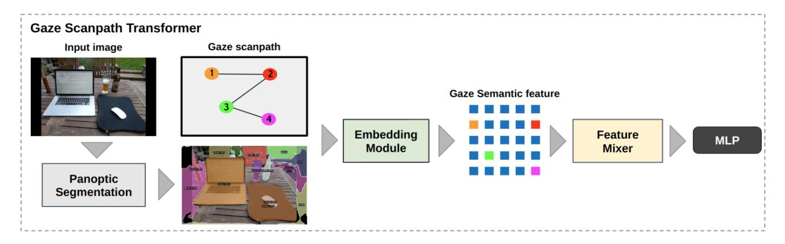
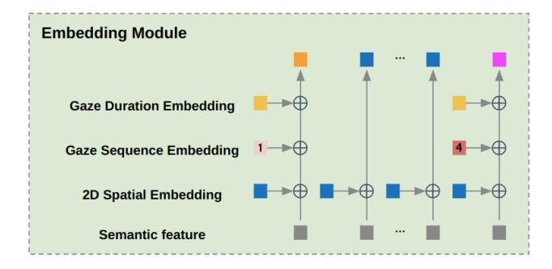
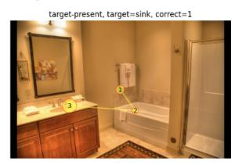
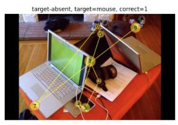
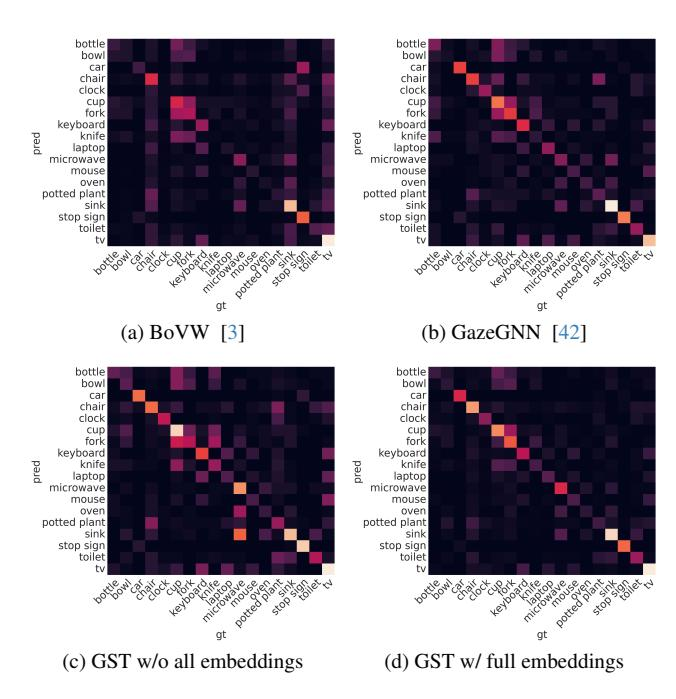
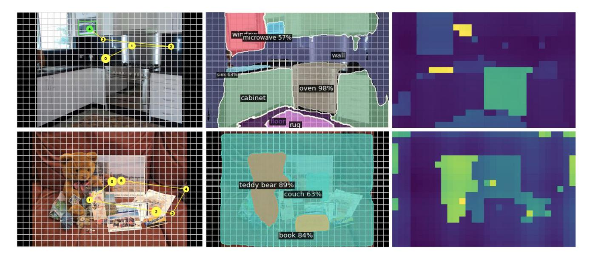

# Gaze Scanpath Transformer: Predicting Visual Search Target by Spatiotemporal Semantic Modeling of Gaze Scanpath

# Takumi Nishiyasu and Yoichi Sato The University of Tokyo, Japan

{nisiyasu, ysato}@iis.u-tokyo.ac.jp

### Abstract

*We introduce a new method, called the Gaze Scanpath Transformer, for predicting a search target category during a visual search task. Previous methods for estimating visual search targets focus solely on the image features at gaze fixation positions. As a result, the previous methods are unable to take into account the spatiotemporal information of gaze scanpaths and lack consideration of the semantic interrelationships between objects on gaze fixations. In contrast, our method can estimate a visual search target based on the spatiotemporal information of a gaze scanpath and interrelationships among image semantic features at gaze fixation positions. This is achieved by embedding the position and the duration of each fixation, and the order of fixations into the image semantic features, and by using the model's attention mechanism to facilitate information exchange and emphasis on image semantic features at gaze fixation positions. Evaluation using the COCO-Search18 dataset demonstrates that our proposed method achieves significant performance improvements over other state-ofthe-art baseline models for search target prediction.*

# 1. Introduction

Deducing a person's attributes, behavior, and intentions based on their gaze behavior is a challenging and important task for various research areas, including human-computer interaction, cognitive science, and behavioral psychology. Significant research efforts have been made on the analysis of gaze behavior for various purposes such as estimating individuals' states [23, 26, 40], assessing skill levels [9, 10], measuring concentration [45, 49, 50], determining interests and intentions [4, 7, 31], inferring drivers' intentions [44], and enhancing interactions with robots [18, 25]. Modeling the relationship between gaze behavior and the semantic characteristics of the objects viewed in images or videos [19, 20, 36, 37] is essential for these applications, and there is a significant demand for its further advancements.

Our study focuses on search target's category inference from gaze scanpaths during a visual search task. Visual search is a task where a person tries to answer whether or not a target object of a given category exists in an image within a limited time frame [12, 22, 47, 51]. Some previous studies have addressed the problem of estimating a search target from gaze fixations where the search target exists in a given image [3, 33, 38]. However, the existing methods focus solely on image features at gaze fixation positions and, as a result, fail to incorporate the spatiotemporal information of gaze scanpaths and lack mechanisms for capturing interrelationships of image semantics among different image regions.

In this study, as visual search target inference, we tackle the problem of estimating the search target category in situations where it is unknown whether the target exists within the image or not. We handle a multitask learning model that, in addition to estimating the category of the target, simultaneously estimates the presence or absence of the target in the image and infers the subject's judgment regarding the target's presence or absence.

In this paper, we introduce a novel method, named the Gaze Scanpath Transformer (GST), for predicting the category of the visual search target. The GST integrates spatiotemporal embeddings such as the position, duration of each fixation, and the order of fixations, along with a mechanism to capture the interrelationships between semantic features at gaze fixation positions. Inspired by prior research [3], the GST first extracts semantic features from an input image using the off-the-shelf panoptic segmentation model [21]. Then, the GST explicitly embeds these features with the position, duration, and order of gaze fixations. Following this, Feature Mixer, equipped with a multi-head attention mechanism, facilitates the exchange of information between the semantic features of gaze fixations and highlights the interrelationships among these features. Finally, this process yields features that encompass the spatiotemporal information of gaze and the semantic interrelationships between fixations, which are then used to predict the target.

Our method was evaluated on the COCO-Seacrh18

dataset [12, 47] for visual search. In experiments, our method demonstrated significant superiority in performance and outperformed existing methods. Through ablation studies, we show the effects of embedding of gaze fixations and the impacts of Feature Mixer that exchanges and highlights the interrelationships between semantic features at gaze fixation positions. Furthermore, we evaluated our method's performance under various conditions where the target is present, absent, or mixed in visual search target inference. Through this evaluation, we identified the limitations of evaluation within the existing problem setting where the target is present in the image, as well as issues regarding dataset bias and the generalizability of the methods.

The main contributions of this work are summarized as:

- 1. We propose a new visual search target inference model that embeds spatiotemporal information for semantic features at gaze fixation positions and captures the interrelationships of semantic features.
- 2. Through comprehensive evaluations and ablation studies, our research demonstrated the superiority of our proposed method over existing methods and found the limitations of problem settings.

### 2. Related Work

Task estimation from gaze behavior. Previous studies have demonstrated that gaze behavior can vary significantly depending on the tasks assigned to subjects, such as estimating the richness or the age of people in a painting, initially observed by Yarbus [48]. Follow-up experiments by Borji *et al*. confirmed the feasibility of classifying tasks by utilizing effective gaze features [5]. The research field experienced remarkable progress as the scope of datasets widened and the variety of tasks increased. For instance, Bulling *et al*. created a dataset designed for action classification using first-person videos and wearable eye trackers, showcasing the potential of integrating gaze data with various modalities [8]. Additionally, recent efforts have focused on creating datasets and a model for identifying user tasks in VR environments by utilizing eye-tracking data from headmounted displays [17].

### Scanpath prediction and analysis during visual search.

The study of scanpath prediction, aiming to forecast where people look while viewing images or videos, has expanded from not only free-view settings [1, 2, 15, 39] but also to task-related scenarios [11, 28, 32, 46]. The creation of the COCO-Search18 datasets [12, 47] has played a key role, providing a way to capture eye movements during visual searches and facilitating a deeper examination of gaze behavior. Leveraging these datasets, researchers have proposed several models to predict gaze scanpaths in visual searches, considering the image and target object's category [13, 24, 28, 32, 46]. Conversely, this paper proposes a new method for predicting the category of a target object in visual search, given an image and a scanpath as input, by analyzing the spatiotemporal semantics of the scanpath.

Visual search target inference from gaze behavior. Previous studies have explored models for estimating visual search targets. Zelinsky *et al*. demonstrated that objects' features at gaze fixation positions might resemble those of the target during a visual search, utilizing a classifier based on SIFT features [27] and local color histograms to discern the target among various distractions [52]. Building on this concept, Borji *et al*. employed hand-crafted features like RGB histograms, gist features [30], and local binary patterns (LBP) [29] for inference [6]. Satter *et al*. introduced a method using the Bag of Visual Words (BoVW) [14] as a method for encoding visual features of fixated image patches [33]. Stauden *et al*. further extended this method by implementing the Bag of Deep Visual Words, utilizing deep visual words from a pre-trained CNN model, achieving higher performance [38]. Following this progression, Barz *et al*. also reported significantly improved performance when creating Visual Words based on semantic segmentation results instead of Deep Visual Words [3]. Extending beyond merely estimating a user's search target from gaze data, some methods have also been developed to create a visual representation of the search target categories, further enriching the application of gaze information in visual search tasks [34, 35].

However, existing methods have solely focused on the image features at gaze fixation positions, failing to incorporate the spatiotemporal information of gaze scanpaths and lacking mechanisms to capture the semantic interrelationships among objects within a given image. In contrast, the GST proposed in this paper integrates information on the position, duration of each fixation, and the order of fixations as well as the interrelationships among semantic features.

In evaluating this method, we found limitations in the problem settings of existing research. Existing problem settings allow for the signal of a target's presence within an image, enabling the estimation of the target from clues obtained from the entire image without focusing on gaze behavior, thus not adequately assessing the model's performance. Therefore, this paper employs a problem setting focusing on estimating the category of the search target during a visual search under the condition that the presence of the search target within the image is not predetermined. We compared and analyzed the model's performance using this problem setting to appropriately evaluate its effectiveness.

## 3. Gaze Scanpath Transformer

### 3.1. Problem formulation and training objective

We consider the problem of identifying the category of a search target from an image feature and gaze fixations during visual search. This problem assumes a scenario where

Figure 1. Overview of the proposed method. In the first stage, the entire image is extracted from the features processed by the panoptic segmentation model. Each feature is then embedded with the fixated position and gaze order, and Feature Mixer is used to emphasize the relationship between all features. The features are then used for class classification by MLP Head.

it is unknown whether the target object is present or absent in the image. The expected output of the model for this problem is a set of three labels: the category of the target object, a binary state indicating the presence or absence of the target in the image, and a binary state reflecting the subject's judgment on whether the target is present or absent. While the primary aim of this task is estimating the target category, the estimation of the target's presence and the subject's judgment are performed simultaneously to capture gaze behavior.

For training, we assume a set of N images  $I_i$ , and corresponding gaze scanpaths  $\mathbf{G}_i$  and sets of labels  $\mathbf{l}_i$  are given as  $\{I_i, \mathbf{G}_i, \mathbf{l}_i\}_{i=1}^N$ . The gaze scanpath  $\mathbf{G}_i = [\mathbf{x}_i, \mathbf{y}_i, \mathbf{t}_i]^\mathsf{T}$  is a combination of m gaze positions  $(\mathbf{x}_i, \mathbf{y}_i)$  and their fixation durations  $\mathbf{t}_i$ . To ensure the input gaze data matches the maximum gaze fixation count n, the missing parts of the gaze scanpath are padded with n-m zeros at the end of each vector. The set of labels is defined as  $\mathbf{l}_i = \{l_i^t, l_i^s, l_i^j\}$ , where  $l_i^t$  represents the target category,  $l_i^s$  indicates the state of target presence, and  $l_i^j$  reflects the subject's judgments.

Let  $\hat{\mathbf{l}}_i$  be the output obtained from the trained visual search target inference model GST is given as

$$\hat{\mathbf{l}}_i = GST(I_i, \mathbf{G}_i). \tag{1}$$

For visual target category inference as multi-class classification, we utilize categorical cross-entropy loss for determining the specific task label from multiple classes  $\mathcal{L}^t(\hat{l}^t, l^t)$ . Moreover, for binary classification tasks, such as determining the state of target presence and the correctness of subject's judgment, we use binary cross-entropy loss functions  $\mathcal{L}^s(\hat{l}^s, l^s)$  and  $\mathcal{L}^j(\hat{l}^j, l^j)$ . The total loss function, combining the three loss functions with balance factors  $\alpha$  and  $\beta$ , can be represented as follows:

Figure 2. This figure illustrates the Embedding Module, which applies embeddings to semantic features extracted through panoptic segmentation. After flattening these features into patches, a 2D Spatial Embedding is applied to every patch to incorporate spatial information. For patches at gaze positions, two additional embeddings are applied: the Gaze Sequence Embedding, representing the order of gaze, and the Gaze Duration Embedding, capturing the duration of gaze.

$$\mathcal{L}_{total} = \mathcal{L}^t + \alpha \mathcal{L}^s + \beta \mathcal{L}^j \tag{2}$$

#### **3.2. Model**

As shown in Figure 1, the Gaze Scanpath Transformer model first extracts semantic features from an input image  $I_i$ . Then, all features are flattened, and features embedded with gaze information from gaze features  $\mathbf{g}_i$  are sent to Feature Mixer. Finally, the MLP classifier predicts labels  $\mathbf{l}_i = \{l_i^t, l_i^s, l_i^j\}$  by using the resulting features. The following paragraphs describe each component of the proposed model.

Feature extraction Building upon insights from prior research [3], our model uses the result of panoptic segmentation [21] as semantic features for visual search target inference, obtained by first conducting panoptic segmentation on images of size (H, W), and then downsizing the segmentation results to (h, w). After this downsizing, the results are transformed into one-hot encoded vectors for each label, thereby expanding the channel dimension to D. The final processed features are semantic features whose size is (D, h, w), where D is the channel count from the one-hot encoding, and h and w represent the height and width of the downscaled feature map, respectively.

These semantic features are then transformed into a sequence of feature patches of size P × P, resulting in h f 1 i ;f 2 i ; · · · ;f hw/P 2 i i ∈ R P 2D×hw/P 2 . Each patch captures localized semantic information, enabling the model to focus on specific segments of the scene. Subsequently, the feature sequence undergoes a flattening process, and a class token fclass is appended to generate a comprehensive feature set and is given as follows:

$$\mathbf{f}_{i}^{\text{all}} = \left[ \mathbf{f}_{\text{class}}; \mathbf{f}_{i}^{1}; \mathbf{f}_{i}^{2}; \cdots; \mathbf{f}_{i}^{hw/P^{2}} \right]$$
(3)

Embedding Module This module integrates the position, duration, and order of gaze fixations into the semantic features of the image, enhancing the model's capability to interpret the spatiotemporal and semantic aspect of gaze scanpath.

Following the Vision Transformer [16], we apply 2D absolute positional embeddings (PPE) to all patches. Alongside, we incorporate Gaze Duration Embedding (GDE) and Gaze Sequential Embedding (GSE), which are specifically designed to embed gaze information into the semantic features. The encoding process for both GDE and GSE is inspired by traditional 1D absolute positional encoding and given as follows:

For GDE, encoding the duration of fixations t:

$$\mathbf{GDE}(pos, 2d) = \sin\left(\frac{t}{10000^{2d/D}}\right) \tag{4}$$

$$\mathbf{GDE}(pos, 2d+1) = \cos\left(\frac{t}{10000^{2d/D}}\right) \tag{5}$$

where pos represents the position of the gaze fixations(x, y) in the gaze scanpath, d is the dimension index. Similarly, for GSE, encoding the order of fixations k:

$$\mathbf{GSE}(pos, 2d) = \sin\left(\frac{k}{10000^{2d/D}}\right) \tag{6}$$

$$\mathbf{GSE}(pos, 2d+1) = \cos\left(\frac{k}{10000^{2d/D}}\right) \tag{7}$$

Figure 3. Example of images on COCO-Search18 [12, 47].These datasets are comprised of subsets for different task scenarios: the "Target Present (TP)" subset includes tasks where the search object is present within the image, and the "Target Absent (TA)" subset is designed for tasks where the search object is not present in the image.

These embeddings are added to each patch embedding f all i and introduced to Feature Mixer as shown in the equation below:

$$\mathbf{z}_i = \mathbf{f}_i^{\mathbf{all}} + \mathbf{PPE} + \mathbf{GDE} + \mathbf{GSE}$$
 (8)

Feature Mixer Feature Mixer is designed to exchange information between each semantic feature at gaze fixation position and enhance the interrelationship of each semantic feature during visual target search tasks. The underlying concept is based on the premise that the gaze behavior in visual search is not random but influenced by complex interactions among the features of different gaze fixations. To implement this concept, we utilize the multi-head attention mechanism in [16]. The multi-head attention mechanism emphasizes the semantic features of each gaze fixation, allowing the model to capture complex interactions among the features at gaze fixation positions. This leads to achieving a comprehensive semantic representation of the gaze scanpath during a visual search task.

Afterward, as described by the following equation, MLP heads corresponding to each label output the labels.

$$\hat{\mathbf{l}}_i = MLPheads(FeatureMixer(\mathbf{z}_i))$$
 (9)

# 4. Experiment

### 4.1. Experimental settings

Dataset We used the COCO-Search18 datasets [12, 47] that recorded the gaze information during the task where subjects searched for a specific target in an image and answered whether it was present in the image (*e.g*., searching for a fork and answering whether it was present). Figure 3 shows some examples of the dataset. The COCO-Search18 datasets consist of two subsets: the Target Present (TP) dataset for tasks where the search object is present in the image and the Target Absent (TA) dataset for tasks where the search object is absent from the image. Each subset consists of 3101 images. The COCO-Search18 datasets contain 18 target categories, with 40558 training samples, 6155 validation samples, and 12238 test samples in total. In our research, both subsets were employed for training and evaluating the models.

Baseline In our comparative analysis, we prepared two baseline methods: the BoVW-based model and GazeGNN, both serving as baselines for evaluating our proposed method's performance. The existing visual search target inference model, BoVW-based model [3], uses a Bag of Visual Words (BoVW) representation of semantic features extracted from gaze positions and Support Vector Machines (SVM) for classification. We investigated the relationship between the number of Visual Words and performance, and set it to 500, which showed the highest value. GazeGNN [42], which is originally introduced for gazeinformed X-ray image diagnosis, has been adapted and retrained for search target inference tasks. The inputs for both methods use semantic features converted from segmentation results in the same manner as the proposed method. Additionally, gaze information that has been formatted using each model's original preprocessing method is also included in the inputs.

Evaluation settings In this study, we utilize a comprehensive evaluation framework across three experimental settings: TP (Target Present), TA (Target Absent), and TP+TA (combined), to thoroughly assess our model's performance as follows.

- TP/TA experiments: These experiments are aimed to test the model's performance on inferencing one of 18 target categories, using accuracy as the metric on each of the two subsets (TP and TA) of the COCO-Search18.
- TP+TA experiment: To evaluate the performance of the visual search target inference in situations where the presence of the target in the image is unknown, the TP (Target Present) and TA (Target Absent) subsets are merged. We use the accuracy of the model's inference on the target category (Target), the accuracy of estimating the presence of the target (Presence), and the accuracy of estimating the subject's judgment (Judgment) as metrics.

Implementation details For the extraction of semantic features, our model employs the Detectron2 framework [43], utilizing PanopticFPN [21] as the backbone. The size of the input images(H, W) is the maximum size of the original images. The size of the semantic features is set to (D, h, w) = (400, 19, 30) and patch size is set to P = 1. Feature Mixer is composed of L = 6 layers of transformer blocks [16], the number of multi-heads is set to 16 and the

Table 1. Performance evaluation in the TP+TA experimental setting using accuracy (%) as the metric: the GST surpasses baseline models. Scores achieving the highest metric are emphasized in bold font. Random represents performance at chance level.

| Model        | Target | Presence | Judgment |
|--------------|--------|----------|----------|
| Random       | 5.16   | 50.23    | 92.20    |
| BoVW [3]     | 27.38  | 78.59    | 92.21    |
| GazeGNN [42] | 38.77  | 73.28    | 92.02    |
| GST          | 46.45  | 84.99    | 92.47    |

dimension of MLP is set to 2048. The maximum length of the gaze scanpath is set to n = 20. For the training process, we employed the Adam optimizer. The learning rate was set at 1.0 × 10−4 , with momentum set to 0.9, throughout 10 epochs. In this method, we did not apply any data augmentation. The balance factors for the loss function, are α = 1 and β = 1. The model's performance was evaluated against the validation dataset at the end of each epoch, and the iteration with the highest validation score was selected for testing and analysis.

### 4.2. Model comparison

Quantitative comparison Table 1 presents the performance obtained after training on the TP+TA dataset and subsequent testing on the TP+TA test set. The results show the superior performance of our proposed method compared to the baselines. Notably, the GST demonstrates the highest Target accuracy at 46.45% and Presence accuracy at 84.99%, which are substantial increments from the baselines. This shows that our method demonstrates a significant superiority of the visual search target inference in the TP+TA Experiment, underscoring the robustness and suitability of the proposed model.

Visual comparison The confusion matrices presented in Fig.4 offer a clear visual comparison of the proposed method and baselines. Compared to the BoVW model [3] in (a) and the GazeGNN [42] in (b), the proposed method in (d) demonstrates accurate classification performance, highlighted by a distinctly bright diagonal.

Fig.5 presents visual comparisons of the proposed model's intermediate results, along with the input images and their respective gaze scanpaths. The upper row illustrates the TP setting where the target object (a microwave) is present in the image, whereas the lower row illustrates the TA setting with a clock as the target. Moreover, this figure includes outcomes from the panoptic segmentation performed by the feature extractor alongside the attention weights generated by the GST's attention mechanism. A grid overlay highlights the size of the input patches. As

Figure 4. Visual comparison of confusion matrix. (a) and (b) show the baseline performances, whereas (c) and (d) show how various embeddings of the GST influence performance.

shown in the center and right image, the attention weights are noted to mirror the contours of the semantic features fed into the Feature Mixer. This is due to the high similarity among the semantic features of each patch from panoptic segmentation. Comparing the left and right of both TP and TA scenarios in Fig.5, it is demonstrated that patches in the right images corresponding to the gaze scanpaths in the left images are highlighted. This observation suggests that Feature Mixer's multi-head attention mechanism focuses on areas embedded with the duration and order of gaze fixations. Additionally, in the TP scenario, target objects (e.g., the microwave in the image) are emphasized by the multi-head attention. This indicates that Feature Mixer captures image semantic features and embeddings of gaze fixations.

#### 4.3. Ablation study

**Effect of position embedding** The ablation study detailed in Table 2 provides an insightful examination of the GST full model's performance, with a particular focus on the integration of embeddings, including both gaze and patch embeddings.

Comparing the full model in the bottom row of Table 2 with the model that lacks all embeddings in the top row, it is evident that incorporating embeddings significantly enhances the model's performance, with Target accuracy increasing to 46.45% and Presence accuracy to 84.99%. Furthermore, comparing the performance between the full model and the model that includes only PPE and lacks gaze

Table 2. Ablation study on the TP+TA experiment: Demonstrating the effectiveness of 2D absolute positional embeddings to all patches (PPE), Gaze Duration Embeddings (GDE), and Gaze Sequential Embeddings (GSE) described in equation (8). The highest score for each metric is highlighted in bold font.

| PPE | GDE | GSE | Accuracy (%) |          |          |
|-----|-----|-----|--------------|----------|----------|
|     |     |     | Target       | Presence | Judgment |
| X   | Х   | X   | 37.75        | 67.90    | 92.32    |
| ✓   | X   | X   | 39.05        | 70.75    | 91.78    |
| X   | ✓   | X   | 38.62        | 69.88    | 92.32    |
| X   | X   | ✓   | 44.36        | 84.09    | 92.32    |
| X   | ✓   | ✓   | 46.76        | 85.50    | 92.43    |
| ✓   | X   | ✓   | 43.51        | 84.19    | 91.95    |
| ✓   | ✓   | X   | 41.45        | 81.64    | 92.29    |
| ✓   | ✓   | ✓   | 46.45        | 84.99    | 92.47    |

Table 3. Ablation study of Feature Mixer on the TP+TA experiment with Accuracy (%) as the metric: Showcasing the Transformer's effectiveness. The highest score for each metric is highlighted in bold font.

| Comparison       | Target | Presence | Judgment |
|------------------|--------|----------|----------|
| MLP-Mixer [41]   | 33.18  | 62.91    | 91.78    |
| Transformer [16] | 46.45  | 84.99    | 92.47    |

embeddings, it is shown that the impact of gaze embeddings is significant. The performance difference due to the presence or absence of gaze embeddings is visually evident in the confusion matrices of Fig. 4, especially between (c) GST w/o all embeddings and (d) GST w/ full embeddings is also visually reflected in the confusion matrices of Fig. 4, between (c) GST w/o all embeddings and (d) GST w/ full embeddings.

This ablation study revealed that all embeddings are effective, with varying impacts. Gaze Duration Embeddings (GDE) had a minor effect, slightly less impactful than Patch Position Embeddings (PPE) or Gaze Sequential Embeddings (GSE). GSE, encoding the sequence of gaze fixations, significantly enhanced accuracy over other methods.

Furthermore, it is found that combinations of embeddings can either enhance or degrade performance. For instance, PPE alone or in combination with GDE improved performance, but combining it with GSE led to a decrease in performance. On the other hand, the coexistence of two types of gaze information embeddings, GDE and GSE, is observed to enhance model performance. This suggests that both GDE and GSE include critical features for estimating the search target and the presence of the target, leading to the conclusion that they are both important for the task.

Figure 5. Visual examples of model inputs and intermediate features. The top row shows a sample from TP, and the bottom row displays a sample from TA. For TP, the search target is a microwave, and for TA, it's a clock. The left images are input images with corresponding gaze scanpaths, where the size of each circle represents the duration of fixation, and numbers indicate the order of fixations. The middle images show the results of panoptic segmentation, with each area's category and its confidence level denoted numerically. The images on the right illustrate the attention weights from the GST's attention mechanism, where brighter colors indicate areas the model focused on more intensely.

Effect of feature mixer To evaluate the superiority of the multi-head attention mechanism within Feature Mixer module, we compared its performance against a version where the components of each layer of Feature Mixer, specifically Transformer Blocks [16], were replaced with Mixer Layers from MLP-Mixer [41]. The MLP-Mixer utilizes MLP layers instead of the multi-head attention mechanism to exchange and emphasize information between features, mixing them within the spatial domain. For a fair comparison, the number of Mixer Layers and the dimensions of input feature and output feature of each layer were set identical to those in the GST.

The TP+TA experiment, as shown in Table 3, reveals that the feature mixing technique employed by MLP-Mixer is less effective than that of the multi-head attention mechanism of the Transformer utilized in the GST. This difference in performance suggests that the GST's Feature Mixer significantly contributes to the improvement in accuracy for both Target and Presence inference.

Effect of number of fixations Table 4 shows that the number of fixation points significantly affects performance. As fixation points increase from 3 to 11, there's a general trend of improved Target accuracy and Presence accuracy, indicating that more gaze fixation points contribute to better performance. However, when the number of fixations surpasses 7, the enhancement to performance from further fixations is minimal.

Table 4. Ablation study of the GST in the TP+TA experiment, comparing performance differences due to the number of fixations (fix num) using accuracy (%) as the metric. Bold font indicates the performance of the default setting of the GST.

| fix num | Target | Presence | Judgment |
|---------|--------|----------|----------|
| 3       | 39.43  | 70.04    | 91.92    |
| 5       | 44.66  | 84.70    | 92.34    |
| 7       | 46.45  | 84.99    | 92.47    |
| 9       | 47.18  | 85.06    | 92.45    |
| 11      | 47.74  | 85.12    | 92.48    |
|         |        |          |          |

Table 5. Ablation study of the GST in the TP+TA experiment, comparing performance differences of balance factor (α, β) using accuracy (%) as the metric. The highest score for each metric is highlighted in bold font.

| Parameters | Target | Presence | Judgment |
|------------|--------|----------|----------|
| (0, 0)     | 37.92  | -        | -        |
| (0.1, 0.1) | 38.43  | 67.89    | 92.24    |
| (0.1, 1)   | 38.42  | 68.22    | 92.30    |
| (1, 0.1)   | 47.09  | 85.10    | 92.39    |
| (1, 1)     | 46.45  | 84.99    | 92.47    |

Effect of balance factor of loss function The tuning of the balance factor of loss function (2), (α, β) plays a pivotal role in model performance. α and β are balance fac-

Table 6. Performance comparison on TP / TA experiment using accuracy (%) as the metric. The datasets during training and testing are identical. The highest score for each metric is highlighted in bold font.

| Model                    | TP → TP        | TA →TA         |
|--------------------------|----------------|----------------|
| BoVW [3] GazeGNN [42] | 30.57 62.96 | 28.35 40.82 |
| GST                      | 60.05          | 42.57          |

Table 7. Performance comparison across different training and testing scenarios. In addition to TP+TA, which utilizes both Target Present (TP) and Target Absent (TA) datasets, we also introduce TP+TA multi, trained within a multi-task learning framework. The bold font highlights the performance of the GST's default setting.

| Training → Testing  | Accuracy (%) |
|---------------------|--------------|
| TP → TA             | 7.30         |
| TA → TP             | 11.54        |
| TP → TP+TA          | 33.67        |
| TA → TP+TA          | 27.06        |
| TP+TA → TP          | 44.00        |
| TP+TA → TA          | 31.85        |
| TP+TA → TP+TA       | 37.92        |
| TP+TA multi → TP    | 54.38        |
| TP+TA multi → TA    | 38.51        |
| TP+TA multi → TP+TA | 46.45        |

tors that illustrate the degree of emphasis on estimating the presence of a target and the subject's judgment, respectively. As shown in Table 5, setting (α, β) to (0, 0), which means not emphasizing either loss, results in decreased performance, highlighting the importance of these balance factors in the model's learning process. Adjusting (α, β) to (1, 1) achieves almost optimal results, reflecting a balance in the impact of Target and Presence accuracy. This demonstrates the importance of the model considering not only the target category inference that can be inferred from the image alone but also inferences of gaze behavior, such as the presence of the target and the subject's judgment, in visual target category inference. However, the finding that β has a relatively minor impact suggests that prioritizing the inference of a target's presence over the subject's judgment could lead to better performance outcomes.

### 4.4. Discussion and Limitation

As shown in Table 6, training and testing on the same dataset (TP → TP, TA → TA) generally results in higher accuracy. Notably, in the TP scenario, models like GazeGNN [42] and the GST, which utilize semantic features from the entire image, outperform BoVW [3] that utilizes only semantic features from gaze fixation positions. This is because, in the (TP → TP) experiment, the target can be identified without gaze information since it is present in the image. Therefore, it can be argued that evaluating models like GazeGNN and the GST, which utilize features from the entire image, may not be appropriate in the setting (TP → TP) used in the previous studies [3].

Due to the availability of clues from the entire image, high performance is achieved because of dataset bias, but there is still a certain effectiveness in focusing on gaze information. Comparing the performance when training solely on search target category inference (TP+TA) versus when training on related gaze behavior tasks as well in a multitask learning framework (TP+TA multi) in Table 7, the (TP+TA multi) setup showed higher performance in all test patterns (TP, TA, TP+TA). This indicates that gaze information assuredly contains clues for estimating the search target.

This study relies on datasets collected under specific conditions, potentially causing the model's predictions to be influenced by biases inherent in the dataset. Observations of the model's performance on the same environment (TP → TP, TA → TA) and the performance of the GST without embeddings reveal that it is possible to estimate the target using only the features within the image, without heavily relying on gaze information. The model appears to overly depend on the semantic features of images without fully utilizing gaze information.

Furthermore, as observed from the results of experiments conducted on the same environments (TP → TP, TA → TA) and across different environments (TP → TA, TA → TP, TP → TP+TA, and TA → TP+TA), there is a significant gap between performance within the same environments and performance in cross-environments settings. This suggests that gaze behavior is highly susceptible to changes across different environments, potentially impacting the generalizability of the proposed method.

### 5. Conclusion

In this work, we proposed the Gaze Scanpath Transformer, a novel method that predicts search target categories from image semantic features and gaze scanpath. Unlike previous methods, the GST integrates spatiotemporal and semantic information of gaze scanpath, improving the accuracy of visual search target inference. The effectiveness of this method has been demonstrated through evaluation on the COCO-Search18 dataset. We hope that our research contributes to a deeper understanding of gaze behavior in visual search targets and serves as a stepping stone for future models of visual search target inference. Acknowledgement This work was supported by JST Adopting Sustainable Partnerships for Innovative Research Ecosystem (ASPIRE), Grant Number JPMJAP2303, and SPRING Grant Number JPMJSP2108.

# References

- [1] Marc Assens, Xavier Giro-i Nieto, Kevin McGuinness, and Noel E O'Connor. Pathgan: Visual scanpath prediction with generative adversarial networks. In *Proc. European Conference on Computer Vision Workshops (ECCVW)*, pages 0–0, 2018. 2
- [2] Marc Assens Reina, Xavier Giro-i Nieto, Kevin McGuinness, and Noel E O'Connor. Saltinet: Scan-path prediction on 360 degree images using saliency volumes. In *Proc. IEEE International Conference on Computer Vision Workshops (ICCVW)*, pages 2331–2338, 2017. 2
- [3] Michael Barz, Sven Stauden, and Daniel Sonntag. Visual search target inference in natural interaction settings with machine learning. In *Proc. ACM Symposium on Eye Tracking Research and Applications (ETRA)*, pages 1–8, 2020. 1, 2, 4, 5, 6, 8
- [4] Roman Bednarik, Hana Vrzakova, and Michal Hradis. What do you want to do next: a novel approach for intent prediction in gaze-based interaction. In *Proc. ACM Symposium on Eye Tracking Research and Applications (ETRA)*, pages 83– 90, 2012. 1
- [5] Ali Borji and Laurent Itti. Defending yarbus: Eye movements reveal observers' task. *Journal of vision*, 14(3):29–29, 2014. 2
- [6] Ali Borji, Andreas Lennartz, and Marc Pomplun. What do eyes reveal about the mind?: Algorithmic inference of search targets from fixations. *Neurocomputing*, 149:788–799, 2015. 2
- [7] Boris Brandherm, Helmut Prendinger, and Mitsuru Ishizuka. Interest estimation based on dynamic bayesian networks for visual attentive presentation agents. In *Proc. International Conference on Multimodal Interfaces (ICMI)*, pages 346– 349, 2007. 1
- [8] Andreas Bulling, Jamie A Ward, Hans Gellersen, and Gerhard Troster. Eye movement analysis for activity recogni- ¨ tion using electrooculography. *IEEE Transactions on Pattern Analysis and Machine Intelligence (TPAMI)*, 33(4):741–753, 2010. 2
- [9] Nora Castner, Enkelejda Kasneci, Thomas Kubler, Katha- ¨ rina Scheiter, Juliane Richter, Ther´ ese Eder, Fabian H ´ uttig, ¨ and Constanze Keutel. Scanpath comparison in medical image reading skills of dental students: distinguishing stages of expertise development. In *Proc. ACM Symposium on Eye Tracking Research and Applications (ETRA)*, pages 1– 9, 2018. 1
- [10] Nora Castner, Thomas C Kuebler, Katharina Scheiter, Juliane Richter, Ther´ ese Eder, Fabian H ´ uttig, Constanze Keu- ¨ tel, and Enkelejda Kasneci. Deep semantic gaze embedding and scanpath comparison for expertise classification during opt viewing. In *Proc. ACM Symposium on Eye Tracking Research and Applications (ETRA)*, pages 1–10, 2020. 1
- [11] Xianyu Chen, Ming Jiang, and Qi Zhao. Predicting human scanpaths in visual question answering. In *Proceedings of the IEEE/CVF Conference on Computer Vision and Pattern Recognition*, pages 10876–10885, 2021. 2

- [12] Yupei Chen, Zhibo Yang, Seoyoung Ahn, Dimitris Samaras, Minh Hoai, and Gregory Zelinsky. Coco-search18 fixation dataset for predicting goal-directed attention control. *Scientific reports*, 11(1):1–11, 2021. 1, 2, 4
- [13] Yupei Chen, Zhibo Yang, Souradeep Chakraborty, Sounak Mondal, Seoyoung Ahn, Dimitris Samaras, Minh Hoai, and Gregory Zelinsky. Characterizing target-absent human attention. In *Proc. IEEE/CVF Conference on Computer Vision and Pattern Recognition (CVPR)*, pages 5031–5040, 2022. 2
- [14] Gabriella Csurka, Christopher Dance, Lixin Fan, Jutta Willamowski, and Cedric Bray. Visual categorization with ´ bags of keypoints. In *Workshop on statistical learning in computer vision, ECCV*, pages 1–2, 2004. 2
- [15] Ryan Anthony Jalova de Belen, Tomasz Bednarz, and Arcot Sowmya. Scanpathnet: A recurrent mixture density network for scanpath prediction. In *Proc. IEEE/CVF Conference on Computer Vision and Pattern Recognition Workshops (CVPRW)*, pages 5010–5020, 2022. 2
- [16] Alexey Dosovitskiy, Lucas Beyer, Alexander Kolesnikov, Dirk Weissenborn, Xiaohua Zhai, Thomas Unterthiner, Mostafa Dehghani, Matthias Minderer, Georg Heigold, Sylvain Gelly, et al. An image is worth 16x16 words: Transformers for image recognition at scale. In *Proc. International Conference on Learning Representations (ICLR)*, 2020. 4, 5, 6, 7
- [17] Zhiming Hu, Andreas Bulling, Sheng Li, and Guoping Wang. Ehtask: Recognizing user tasks from eye and head movements in immersive virtual reality. *IEEE Transactions on Visualization and Computer Graphics (TVCG)*, 2021. 2
- [18] Chien-Ming Huang and Bilge Mutlu. Anticipatory robot control for efficient human-robot collaboration. In *Proc. ACM/IEEE international conference on human-robot interaction (HRI)*, pages 83–90, 2016. 1
- [19] Erina Ishikawa. Modeling semantic aspects of gaze behavior while catalog browsing. In *Proc. ACM on International Conference on Multimodal Interaction (ICMI)*, pages 357– 360, 2013. 1
- [20] Erina Ishikawa, Ryo Yonetani, Hiroaki Kawashima, Takatsugu Hirayama, and Takashi Matsuyama. Semantic interpretation of eye movements using designed structures of displayed contents. In *Proc. Workshop on Eye Gaze in Intelligent Human Machine Interaction (GazeIn)*, pages 1–3, 2012. 1
- [21] Alexander Kirillov, Ross Girshick, Kaiming He, and Piotr Dollar. Panoptic feature pyramid networks. In ´ *Proc. IEEE/CVF Conference on Computer Vision and Pattern Recognition (CVPR)*, pages 6399–6408, 2019. 1, 4, 5
- [22] Kathryn Koehler, Fei Guo, Sheng Zhang, and Miguel P Eckstein. What do saliency models predict? *Journal of vision*, 14(3):14–14, 2014. 1
- [23] Jing Li, Yihao Zhong, Junxia Han, Gaoxiang Ouyang, Xiaoli Li, and Honghai Liu. Classifying asd children with lstm based on raw videos. *Neurocomputing*, 390:226–238, 2020. 1
- [24] Peizhao Li, Junfeng He, Gang Li, Rachit Bhargava, Shaolei Shen, Nachiappan Valliappan, Youwei Liang, Hongxiang Gu, Venky Ramachandran, Golnaz Farhadi, et al. Uniar:

- Unifying human attention and response prediction on visual content. *arXiv preprint arXiv:2312.10175*, 2023. 2
- [25] Songpo Li and Xiaoli Zhang. Implicit intention communication in human–robot interaction through visual behavior studies. *IEEE Transactions on Human-Machine Systems*, 47 (4):437–448, 2017. 1
- [26] Sidrah Liaqat, Chongruo Wu, Prashanth Reddy Duggirala, Sen-ching Samson Cheung, Chen-Nee Chuah, Sally Ozonoff, and Gregory Young. Predicting asd diagnosis in children with synthetic and image-based eye gaze data. *Signal Processing: Image Communication*, 94:116198, 2021. 1
- [27] David G Lowe. Object recognition from local scale-invariant features. In *Proc. IEEE International Conference on Computer Vision (ICCV)*, pages 1150–1157, 1999. 2
- [28] Sounak Mondal, Zhibo Yang, Seoyoung Ahn, Dimitris Samaras, Gregory Zelinsky, and Minh Hoai. Gazeformer: Scalable, effective and fast prediction of goal-directed human attention. In *Proc. IEEE/CVF Conference on Computer Vision and Pattern Recognition (CVPR)*, pages 1441–1450, 2023. 2
- [29] Timo Ojala, Matti Pietikainen, and Topi Maenpaa. Multiresolution gray-scale and rotation invariant texture classification with local binary patterns. *IEEE Transactions on Pattern Analysis and Machine Intelligence (TPAMI)*, 24(7):971–987, 2002. 2
- [30] Aude Oliva and Antonio Torralba. Modeling the shape of the scene: A holistic representation of the spatial envelope. *International Journal of Computer Vision (IJCV)*, 42:145– 175, 2001. 2
- [31] Kitsuchart Pasupa, Craig J Saunders, Sandor Szedmak, Arto Klami, Samuel Kaski, and Steve R Gunn. Learning to rank images from eye movements. In *Proc. International Conference on Computer Vision Workshops (ICCVW)*, pages 2009– 2016, 2009. 1
- [32] Mengyu Qiu, Quan Rong, Dong Liang, and Huawei Tu. Visual scanpath transformer: Guiding computers to see the world. In *Proc. IEEE International Symposium on Mixed and Augmented Reality (ISMAR)*, pages 223–232. IEEE, 2023. 2
- [33] Hosnieh Sattar, Sabine Muller, Mario Fritz, and Andreas Bulling. Prediction of search targets from fixations in openworld settings. In *Proc. IEEE Conference on Computer Vision and Pattern Recognition (CVPR)*, pages 981–990, 2015. 1, 2
- [34] Hosnieh Sattar, Andreas Bulling, and Mario Fritz. Predicting the category and attributes of visual search targets using deep gaze pooling. In *Proc. IEEE International Conference on Computer Vision Workshops (ICCVW)*, pages 2740–2748, 2017. 2
- [35] Hosnieh Sattar, Mario Fritz, and Andreas Bulling. Deep gaze pooling: Inferring and visually decoding search intents from human gaze fixations. *Neurocomputing*, 387:369–382, 2020. 2
- [36] Kei Shimonishi, Hiroaki Kawashima, Ryo Yonetani, Erina Ishikawa, and Takashi Matsuyama. Learning aspects of interest from gaze. In *Proc. Workshop on Eye Gaze in Intelligent Human Machine Interaction: Gaze in multimodal interaction (GazeIn)*, pages 41–44, 2013. 1

- [37] Kei Shimonishi, Hiroaki Kawashima, Erina Schaffer, and Takashi Matsuyama. Tracing temporal changes of selection criteria from gaze information. In *Companion Publication of the 21st International Conference on Intelligent User Interfaces (IUI '16 Companion)*, pages 9–12, 2016. 1
- [38] Sven Stauden, Michael Barz, and Daniel Sonntag. Visual search target inference using bag of deep visual words. In *Joint German/Austrian Conference on Artificial Intelligence (Kunstliche Intelligenz) ¨* , pages 297–304. Springer, 2018. 1, 2
- [39] Xiangjie Sui, Yuming Fang, Hanwei Zhu, Shiqi Wang, and Zhou Wang. Scandmm: A deep markov model of scanpath prediction for 360deg images. In *Proc. IEEE/CVF Conference on Computer Vision and Pattern Recognition (CVPR)*, pages 6989–6999, 2023. 2
- [40] Yudong Tao and Mei-Ling Shyu. Sp-asdnet: Cnn-lstm based asd classification model using observer scanpaths. In *Proc. IEEE International Conference on Multimedia & Expo Workshops (ICMEW)*, pages 641–646, 2019. 1
- [41] Ilya O Tolstikhin, Neil Houlsby, Alexander Kolesnikov, Lucas Beyer, Xiaohua Zhai, Thomas Unterthiner, Jessica Yung, Andreas Steiner, Daniel Keysers, Jakob Uszkoreit, et al. Mlp-mixer: An all-mlp architecture for vision. *Proc. Advances in neural information processing systems (NeurIPS)*, 34:24261–24272, 2021. 6, 7
- [42] Bin Wang, Hongyi Pan, Armstrong Aboah, Zheyuan Zhang, Elif Keles, Drew Torigian, Baris Turkbey, Elizabeth Krupinski, Jayaram Udupa, and Ulas Bagci. Gazegnn: A gazeguided graph neural network for chest x-ray classification. In *Proc. of the IEEE/CVF Winter Conference on Applications of Computer Vision (WACV)*, pages 2194–2203, 2024. 5, 6, 8
- [43] Yuxin Wu, Alexander Kirillov, Francisco Massa, Wan-Yen Lo, and Ross Girshick. Detectron2. https://github. com/facebookresearch/detectron2, 2019. 5
- [44] Yang Xing, Chen Lv, Huaji Wang, Hong Wang, Yunfeng Ai, Dongpu Cao, Efstathios Velenis, and Fei-Yue Wang. Driver lane change intention inference for intelligent vehicles: framework, survey, and challenges. *IEEE Transactions on Vehicular Technology*, 68(5):4377–4390, 2019. 1
- [45] Yasunori Yamada and Masatomo Kobayashi. Detecting mental fatigue from eye-tracking data gathered while watching video: Evaluation in younger and older adults. *Artificial intelligence in medicine*, 91:39–48, 2018. 1
- [46] Zhibo Yang, Lihan Huang, Yupei Chen, Zijun Wei, Seoyoung Ahn, Gregory Zelinsky, Dimitris Samaras, and Minh Hoai. Predicting goal-directed human attention using inverse reinforcement learning. In *Proc. IEEE/CVF Conference on Computer Vision and Pattern Recognition (CVPR)*, 2020. 2
- [47] Zhibo Yang, Sounak Mondal, Seoyoung Ahn, Gregory Zelinsky, Minh Hoai, and Dimitris Samaras. Target-absent human attention. In *Proc. European Conference on Computer Vision (ECCV)*, pages 52–68. Springer, 2022. 1, 2, 4
- [48] Alfred L Yarbus. *Eye movements and vision*. NewYork: Plenum Press., 1967. 2
- [49] Ryo Yonetani. Modeling video viewing behaviors for viewer state estimation. In *Proc. ACM International Conference on Multimedia (ACM MM)*, pages 1393–1396, 2012. 1

- [50] Ryo Yonetani, Hiroaki Kawashima, and Takashi Matsuyama. Multi-mode saliency dynamics model for analyzing gaze and attention. In *Proc. ACM Symposium on Eye Tracking Research and Applications (ETRA)*, pages 115–122, 2012. 1
- [51] Gregory Zelinsky, Zhibo Yang, Lihan Huang, Yupei Chen, Seoyoung Ahn, Zijun Wei, Hossein Adeli, Dimitris Samaras, and Minh Hoai. Benchmarking gaze prediction for categorical visual search. In *Proc. IEEE/CVF Conference on Computer Vision and Pattern Recognition Workshops (CVPRW)*, pages 0–0, 2019. 1
- [52] Gregory J Zelinsky, Yifan Peng, and Dimitris Samaras. Eye can read your mind: Decoding gaze fixations to reveal categorical search targets. *Journal of vision*, 13(14):10–10, 2013. 2