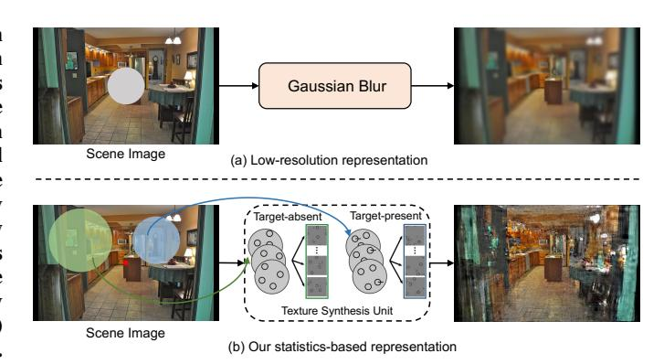
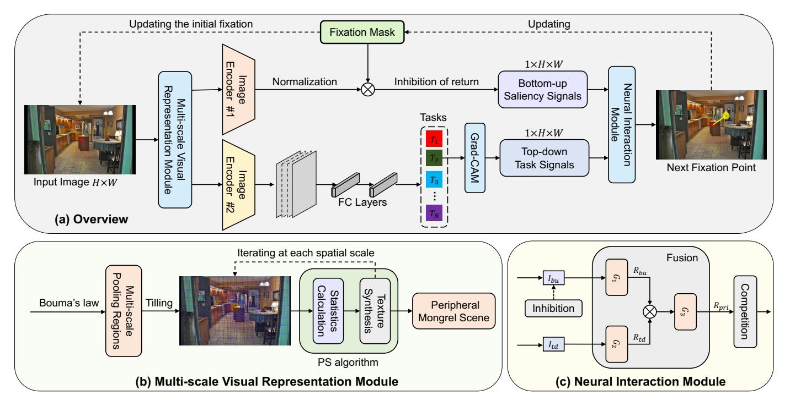
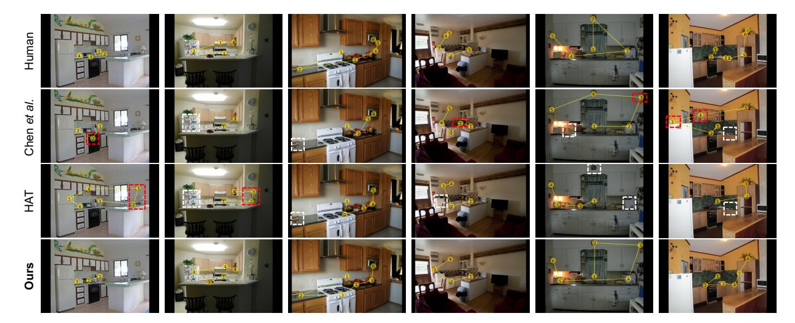

# Scanpath Prediction via Utilizing Peripheral Information of the Human Visual System

Kepei Zhang1,2,3, Ge Tong1,2,3, Xuetao Zhang1,2,3,\*

*Abstract*—Predicting the gaze patterns of the human eye when performing a visual search helps understand the mechanism of the human visual system. Most current scanpath models consider the physiological properties of human visual space when modeling gaze behaviors, and use image patches with different resolutions to represent the central and peripheral vision. However, the simplified method of lowering the image resolution to simulate the peripheral scene cannot accurately represent the visual information loss. On the other hand, few studies have focused on how peripheral information loss affects human attention shift during visual search. To address the above issues, we propose a novel scanpath prediction approach by designing a Multi-scale Visual Representation Module (MVRM) to process peripheral information of the human visual system. Besides, we introduce a Neural Interaction Module (NIM) with three interaction mechanisms of visual signals to predict the next fixation point. Experimental results on the benchmark datasets demonstrate the superiority of our method.

*Index Terms*—scanpath prediction, peripheral vision, visual search, human visual system

## I. INTRODUCTION

An ordered sequence of fixation points resulting from a series of human eye movements is known as a visual scanpath. Scanpath prediction aims to simulate human gaze sequences to understand attention allocation patterns, with applications in diverse fields such as human-computer interaction [1], adaptive display design [2], and Virtual Reality (VR) technologies [3].

Most existing scanpath models are designed for freeviewing scenarios [4]–[6], predicting scanpaths in both spatial and temporal dimensions to simulate how human attention is drawn to salient regions. However, predicting scanpaths in visual search tasks has greater significance for visual psychology and practical applications compared to free-viewing behaviors. During visual search, human attention is typically guided by two types of signals: bottom-up saliency signals, derived from the visual input to drive attention shifts, and top-down task signals, which direct attention based on specific goals.

Whether predicting free-viewing scanpaths or goal-directed ones, it is essential to accurately model the human visual system. In the human visual space, central vision provides clear and detailed information. Outside the fovea area, although peripheral vision has limited visual information, it is indispensable for efficiently navigating and interpreting

\*Corresponding author: xuetaozh@xjtu.edu.cn

Fig. 1: (a) The traditional peripheral representation method is based on low-resolution. (b) Our representation method uses summary statistics computation and texture synthesis.

complex visual scenes, making it a key factor in developing human-like scanpath models.

However, most existing models [7], [8] that use peripheral information to direct human attention simply consider peripheral vision as a low-resolution region relative to central fovea vision with high resolution. As shown in Fig. 1(a), outside the fovea area, this representation method usually employs identical Gaussian blur in the entire peripheral region to simulate the information loss, which does not accurately characterize the visual information loss or explore the effects of information loss on attentional guidance in visual search.

In the field of visual psychology [9]–[11], the visual representation and mechanism of peripheral vision from the perspective of image statistics have been widely studied. When searching for a target, peripheral patches at a fixation may contain the target alongside distractors or only distractors. The search task is easier if peripheral vision can distinguish between these patches, as it immediately guides the observer to the target. When discrimination is poor, the observer must scan the display to locate the target. Some experiments [11] have shown that peripheral patch discriminability significantly influences search efficiency and is constrained by 2D image statistics. These statistics — such as luminance distribution, autocorrelation, and correlations in oriented V1-like wavelets (across orientation, position, and scale) — effectively capture texture appearance and enable texture image synthesis.

1 National Key Laboratory of Human-Machine Hybrid Augmented Intelligence, Xi'an, China

2 National Engineering Research Center of Visual Information and Applications, Xi'an, China

3 Institute of Artificial Intelligence and Robotics, Xi'an Jiaotong University, Xi'an, China

Fig. 2: (a) The overview of our proposed framework, which employs novel visual representation and neural response mechanisms to achieve scanpath prediction. (b) The structure of MVRM. It consists of multi-scale pooling regions extraction and PS texture synthesis algorithm. (c) The structure of NIM. It uses three interaction mechanisms of visual signals to determine the next fixation point.

Inspired by their work, as shown in Fig. 1(b), we introduce a novel peripheral visual representation. To address the limitations of traditional methods, a novel scanpath generation method is also proposed to predict goal-directed human attention, which employs a Multi-scale Visual Representation Module (MVRM) to represent peripheral vision from the perspective of image statistics. Additionally, we extract the bottom-up and top-down attention signals via different image encoders and predict fixation points from priority maps through a Neural Interaction Module (NIM). In summary, our main contributions include:

- Inspired by the statistical representation of the peripheral scene, we propose a Multi-scale Visual Representation Module to perceive and process the scene information.
- We introduce a Neural Interaction Module to predict fixation points, which includes three interaction mechanisms of visual signals in the human superior colliculus.
- We conduct comprehensive experiments on the targetpresent (TP) and target-absent (TA) parts of visual search datasets. Compared with other baselines, the proposed method achieves remarkable results on standard scanpath prediction.

#### II. RELATED WORK

## A. Scanpath Prediction

Recent advances in scanpath prediction have leveraged deep learning methods [12]–[14], yielding significant progress.

Chen et al. [15] proposed a personalized scanpath prediction framework, emphasizing the incorporation of individual differences to improve predictive accuracy. Additionally, Yang et al. [16] developed a Transformer-based model that unifies top-down and bottom-up attention mechanisms, significantly enhancing scanpath prediction performance. Nonetheless, these models are computationally intensive and exhibit limitations in handling dynamic scenes or predicting long temporal sequences.

#### B. Peripheral Vision

Some seminal works by Rosenholtz et al. [17]–[19] highlight the importance of peripheral vision in visual search and scene perception. Their proposed framework has been instrumental in explaining how peripheral vision facilitates target detection and guides gaze behavior, particularly in cluttered scenes. In computational modeling, Min et al. [20] introduced a Peripheral Vision Transformer (PVT) model that integrates human peripheral vision mechanisms into deep learning frameworks to improve target recognition. However, this model assumes linear processing in peripheral vision, overlooking the complex nonlinear integration processes present in biological systems.

#### III. METHOD

## A. Overview

To understand how the loss of peripheral vision information affects human gaze behaviors and visual searching processes,

we propose a novel framework for predicting goal-directed scanpaths. As shown in Fig. 2(a), given a scene image, the proposed MVRM first processes central visual information and peripheral information, and synthesizes them into a texture image with the same statistics as the input. Then, bottom-up saliency signals and top-down task signals are separately extracted from the synthesized texture image via different image encoders. Visual neurons in the superior colliculus generate corresponding signal response maps and employ a Neural Interaction Module (NIM) to determine the next fixation behavior. The complete scanpath during visual search is obtained by looping the above process a specified number of times.

#### B. Multi-scale Visual Representation Module

Studies of visual crowding [17], [21] have shown that for the entire peripheral area beyond the fovea, the size of receptive fields increases linearly with eccentricity (distance to the center of the fixation point). Hence, we propose a Multi-scale Visual Representation Module (MVRM), which first preserves all central visual information based on the fovea size of the human eyes, and then generates multi-scale pooling regions used to compute the summary statistics in the peripheral area.

According to Bouma's law [22], the radius of local pooling regions is about half the eccentricity. As shown in Fig. 2(b), our MVRM tiles partially overlapping local patches to the entire visual input and uses Portilla & Simoncelli (PS) algorithm [23] in each local patch to calculate a fixed set of texture statistics. Mathematically, all texture statistics are localized weighted spatial averages computed from weighting functions. These weighting functions within each pooling region smoothly overlap each other and can be separated in terms of polar angle and logarithmic eccentricity, ensuring that their size grows linearly with eccentricity, which can be defined as a generalized window function as follows:

$$W(x) = \begin{cases} \cos^2\left(\frac{\pi}{2}\left(\frac{x - (t-1)/2}{t}\right)\right), & \frac{-(t+1)}{2} < x \le \frac{t-1}{2} \\ 1, & \frac{t-1}{2} < x \le \frac{1-t}{2} \\ 1 - \cos^2\left(\frac{\pi}{2}\left(\frac{x - (1+t)/2}{t}\right)\right), & \frac{1-t}{2} < x \le \frac{t+1}{2} \end{cases}$$

where t is the width of the transition area between weighting window functions. The weighting window functions on particular eccentricities are separable at the polar angle. They are defined in  $[0,\pi]$  with a number of  $N_{\theta}$  and can be described as:

$$h_n(\theta) = \mathcal{W}\left(\frac{\theta - \left(w_\theta n + \frac{w_\theta(1-t)}{2}\right)}{w_\theta}\right), w_\theta = \frac{2\pi}{N_\theta}, \quad (2)$$

where  $n = \{0, ..., N_{\theta} - 1\}$  is the index of the window functions and  $w_{\theta}$  is width of the windows. Similarly, the weighting window functions at the particular polar angle are separable in logarithmic eccentricity. They are defined between

the minimum eccentricity  $e_0$  and the max eccentricity  $e_r$  with a number of  $N_e$  and can be expressed as:

$$g_n(e) = \mathcal{W}\left(\frac{\log(e) - [\log(e_0) + w_e(n+1)]}{w_e}\right),$$

$$w_e = \frac{\log(e_r) - \log(e_0)}{N_e},$$
(3)

where  $n = \{0, ..., N_e - 1\}$  is the index of the window functions and  $w_e$  is width of the windows.

Once the summary texture statistics are obtained, they are synthesized into multi-scale texture patches. During the synthesis process from the central fovea to the entire image range, the previous partial synthesis results are used as seeds for subsequent pooling regions. The MVRM adopts a coarse-to-fine strategy, iterating several times until the final texture image has the same statistics as the input.

#### C. Neural Interaction Module

The Superior Colliculus (SC) is a highly complex neural structure located in the tectal region of the human midbrain [24]. It plays a crucial role in visual attention, eye movement control, and spatial perception. Based on the physiological properties of the SC, we further introduce a Neural Interaction Module (NIM) to predict the position of fixation points during visual search. In general, as shown in Fig. 2(c), our NIM includes three interaction mechanisms of visual signals in the SC: fusion, competition, and inhibition.

**Fusion.** The visual neurons in the superficial layers and the middle layers of SC first respond to the bottom-up saliency and top-down task signals, respectively. Let  $I_{bu}$  and  $I_{td}$  denote the signals mapped to the SC space. The response maps  $R_{bu} \in \mathbb{R}^{H \times W}$  and  $R_{td} \in \mathbb{R}^{H \times W}$  are summarized and then responded to by neurons in the deeper layers of the SC. During these response stages, we use different Gaussian filters to approximate the signal fusion processes, which indicate the overall activity of the neuronal population and can be formulated as follows:

$$R_{bu} = I_{bu} * G_1,$$
  
 $R_{td} = I_{td} * G_2,$  (4)  
 $R_{pri} = (R_{bu} + R_{td}) * G_3,$ 

where  $G_1$  (1.9 mm in diameter with a  $\sigma$  of 0.6 mm),  $G_2$  (1.6 mm in diameter with a  $\sigma$  of 1.33 mm), and  $G_3$  (2 mm in diameter with a  $\sigma$  of 0.5 mm) represent the Gaussian windows at different response stages. Here, 1 mm in SC corresponds to 76 pixels in visual space.  $R_{pri}$  is the priority map of deep neural responses, which is close to the executive level and reflects the motor selectivity.

**Competition.** After a series of Gaussian smoothing processes, the closer signals can fuse into a stronger signal, resulting in intense competition between the more distant signals. From the priority map  $R_{pri}$ , the SC selects the most active signal as the next fixation point and performs the next saccade. Hence, we use the Winner-Take-All (WTA) strategy

TABLE I: Quantitative comparisons of target search scanpath prediction on the test set of COCO-Search18. The best results are highlighted in bold.

| Method                | SS    | Shape | Direction | Length | Position |  |  |  |
|-----------------------|-------|-------|-----------|--------|----------|--|--|--|
| Target-present Search |       |       |           |        |          |  |  |  |
| Human                 | 0.500 | 0.903 | 0.736     | 0.880  | 0.910    |  |  |  |
| CNN                   | 0.431 | 0.741 | 0.612     | 0.851  | 0.780    |  |  |  |
| RNN                   | 0.406 | 0.877 | 0.537     | 0.721  | 0.724    |  |  |  |
| LSTM                  | 0.456 | 0.837 | 0.605     | 0.835  | 0.766    |  |  |  |
| GRU                   | 0.378 | 0.768 | 0.507     | 0.831  | 0.735    |  |  |  |
| IRL [8]               | 0.422 | 0.886 | 0.695     | 0.866  | 0.865    |  |  |  |
| GEM-ZSL [25]          | 0.357 | 0.829 | 0.634     | 0.829  | 0.783    |  |  |  |
| Chen et al. [1]       | 0.445 | 0.881 | 0.647     | 0.775  | 0.807    |  |  |  |
| FFMs [13]             | 0.451 | 0.831 | 0.687     | 0.859  | 0.661    |  |  |  |
| Gazeformer [14]       | 0.469 | 0.753 | 0.532     | 0.866  | 0.747    |  |  |  |
| HAT [16]              | 0.470 | 0.854 | 0.647     | 0.856  | 0.741    |  |  |  |
| Ours                  | 0.467 | 0.896 | 0.723     | 0.873  | 0.879    |  |  |  |

| Target-absent Search |       |       |       |       |       |  |  |
|----------------------|-------|-------|-------|-------|-------|--|--|
| Human                | 0.381 | 0.873 | 0.718 | 0.852 | 0.841 |  |  |
| CNN                  | 0.331 | 0.753 | 0.524 | 0.678 | 0.685 |  |  |
| RNN                  | 0.344 | 0.744 | 0.598 | 0.783 | 0.642 |  |  |
| LSTM                 | 0.306 | 0.630 | 0.537 | 0.672 | 0.584 |  |  |
| GRU                  | 0.306 | 0.669 | 0.510 | 0.621 | 0.572 |  |  |
| IRL [8]              | 0.319 | 0.706 | 0.565 | 0.723 | 0.698 |  |  |
| GEM-ZSL [25]         | 0.357 | 0.668 | 0.546 | 0.724 | 0.662 |  |  |
| Chen et al. [1]      | 0.331 | 0.820 | 0.627 | 0.770 | 0.699 |  |  |
| FFMs [13]            | 0.372 | 0.657 | 0.427 | 0.533 | 0.642 |  |  |
| Gazeformer [14]      | 0.357 | 0.718 | 0.535 | 0.718 | 0.735 |  |  |
| HAT [16]             | 0.402 | 0.781 | 0.611 | 0.767 | 0.726 |  |  |
| Ours                 | 0.421 | 0.823 | 0.669 | 0.826 | 0.811 |  |  |

to model the competition. Let Psc and Pvs denote the position of the most active point in SC space and the mapped location in visual space, respectively. The process of generating the next fixation point can be formulated as:

$$P_{sc} = argmax(R_{pri}),$$
  

$$P_{vs} = f_{map}(P_{sc}),$$
(5)

where fmap represents the mapping relationship [26] between SC and visual space.

Inhibition. The generated new fixation point updates the current position of the central fovea and enters into a new loop process for the next fixation point generation. To prevent the attention from returning to regions where information has already been processed, we employ the inhibition of return (IOR) mechanism [27] of humans, which labels previous fixation points during visual search and generates a fixation mask used to weaken the strength of the bottom-up saliency signals.

# IV. EXPERIMENTS

# *A. Setup*

Datasets. We use two datasets to train and evaluate our method: COCO-Search18 [28] and MCS [7]. COCO-Search18 is the only available large-scale visual search dataset that contains 18 search categories with 3101 target-present (TP) images and 3101 target-absent (TA) images, each viewed by 10 volunteers. The test set of MCS is additionally used to

TABLE II: Quantitative comparisons of target-present search scanpath prediction on the test set of MCS. The best results are highlighted in bold.

| Method          | SS    | Shape | Direction | Length | Position |
|-----------------|-------|-------|-----------|--------|----------|
| Human           | 0.423 | 0.954 | 0.710     | 0.953  | 0.931    |
| CNN             | 0.330 | 0.925 | 0.625     | 0.902  | 0.894    |
| RNN             | 0.378 | 0.916 | 0.674     | 0.890  | 0.868    |
| LSTM            | 0.401 | 0.910 | 0.672     | 0.879  | 0.871    |
| GRU             | 0.357 | 0.920 | 0.662     | 0.901  | 0.875    |
| IRL [8]         | 0.372 | 0.929 | 0.652     | 0.831  | 0.899    |
| GEM-ZSL [25]    | 0.335 | 0.890 | 0.685     | 0.869  | 0.816    |
| Chen et al. [1] | 0.401 | 0.852 | 0.565     | 0.738  | 0.834    |
| FFMs [13]       | 0.363 | 0.831 | 0.594     | 0.765  | 0.723    |
| Gazeformer [14] | 0.398 | 0.854 | 0.626     | 0.879  | 0.842    |
| HAT [16]        | 0.376 | 0.852 | 0.695     | 0.912  | 0.852    |
| Ours            | 0.416 | 0.932 | 0.701     | 0.917  | 0.921    |

evaluate our work's effectiveness, which consists of 40 images for searching microwaves and clocks in challenging kitchen scenes.

Evaluation Metrics. We use two metrics, Sequence Score (SS) [29] and MultiMatch [30], to measure scanpath prediction success, both of which capture the scanpath similarity between human fixation sequences and sequences generated by the model. SS converts a scanpath into a string of fixation cluster IDs and then uses a string-matching algorithm [31] to measure the similarity between two strings. MultiMatch measures five aspects of scanpath similarity at the pixel level, and here we focus on the first four dimensions: shape, direction, length, and position.

Implementation details. We set the central fovea region as a 16×16 pixel image patch to simulate the receptive field size of 1° around the central vision. For the peripheral area, the number of pooling regions at a given radius is set to 36. The Bouma ratio and the amount of overlap between pooling regions are set to 0.5. The number of iterations at each spatial scale is 10. For the extraction of the bottom-up saliency signal, we use pre-trained Vgg-16 as the image encoder. We additionally employ a fine-tuned version of Grad-CAM [32] for extracting the top-down task-specific signals. All model evaluations are based on 70% training, 20% validation, and 10% test, random splits of TP images of COCO-Search18 [28], within each target category. Each comparison model generates 10 scanpaths of maximum length 6 (excluding the first fixation point) for each test image, with the results averaged over scanpaths.

## *B. Performance Comparison*

Comparison methods. The human consistency computed from the collected human fixation data is reported as a gold standard. We first compare our model against several benchmark methods from Zelinsky *et al*. [7], such as CNN, RNN, LSTM, and GRU. Furthermore, we compare our model to the previous SOTA methods of scanpath prediction: IRL [8], GEM-ZSL [25], Chen *et al*. [1], FFMs [13], Gazeformer [14], and HAT [16].

Fig. 3: Qualitative comparisons of our model with the other advanced work. From left to right, the search targets are microwaves (the first three columns), clocks (the fourth and fifth columns), and potted plants (the last column). We present inaccurate fixation points in the red dashed box and missing fixation points in the white dashed box.

TABLE III: Ablation study of our method. Experiments are conducted on the TP test set of COCO-Search18. Results are retained to two decimal places.

(a) Performance comparison between our resolution-based version and the proposed method using MVRM.

| Method     | SS   | Sh   | Di   | Le   | Po   |
|------------|------|------|------|------|------|
| Res-based  | 0.33 | 0.82 | 0.64 | 0.74 | 0.81 |
| Using MVRM | 0.47 | 0.90 | 0.72 | 0.87 | 0.88 |

(b) Ablation on parameter settings. Nr represents the number of pooling regions.

| Setting      | SS   | Sh   | Di   | Le   | Po   |
|--------------|------|------|------|------|------|
| w/ [Nr = 18] | 0.41 | 0.82 | 0.63 | 0.73 | 0.72 |
| w/ [Nr = 72] | 0.35 | 0.80 | 0.62 | 0.64 | 0.81 |
| w/ [Nr = 36] | 0.47 | 0.90 | 0.72 | 0.87 | 0.88 |

(c) Ablation on the interaction mechanisms.

| Method          | SS   | Sh   | Di   | Le   | Po   |
|-----------------|------|------|------|------|------|
| w/o fusion      | 0.33 | 0.67 | 0.62 | 0.52 | 0.74 |
| w/o competition | 0.25 | 0.75 | 0.69 | 0.61 | 0.63 |
| w/o inhibition  | 0.14 | 0.53 | 0.35 | 0.63 | 0.56 |
| Full-set        | 0.47 | 0.90 | 0.72 | 0.87 | 0.88 |

Quantitative evaluation. As shown in Table. I and Table. II, our method outperforms all other predictive methods in predicting target-present (TP) human scanpaths in nearly all metrics, especially in MCS [7] with more challenging scenes. Compared to these resolution-based models, our texture-based method further improves the performance significantly for the average agreement with the real human eyes. Particularly in MultiMatch reflecting spacial similarity, our method is significantly better than the most recent HAT [16] although it slightly lags behind in Sequence Score. For the target-absent (TA) search, the main influences on human attention change from targets to contextual cues for global scene understanding and object relevance. Different from TP results, the TA search results in Table. I show that our method also achieves optimal performance. These results suggest that our method better utilizes the peripheral information and captures the semantic features of visual scenes.

Qualitative results. We qualitatively compare our method with the real human eyes and other different methods. As shown in Fig. 3, during the search for clocks, microwaves, and potted plants in challenging scenarios, our method shows a high degree of similarity to humans and predicts the fixations points on distractors similar to the target and contextual objects related to the target, just like humans do.

## *C. Ablation Study*

We perform ablation experiments on COCO-Search18 [28] to investigate the effectiveness of the proposed modules.

Visual representation. As shown in Table. III(a), compared to the resolution-based version of our method with all other settings being equal, our method achieves remarkable improvements in all metrics. It demonstrates that MVRM better utilizes the peripheral information through multi-scale texture extraction and synthesis rather than reducing resolution.

Parameter settings related to peripheral loss. During the multi-scale visual representation, we use MVRM to perform summary statistics computation and texture synthesis. Table. III(b) shows the effect of different numbers of pooling regions at a given radius on the above processes. When increasing the Nr to 72, our MVRM captures finer details in the pooling regions, allowing the synthesized images to retain more local details and exhibit less overall distortion (i.e., less loss of peripheral information), which may fail to accurately simulate the difference between central and peripheral vision in the human visual system. On the other hand, decreasing the Nr to 18 leads to broader pooling regions and more noticeable distortions in the synthesized images (i.e., more loss of peripheral information), which may prevent successful visual search.

Interaction mechanisms of NIM. In the NIM, the three interaction mechanisms of visual signals are used to determine the next fixation point. The ablation results in Table. III(c) verifies the effectiveness of these mechanisms. Particularly, the inhibition of return (IOR) mechanism is the key component to prevent the attention from returning to previous regions, which accurately simulates the signal processing of the human visual system and significantly improves search efficiency.

# V. CONCLUSION

In this paper, we propose a new scanpath prediction method that utilizes the peripheral information of the human visual system. Our approach first uses a Multi-scale Visual Representation Module (MVRM) to perform the summary statistics computation and texture synthesis for peripheral regions. The extracted signals (bottom-up and top-down) from the synthesized texture image are processed by a Neural Interaction Module (NIM) to simulate the visual neural response and to determine the next fixation behavior. Through experiments conducted on public datasets for target-present search and target-absent search, the experimental results demonstrate that our approach outperforms the existing state-of-the-art methods. In future work, we plan to employ more physiological mechanisms related to visual psychology and the human visual system. We are also considering exploring more advanced methods that can be applied to free-viewing and visual search tasks to suit different scenarios.

# REFERENCES

- [1] Xianyu Chen, Ming Jiang, et al., "Predicting human scanpaths in visual question answering," in *Proceedings of the IEEE/CVF Conference on Computer Vision and Pattern Recognition*, 2021, pp. 10876–10885.
- [2] Yao Wang, Andreas Bulling, et al., "Scanpath prediction on information visualisations," *IEEE Transactions on Visualization and Computer Graphics*, 2023.
- [3] Sohee Park, Arani Bhattacharya, et al., "Mosaic: Advancing user quality of experience in 360-degree video streaming with machine learning," *IEEE Transactions on Network and Service Management*, vol. 18, no. 1, pp. 1000–1015, 2021.
- [4] Marc Assens, Xavier Giro Nieto, et al., "PathGAN: Visual scanpath ´ prediction with generative adversarial networks," in *Computer Vision: ECCV 2018 Workshops, Munich, Germany, September 8-14, 2018: Proceedings, Part V*. 2019, pp. 406–422, Springer.
- [5] Matthias Kummerer, Matthias Bethge, et al., "Deepgaze iii: Modeling ¨ free-viewing human scanpaths with deep learning," *Journal of Vision*, vol. 22, no. 5, pp. 7–7, 2022.
- [6] Wanjie Sun, Zhenzhong Chen, et al., "Visual scanpath prediction using ior-roi recurrent mixture density network," *IEEE transactions on pattern analysis and machine intelligence*, vol. 43, no. 6, pp. 2101–2118, 2019.
- [7] Gregory Zelinsky, Zhibo Yang, et al., "Benchmarking gaze prediction for categorical visual search," in *Proceedings of the IEEE/CVF Conference on Computer Vision and Pattern Recognition Workshops*, 2019, pp. 4321–4329.
- [8] Zhibo Yang, Lihan Huang, et al., "Predicting goal-directed human attention using inverse reinforcement learning," in *Proceedings of the IEEE/CVF conference on computer vision and pattern recognition*, 2020, pp. 193–202.
- [9] Ruth Rosenholtz, "Peripheral vision: A critical component of many visual tasks," in *Oxford Research Encyclopedia of Psychology*. 2023.

- [10] Lex Fridman, Benedikt Jenik, et al., "Sideeye: A generative neural network based simulator of human peripheral vision," *arXiv preprint arXiv:1706.04568*, 2017.
- [11] Xuetao Zhang, Jie Huang, et al., "Cube search, revisited," *Journal of Vision*, vol. 15, no. 3, pp. 9–9, 2015.
- [12] Shima Rashidi, Krista Ehinger, et al., "Optimal visual search based on a model of target detectability in natural images," *Advances in Neural Information Processing Systems*, vol. 33, pp. 9288–9299, 2020.
- [13] Zhibo Yang, Sounak Mondal, et al., "Target-absent human attention," in *European Conference on Computer Vision*. Springer, 2022, pp. 52–68.
- [14] Sounak Mondal, Zhibo Yang, et al., "Gazeformer: Scalable, effective and fast prediction of goal-directed human attention," in *Proceedings of the IEEE/CVF Conference on Computer Vision and Pattern Recognition*, 2023, pp. 1441–1450.
- [15] Xianyu Chen, Ming Jiang, et al., "Beyond average: Individualized visual scanpath prediction," in *Proceedings of the IEEE/CVF Conference on Computer Vision and Pattern Recognition*, 2024, pp. 25420–25431.
- [16] Zhibo Yang, Sounak Mondal, et al., "Unifying top-down and bottomup scanpath prediction using transformers," in *Proceedings of the IEEE/CVF Conference on Computer Vision and Pattern Recognition*, 2024, pp. 1683–1693.
- [17] Benjamin Balas, Lisa Nakano, et al., "A summary-statistic representation in peripheral vision explains visual crowding," *Journal of vision*, vol. 9, no. 12, pp. 13–13, 2009.
- [18] Christian Koevesdi, Vasha DuTell, et al., "Stattexnet: Evaluating the importance of statistical parameters for pyramid-based texture and peripheral vision models," in *NeuRIPS 2023 Workshop on Gaze Meets ML*, 2023.
- [19] Anne Harrington, Vasha DuTell, et al., "Evaluating peripheral vision as an input transformation to understand object detection model behavior," in *NeuRIPS 2023 Workshop on Gaze Meets ML*, 2023.
- [20] Juhong Min, Yucheng Zhao, et al., "Peripheral vision transformer," *Advances in Neural Information Processing Systems*, vol. 35, pp. 32097– 32111, 2022.
- [21] Adrien Doerig, Alban Bornet, et al., "Beyond bouma's window: How to explain global aspects of crowding?," *PLoS computational biology*, vol. 15, no. 5, pp. e1006580, 2019.
- [22] Denis G Pelli and Katharine A Tillman, "The uncrowded window of object recognition," *Nature neuroscience*, vol. 11, no. 10, pp. 1129– 1135, 2008.
- [23] Javier Portilla and Eero P Simoncelli, "A parametric texture model based on joint statistics of complex wavelet coefficients," *International journal of computer vision*, vol. 40, pp. 49–70, 2000.
- [24] Richard J Krauzlis, Lee P Lovejoy, et al., "Superior colliculus and visual spatial attention," *Annual review of neuroscience*, vol. 36, no. 1, pp. 165–182, 2013.
- [25] Yang Liu, Lei Zhou, et al., "Goal-oriented gaze estimation for zero-shot learning," in *Proceedings of the IEEE/CVF conference on computer vision and pattern recognition*, 2021, pp. 3794–3803.
- [26] Hossein Adeli, Franc¸oise Vitu, et al., "A model of the superior colliculus predicts fixation locations during scene viewing and visual search," *Journal of Neuroscience*, vol. 37, no. 6, pp. 1453–1467, 2017.
- [27] Koorosh Mirpour, Fabrice Arcizet, et al., "Been there, seen that: a neural mechanism for performing efficient visual search," *Journal of neurophysiology*, vol. 102, no. 6, pp. 3481–3491, 2009.
- [28] Yupei Chen, Zhibo Yang, et al., "Coco-search18 fixation dataset for predicting goal-directed attention control," *Scientific reports*, vol. 11, no. 1, pp. 8776, 2021.
- [29] Ali Borji, Hamed R Tavakoli, et al., "Analysis of scores, datasets, and models in visual saliency prediction," in *Proceedings of the IEEE international conference on computer vision*, 2013, pp. 921–928.
- [30] Nicola C Anderson, Fraser Anderson, et al., "A comparison of scanpath comparison methods," *Behavior research methods*, vol. 47, pp. 1377– 1392, 2015.
- [31] Saul B Needleman and Christian D Wunsch, "A general method applicable to the search for similarities in the amino acid sequence of two proteins," *Journal of molecular biology*, vol. 48, no. 3, pp. 443–453, 1970.
- [32] Ramprasaath R Selvaraju, Michael Cogswell, et al., "Grad-cam: Visual explanations from deep networks via gradient-based localization," in *Proceedings of the IEEE international conference on computer vision*, 2017, pp. 618–626.